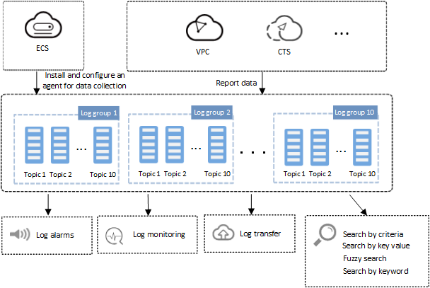

# Introduction

Log Tank Service \(LTS\) collects log data from hosts and cloud services. Through analysis and processing of massive log data, LTS maximizes the availability and performance of cloud services and applications. It provides you with a real-time, efficient, and secure log processing capability, and helps you quickly and efficiently perform real-time decision-making analysis, device O&M management, and user service trend analysis.

**Figure  1**  LTS service diagram  

