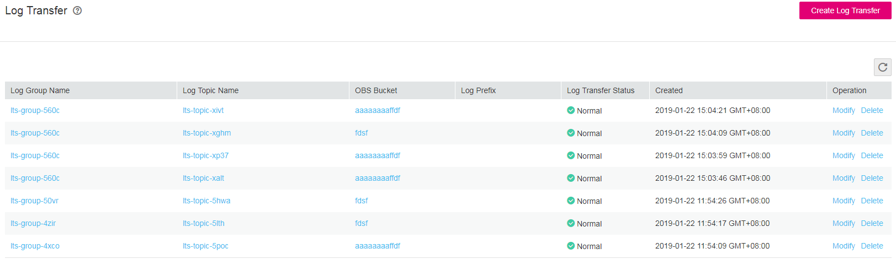

# Viewing a Log Transfer Task

## Scenarios

This section describes how to view a log transfer task.

The status of a transfer task can be  **Normal**,  **Abnormal**, or  **Disabled**  as follows:

-   **Normal**: indicates that the log transfer task works properly.
-   **Abnormal**: indicates that the OBS bucket to which logs are transferred is deleted or the bucket policy is abnormal. Rectify the fault by following the instructions in  [Why Is Log Transfer Abnormal on the Log Transfer Page?](why-is-log-transfer-abnormal-on-the-log-transfer-page.md)
-   **Disabled**: indicates that the log transfer task is stopped.

You can enable or disable a log transfer task by following the instructions in  [Modifying a Log Transfer Task](modifying-a-log-transfer-task.md).

## Prerequisites

-   You have created a log group.
-   You have created a log topic.
-   You have configured a log transfer task.

## Procedure

1.  Log in to the management console.
2.  In the upper left corner of the management console, select the target region and project.
3.  Click  **Service List**  and choose  **Management & Deployment**  \>  **Log Tank Service**.
4.  In the navigation pane on the left, choose  **Log Transfer**.
5.  In the log transfer task list, view the target log transfer task.

    **Figure  1**  Viewing log transfer tasks  
    

