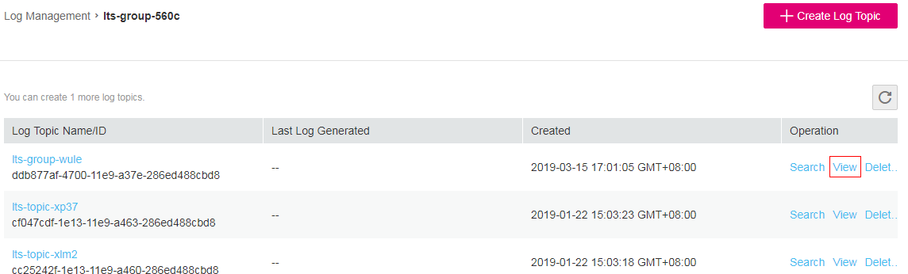

# Viewing Logs in Real Time

To view logs reported to LTS in real time, perform the following operations:

1.  Click  **Service List**  and choose  **Management & Deployment**  \>  **Log Tank Service**.
2.  In the log group list, click the name of the target log group.
3.  In the log topic list, locate the target log topic and click  **View**  in the  **Operation**  column.

    **Figure  1**  Viewing logs in real time  
    

    Logs are reported to LTS every 10 minutes. In the log display area, you may wait for at most 10 minutes to view the logs.

    In addition, you can customize log display by clicking  **Clear**,  **Pause**, or  **Close**  in the upper right corner.

    **Figure  2**  Log display area  
    

    -   **Clear**: clears all logs that are displayed in the log display area.
    -   **Pause**: pauses the real-time log display so that you can view details of the displayed logs.

        After you click  **Pause**, the button changes to  **Continue**. You can click  **Continue**  to resume the log display.

    -   **Close**: closes the real-time log view page. You are redirected to the  **Log Topic List **page.

        > **NOTE:**   
        >If you are using the  **View**  function, stay in the log display area. Do not switch the page. If you leave the log display area, the  **View**  function will be disabled.  

