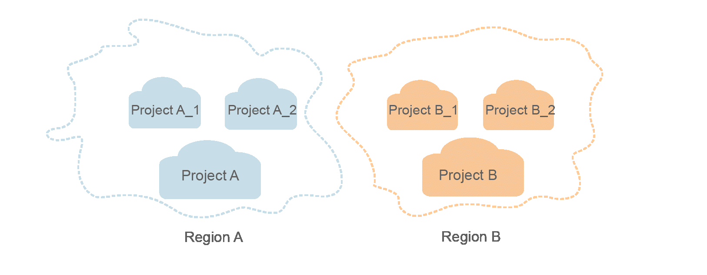

# Concepts

-   Domain

    A domain is created upon successful registration with the cloud platform. The domain has full access permissions for all of its cloud services and resources. It can be used to reset user passwords and grant user permissions. The domain should not be used directly to perform routine management. For security purposes, create IAM users and grant them permissions for routine management.

-   User

    A user is created using a domain to use cloud services. Each user has its own identity credentials \(password and access keys\).

    The domain name, username, and password will be required for API authentication.

-   Region

    Regions are geographic areas isolated from each other. Resources are region-specific and cannot be used across regions through internal network connections. For low network latency and quick resource access, select the nearest region.

-   AZ

    An AZ contains one or more physical data centers. Each AZ has independent cooling, fire extinguishing, moisture-proof, and electricity facilities. Within an AZ, computing, network, storage, and other resources are logically divided into multiple clusters. AZs within a region are interconnected using high-speed optical fibers to support cross-AZ high-availability systems.

-   Project

    Projects group and isolate resources \(including compute, storage, and network resources\) across physical regions. A default project is provided for each region, and subprojects can be created under each default project. Users can be granted permissions to access all resources in a specific project. For more refined access control, create subprojects under a project and create resources in the subprojects. Users can then be assigned permissions to access only specific resources in the subprojects.

    **Figure  1**  Project isolation model  
    

-   Checkpoint

    Checkpoint: When an application consumes data, the latest SN of the consumed data is recorded as a checkpoint. When the data is reconsumed, the consumption can be continued based on this checkpoint.

-   App

    Application: Multiple applications can access data in the same stream. Checkpoints generated for each application are used to record the consumed data in the stream by each application.

