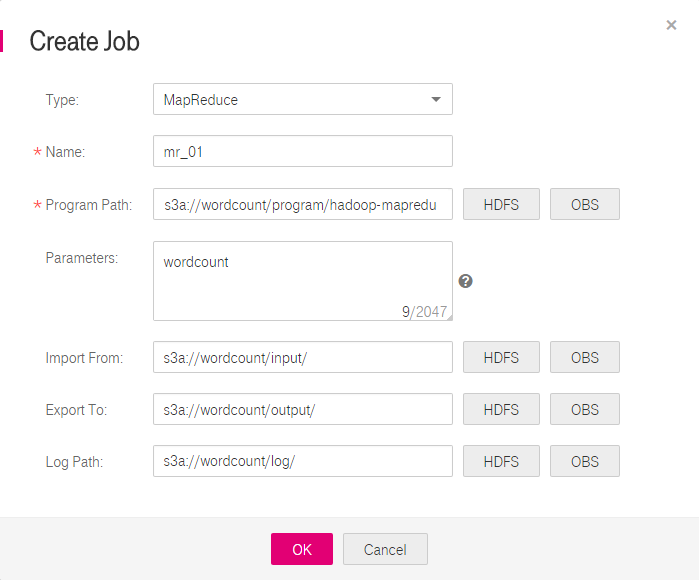

# How Do I Submit Developed Programs to MRS?

MRS provides a platform for executing programs developed by users. You can submit, execute, and monitor such programs by using MRS. To submit developed programs to MRS, set  **Program Path** to the actual path for storing such programs, as shown in [Figure 1](#fedf0da10f6234fc8a2ccac2716163e6f).

**Figure  1**  Creating a job  

