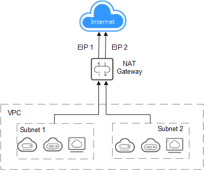

# Application Scenarios

## Using SNAT to Access the Internet

If your servers in the VPC issue a large number of Internet access requests, you can use the SNAT function to let the servers share one or more EIPs to access the Internet without exposing their IP addresses. In a VPC, one subnet corresponds to one SNAT rule, and one SNAT rule is configured with one EIP. NAT Gateway provides different types of NAT gateways and each type supports different numbers of connections. You can create multiple SNAT rules to meet your service requirements.

[Figure 1](#fig1463533919456)  shows how servers in a VPC access the Internet using SNAT.

**Figure  1**  Using SNAT to access the Internet  

## Using DNAT to Provide Services Accessible from the Internet

To allow your servers in a VPC to provide services for the Internet, you can use the DNAT function.

You can bind an EIP to a DNAT rule. As requests with specific protocol and port access the EIP, NAT Gateway forwards the requests to the port of the target server through the mapping between the ports. Besides, NAT Gateway can forward requests on the EIP to your servers based on the mapping IP addresses. NAT Gateway allows multiple servers to share an EIP and precisely controls bandwidth resources.

A DNAT rule is configured for one server. If there are multiple servers, you can create several DNAT rules to share one or more EIPs.

[Figure 2](#fig1553173645114)  shows how servers in a VPC provide services accessible from the Internet using DNAT. The servers shown in the following figure can be an ECS, a BMS, or a Workspace desktop.

**Figure  2**  Using DNAT to provide services accessible from the Internet  

## Using SNAT or DNAT to Access the Internet in a High Speed Way

If a large number of servers that in a private cloud or connect to a VPC through a Direct Connect or VPN connection need to securely access the Internet in a high speed way or to provide services accessible from the Internet, SNAT and DNAT can be used in such scenario. The similar scenarios include Internet, games, e-commerce, and finance.

[Figure 3](#fig19180043184010)  shows the inter-cloud high-speed Internet access.

**Figure  3**  Using SNAT or DNAT to access the Internet in a high speed way  

