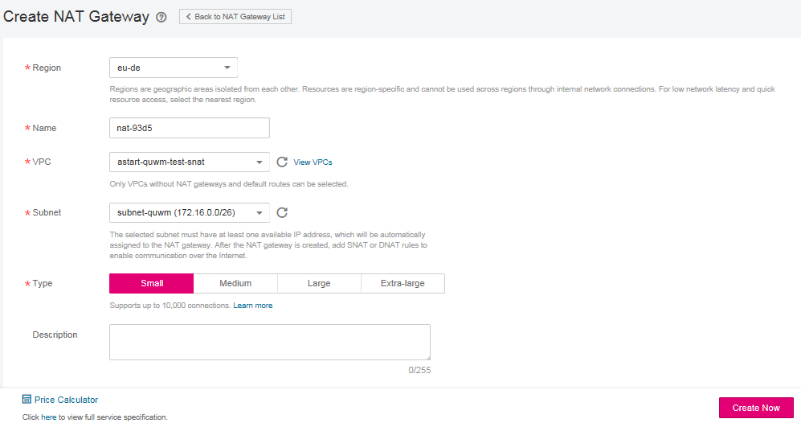

# Step 2: Create a NAT Gateway

## Scenarios

This section guides you on how to create a NAT gateway to enable your servers to access the Internet or to provide services for external networks.

## **Prerequisites**

-   When creating a NAT gateway, you must specify its VPC, subnet, and type.
-   Ensure that the VPC does not have a default route.

## Procedure

1.  Log in to the management console.
2.  Click    in the upper left corner and select the desired region and project.
3.  Under  **Network**, click  **NAT Gateway**.
4.  On the displayed page, click  **Create NAT Gateway**.

    **Figure  1**  Create NAT Gateway  
    

5.  Set the parameters as prompted. For details, see  [Table 1](#nat_qs_0003_table27487005195751).

    **Table  1**  Parameter description

    
    <table><thead align="left"><tr id="nat_qs_0003_row9940336195751"><th class="cellrowborder" valign="top" width="25%" id="mcps1.2.3.1.1">
<strong id="nat_qs_0003_b24725868162658">Parameter</strong>

    </th>
    <th class="cellrowborder" valign="top" width="75%" id="mcps1.2.3.1.2">
Description

    </th>
    </tr>
    </thead>
    <tbody><tr id="nat_qs_0003_row11053428162048"><td class="cellrowborder" valign="top" width="25%" headers="mcps1.2.3.1.1 ">
Region

    </td>
    <td class="cellrowborder" valign="top" width="75%" headers="mcps1.2.3.1.2 ">
Specifies the region where the NAT gateway is located.

    </td>
    </tr>
    <tr id="nat_qs_0003_row32613315195751"><td class="cellrowborder" valign="top" width="25%" headers="mcps1.2.3.1.1 ">
Name

    </td>
    <td class="cellrowborder" valign="top" width="75%" headers="mcps1.2.3.1.2 ">
Specifies the name of the NAT gateway. The value is a string of 1 to 64 characters consisting of digits, letters, underscores (_), and hyphens (-).

    </td>
    </tr>
    <tr id="nat_qs_0003_row27553870195751"><td class="cellrowborder" valign="top" width="25%" headers="mcps1.2.3.1.1 ">
VPC

    </td>
    <td class="cellrowborder" valign="top" width="75%" headers="mcps1.2.3.1.2 ">
Specifies the VPC to which the NAT gateway belongs. You can select the VPC which is not used by other NAT gateways and has no default route. 

    </td>
    </tr>
    <tr id="nat_qs_0003_row47407746195751"><td class="cellrowborder" valign="top" width="25%" headers="mcps1.2.3.1.1 ">
Subnet

    </td>
    <td class="cellrowborder" valign="top" width="75%" headers="mcps1.2.3.1.2 ">
Specifies the VPC subnet to which the NAT gateway belongs.

    
The subnet has at least one available IP address.

    </td>
    </tr>
    <tr id="nat_qs_0003_row3011590195751"><td class="cellrowborder" valign="top" width="25%" headers="mcps1.2.3.1.1 ">
Type

    </td>
    <td class="cellrowborder" valign="top" width="75%" headers="mcps1.2.3.1.2 ">
Specifies the type of the NAT gateway.

    
The value can be <strong id="nat_qs_0003_b842352706152120">Small</strong>, <strong id="nat_qs_0003_b842352706152124">Medium</strong>, <strong id="nat_qs_0003_b842352706152128">Large</strong>, and <strong id="nat_qs_0003_b842352706152132">Extra-large</strong>. You can click <strong id="nat_qs_0003_b842352706152252">Learn more</strong> on the page to view details about each type.

    </td>
    </tr>
    <tr id="nat_qs_0003_row2219225792544"><td class="cellrowborder" valign="top" width="25%" headers="mcps1.2.3.1.1 ">
Description

    </td>
    <td class="cellrowborder" valign="top" width="75%" headers="mcps1.2.3.1.2 ">
Provides supplementary information about the NAT gateway. The description can contain a maximum of 255 characters.

    </td>
    </tr>
    </tbody>
    </table>

6.  Click  **Create Now**. The page for you to confirm the NAT gateway specifications is displayed.
7.  If you do not need to modify the information, click  **Submit**.

    It takes 1 to 5 minutes to create a NAT gateway.

8.  On the  **NAT Gateway**  homepage, check the NAT gateway status. For details about the NAT gateway status, see  [Table 2](#nat_qs_0003_table1213025114317).

    **Table  2**  NAT gateway status

    
    <table><thead align="left"><tr id="nat_qs_0003_row9131125119310"><th class="cellrowborder" valign="top" width="50%" id="mcps1.2.3.1.1">
<strong id="nat_qs_0003_b8423527062072">Status</strong>

    </th>
    <th class="cellrowborder" valign="top" width="50%" id="mcps1.2.3.1.2">
<strong>Description</strong>

    </th>
    </tr>
    </thead>
    <tbody><tr id="nat_qs_0003_row1713115114315"><td class="cellrowborder" valign="top" width="50%" headers="mcps1.2.3.1.1 ">
Running

    </td>
    <td class="cellrowborder" valign="top" width="50%" headers="mcps1.2.3.1.2 ">
The resource is normal.

    </td>
    </tr>
    <tr id="nat_qs_0003_row1013115115314"><td class="cellrowborder" valign="top" width="50%" headers="mcps1.2.3.1.1 ">
Creating

    </td>
    <td class="cellrowborder" valign="top" width="50%" headers="mcps1.2.3.1.2 ">
The resource is being created.

    </td>
    </tr>
    <tr id="nat_qs_0003_row101312514318"><td class="cellrowborder" valign="top" width="50%" headers="mcps1.2.3.1.1 ">
Updating

    </td>
    <td class="cellrowborder" valign="top" width="50%" headers="mcps1.2.3.1.2 ">
The resource is being updated.

    </td>
    </tr>
    <tr id="nat_qs_0003_row1913115514318"><td class="cellrowborder" valign="top" width="50%" headers="mcps1.2.3.1.1 ">
Deleting

    </td>
    <td class="cellrowborder" valign="top" width="50%" headers="mcps1.2.3.1.2 ">
The resource is being deleted.

    </td>
    </tr>
    <tr id="nat_qs_0003_row1613155110316"><td class="cellrowborder" valign="top" width="50%" headers="mcps1.2.3.1.1 ">
Frozen

    </td>
    <td class="cellrowborder" valign="top" width="50%" headers="mcps1.2.3.1.2 ">
The resource has been frozen.

    </td>
    </tr>
    <tr id="nat_qs_0003_row101318515313"><td class="cellrowborder" valign="top" width="50%" headers="mcps1.2.3.1.1 ">
Abnormal

    </td>
    <td class="cellrowborder" valign="top" width="50%" headers="mcps1.2.3.1.2 ">
The resource is abnormal.

    </td>
    </tr>
    </tbody>
    </table>

