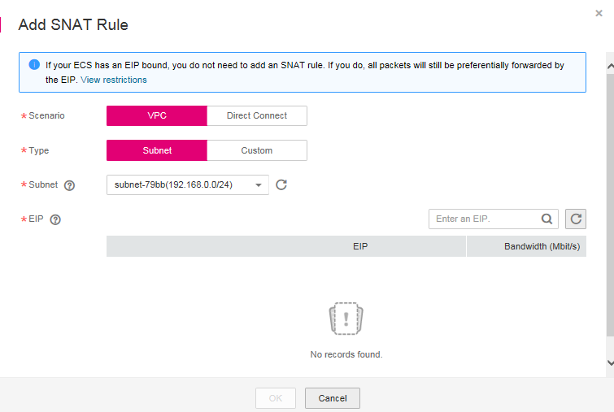

# Step 3: Add an SNAT Rule

## Scenarios

After the NAT gateway is created, you need to add SNAT rules. With an SNAT rule, your servers in a specified subnet can access the Internet by sharing the same EIP.

An SNAT rule is configured for one subnet or CIDR block. If there are multiple subnets or CIDR blocks in a VPC, you can create several SNAT rules to make multiple servers share more EIPs.

## **Prerequisites**

A NAT gateway has been created.

## Procedure

1.  Log in to the management console.
2.  Click    in the upper left corner and select the desired region and project.
3.  Under  **Network**, click  **NAT Gateway**.
4.  On the displayed page, click the name of the NAT gateway for which you want to add the SNAT rule.
5.  On the  **SNAT Rules**  tab, click  **Add SNAT Rule**.

    **Figure  1**  Add SNAT Rule  
    

6.  Set the parameters as prompted.  [Table 1](#table1966804261617)  describes the parameters.

    **Table  1**  Parameter description

    
    <table><thead align="left"><tr id="row17666124215168"><th class="cellrowborder" valign="top" width="16.06%" id="mcps1.2.4.1.1">
<strong id="b9372723144">Parameter</strong>

    </th>
    <th class="cellrowborder" valign="top" width="27.529999999999998%" id="mcps1.2.4.1.2">
<strong id="b1387373883812">Condition</strong>

    </th>
    <th class="cellrowborder" valign="top" width="56.410000000000004%" id="mcps1.2.4.1.3">
<strong id="b37983896144751">Description</strong>

    </th>
    </tr>
    </thead>
    <tbody><tr id="row136661642201612"><td class="cellrowborder" valign="top" width="16.06%" headers="mcps1.2.4.1.1 ">
Scenario

    </td>
    <td class="cellrowborder" valign="top" width="27.529999999999998%" headers="mcps1.2.4.1.2 ">
N/A

    </td>
    <td class="cellrowborder" valign="top" width="56.410000000000004%" headers="mcps1.2.4.1.3 ">
Select <strong id="b200172584111">VPC</strong> when your servers use the SNAT rule to access the Internet.

    
This scenario involves servers in a VPC.

    </td>
    </tr>
    <tr id="row16667842141618"><td class="cellrowborder" valign="top" width="16.06%" headers="mcps1.2.4.1.1 ">
Type

    </td>
    <td class="cellrowborder" valign="top" width="27.529999999999998%" headers="mcps1.2.4.1.2 ">
Set this parameter only when you select <strong id="b1484925165412">VPC</strong> for <strong id="b1784911525410">Scenario</strong>.

    </td>
    <td class="cellrowborder" valign="top" width="56.410000000000004%" headers="mcps1.2.4.1.3 ">
Specifies the method used by servers to access the Internet.

    
Select <strong id="b422718237417">Subnet</strong> when all servers in a subnet in a VPC need to access the Internet through the SNAT rule.

    
Select <strong id="b927672112512">Custom</strong> when specified servers in a subnet in a VPC need to access the Internet through the SNAT rule.

    </td>
    </tr>
    <tr id="row1966711421161"><td class="cellrowborder" valign="top" width="16.06%" headers="mcps1.2.4.1.1 ">
Subnet

    </td>
    <td class="cellrowborder" valign="top" width="27.529999999999998%" headers="mcps1.2.4.1.2 ">
Set this parameter when you select <strong id="b1957353411513">VPC</strong> for <strong id="b757483418516">Scenario</strong>, and <strong id="b2057417341955">Subnet</strong> for <strong id="b18575234558">Type</strong>.

    </td>
    <td class="cellrowborder" valign="top" width="56.410000000000004%" headers="mcps1.2.4.1.3 ">
Specifies the subnet in which servers can access the Internet through the SNAT rule.

    </td>
    </tr>
    <tr id="row2668542131619"><td class="cellrowborder" valign="top" width="16.06%" headers="mcps1.2.4.1.1 ">
EIP

    </td>
    <td class="cellrowborder" valign="top" width="27.529999999999998%" headers="mcps1.2.4.1.2 ">
Set this parameter when you select <strong id="b1636714863918">VPC</strong> for <strong id="b15203195143919">Scenario</strong>.

    </td>
    <td class="cellrowborder" valign="top" width="56.410000000000004%" headers="mcps1.2.4.1.3 ">
Specifies the public IP address used for accessing the Internet.

    
You can only select an EIP that has not been bound, has been bound to a DNAT rule with <strong id="b201941321181914">Port Type</strong> set to <strong id="b13195142118198">Specific port</strong> of the current NAT gateway, or has been bound to an SNAT rule of the current NAT gateway.

    </td>
    </tr>
    </tbody>
    </table>

7.  Click  **OK**.

    > **NOTE:**   
    >You can add multiple SNAT rules for a NAT gateway to suite your service requirements.  

