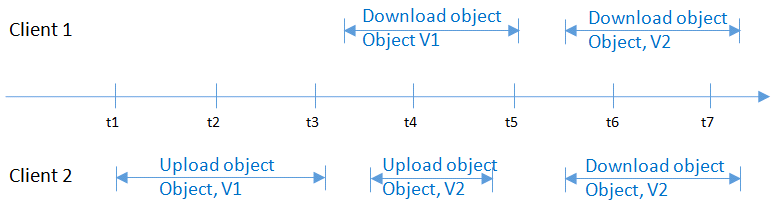

# Concurrent Operation Consistency

If there is a successful response to a write or deletion request sent by a client, the client can obtain the latest data. If a write operation times out, or the server returns HTTP response error code  **500**  or  **503**, the follow-up read operations may fail. If such an error occurs, query whether the data has been successfully uploaded to the server. If not, upload the data again.

If multiple clients simultaneously upload, query, or delete the same object or bucket, these operations may reach the system at different times and have different latency periods. The results that return may also be different than those expected. For example, if multiple clients simultaneously upload the same object, a new upload request will replace the prior one. If you want to prevent an object from being simultaneously accessed, you must add a lock mechanism for the object in upper-layer applications.

## Concurrent Operation Examples

The following provides eight concurrent operation examples.

1.  At the same time as  **Client 2**  is uploading object  **v1**,  **Client 1**  is uploading object  **v2**  with the same name. After the object data is successfully uploaded, both  **Client1**  and  **Client 2**  can access the latest object  **v2**, as shown in  [Figure 1](#fig6178193513458).

    **Figure  1**  Concurrent uploading of the same object  
    

2.  At the same time as  **Client 2**  is uploading object  **v1**  and before metadata is written,  **Client 1**  deletes an object with the same name. The uploading operation of  **Client 1**  is still successful, and both  **Client 1**  and  **Client 2**  can access object  **v1**, as shown in  [Figure 2](#fig5428132211462).

    **Figure  2**  Concurrent uploading and deletion of the same object \(1\)  
    .png "concurrent-uploading-and-deletion-of-the-same-object-(1)")

3.  At the same time as  **Client 2**  has successfully uploaded object  **v1**  and while metadata is still being written,  **Client 1**  deletes an object with the same name. The uploading operation of  **Client 1**  is still successful, but when  **Client 1**  and  **Client 2**  attempt to download the object, an error may display indicating that the object does not exist, as shown in  [Figure 3](#fig14719183104719).

    **Figure  3**  Concurrent uploading and deletion of the same object \(2\)  
    .png "concurrent-uploading-and-deletion-of-the-same-object-(2)")

4.  At the same time as  **Client 1**  is downloading an object,  **Client 2**  is deleting an object with the same name.  **Client 1**  may download complete object data, or may download only a part of data. After  **Client 2**  receives a deletion success message, the attempt to download the object will fail, and an error will return indicating that the object does not exist, as shown in  [Figure 4](#fig164294324717).

    **Figure  4**  Concurrent downloading and deletion of the same object  
    

5.  At the same time as  **Client 1**  is downloading an object,  **Client 2**  is updating an object with the same name.  **Client 1**  may download complete object data, or may download only a part of data. After  **Client 2**  receives an update success message, the attempt to download the object will succeed, and the latest data will return, as shown in  [Figure 5](#fig10267624174815).

    **Figure  5**  Concurrent downloading and updating of the same object  
    

6.  At the same time as  **Client 1**  is uploading part  **v2**  of an object,  **Client 2**  is uploading part  **v1**  of the same object. After part  **v2**  is uploaded successfully, both  **Client 1**  and  **Client 2**  can list the information about the multipart whose entity tag \(ETag\) is part  **v2**, as shown in  [Figure 6](#fig191241454495).

    **Figure  6**  Concurrently uploading the same multipart of the same object  
    

7.  If a client uploads an object and a timeout occurs or error code  **500**  or  **503**  is returned, one of the following symptoms will occur in a subsequent object downloading and listing operation:
    -   If the object fails to be uploaded, the object cannot be downloaded and is not in the object list.
    -   If the object upload operation times out, there is an extremely low possibility that the head operation on the object is normal, but the 500 error code is reported for an attempt to download this object. In this case, please upload the object again.
    -   If the object is newly created, it is not in the object list but can be downloaded using its name.
    -   If the object is overwritten, its listed information, such as the size, ETag, creation time, and owner, is inconsistent with that obtained when you download it.

8.  If  **Client 1**  uploads object  **v1**  and  **Client 2**  uploads object  **v2**  with the same name concurrently, and status code  **200**  is returned, one of the following symptoms will occur in a subsequent object downloading and listing operation:
    -   Object v1 is downloaded and listed.
    -   Object v2 is downloaded and listed.
    -   Object v1 is downloaded while object v2 is displayed in the object list.
    -   Object v2 is downloaded while object v1 is displayed in the object list.

