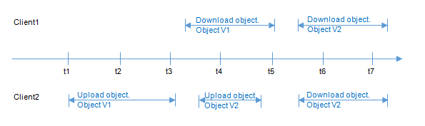

# Concurrent Operation Consistency

After a success message is returned in response to a client's write or deletion request, the client can obtain the latest data. If a client that initiates a write request times out in waiting for a response, or the server returns HTTP response status code 500 or 503, the subsequent read operations may fail. If such an error occurs, check whether the data has been successfully uploaded to the server. If the data is not uploaded successfully, upload the data again.

If multiple clients simultaneously upload, query, or delete the same object or container, these operations may reach the system at different points in time and experience different internal processing latency periods. Therefore, different results may be returned. For example, if multiple clients simultaneously upload the same object, the latest upload request received by the system will replace the previous one. If you want to prevent an object from being accessed in parallel, you must use a lock mechanism in upper-layer applications.

## Concurrent Operation Examples

1. When client 1 is uploading an object v1, client 2 is uploading an object v2 with the same name. After the successful uploads, both client 1 and client 2 can access the latest object data v2, as shown in  [Figure 1](#fig4459805310921).

**Figure  1**  Concurrent upload of the same object  

2. When client 1 is uploading an object v1 and object metadata is not written yet, client 2 deletes an object with the same name. In this scenario, the upload operation of client 1 is still successful, and both client 1 and client 2 can access data object v1, as shown in  [Figure 2](#fig3299670821312).

**Figure  2**  Concurrent upload and deletion of the same object \(1\)  
.png "concurrent-upload-and-deletion-of-the-same-object-(1)")

3. When client 1 has successfully uploaded an object v1 and object metadata is still being written, client 2 deletes an object with the same name. In this scenario, the upload operation of client 1 is still successful. However, when client 1 and client 2 attempt to download Object1, they may be able to access data object v1, or an error may be returned indicating that the object does not exist, as shown in  [Figure 3](#fig25082997203710).

**Figure  3**  Concurrent upload and deletion of the same object \(2\)  
.png "concurrent-upload-and-deletion-of-the-same-object-(2)")

4. When client 1 is downloading an object, client 2 deletes an object with the same name. In this scenario, client 1 may have downloaded a full copy or only part of the object data. After a deletion success message is returned to client 2, an attempt to download the object will fail, and an error will be returned indicating that the object does not exist, as shown in  [Figure 4](#fig402823822155).

**Figure  4**  Concurrent download and deletion of the same object  

5. When client 1 is downloading an object, client 2 is updating an object with the same name. In this scenario, client 1 may have downloaded a full copy or only part of the object data. After an update success message is returned to client 2, an attempt to download the object will succeed, and the latest data will be returned, as shown in  [Figure 5](#fig37505701165838).

**Figure  5**  Concurrent download and update of the same object  

