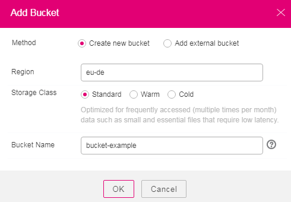

# Adding a Bucket

A bucket is a container that stores objects in OBS. Before you store data in OBS, you need to create a bucket first.

> **NOTE:** 
>On OBS Console, an account can have 100 buckets. There is no such upper limit if you use the API or other methods to create buckets. However, these buckets also take up the bucket quota on OBS Console.

## Procedure

1.  Log in to OBS Browser.
2.  Click  **Add Bucket**  on the upper left of the page. The  **Add Bucket**  dialog box is displayed.
3.  Select  **Create new bucket**.
4.  Select a region.
5.  Select the Storage Class according to your actual needs.
6.  Enter a name in the text box of  **Bucket Name**. You can move the pointer over    next to the  **Bucket Name**  text box to view the naming rules for a bucket.

    **Figure  1**  Adding a bucket  
    

7.  Click  **OK**.
8.  In the displayed dialog box, click  **Close**  to close the dialog box.

