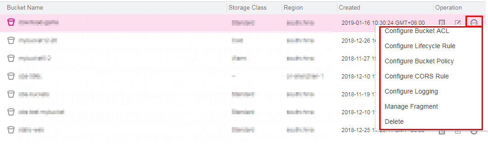

# Bucket Management Methods

OBS Browser supports three methods of bucket management.

1.  You can click the button above the bucket list to manage buckets.

    Also, you can click the blank area in the row where the bucket to be managed resides, and you can manage the bucket using the buttons displayed above the bucket list. For details, see  [Figure 1](#fcd32b0f2cd294fdaaa01e93655c90137).

    **Figure  1**  First method of managing buckets  
    

2.  Click the operation buttons in the row of the bucket to be managed.

    Click the operation buttons in the row of the bucket to be managed. For details, see  [Figure 2](#fig46223652173138).

    **Figure  2**  Second method of managing buckets  
    

3.  Right-click the blank area in the row where the bucket to be managed resides.

    Right-click the blank area in the row where the bucket to be managed resides. A shortcut menu is displayed for managing the bucket. For details, see  [Figure 3](#fig40567659173352).

    **Figure  3**  Third method of managing buckets  
    

