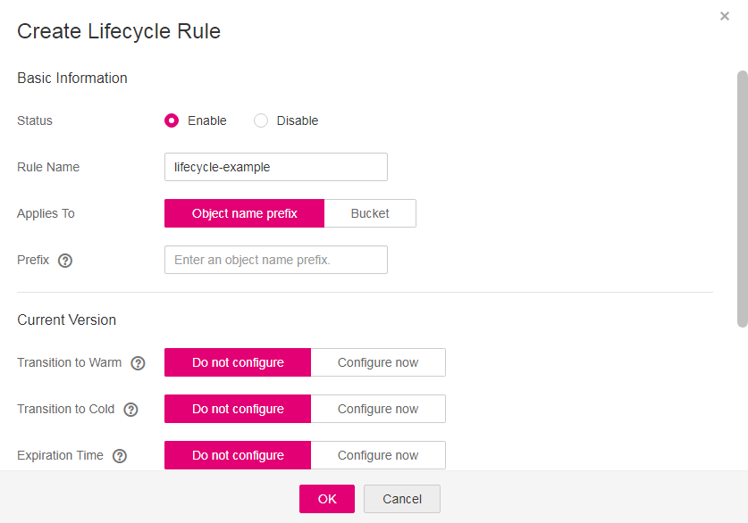

# Configuring a Lifecycle Rule

You can configure the lifecycle rule for a bucket or an object. You can transition the storage class of an object from Standard to Warm or Cold, or from Warm to Cold. However, an object in the Cold storage class cannot be transitioned to other storage classes by configuring the lifecycle rule.

## Procedure

1.  In the bucket list, click the bucket to be operated. The  **Summary**  page of the bucket is displayed.
2.  In the  **Basic Configurations**  area, click the  **Lifecycle Rules**  label. The  **Lifecycle Rules**  page is displayed.

    Alternatively, you can choose  **Basic Configurations**  \>  **Lifecycle Rules**  in the navigation pane on the left.

3.  Click  **Create**. A dialog box is displayed in  [Figure 1](#fig30958876193536).

    **Figure  1**  Creating a lifecycle rule  
    

4.  Configure a lifecycle rule.

    Configure the basic information.

    -   **Status**: 

        Select  **Enable**  to enable the lifecycle rule.

    -   **Rule Name**: 

        Identify lifecycle rules. The  **Rule Name**  contains a maximum of 255 characters.

    -   **Applies To**: Can be set to  **Object name prefix**  or  **Bucket**.
        -   **Object name prefix**: Objects that have the specified prefix will be managed by the lifecycle rule. The prefix cannot start with a slash \(/\), cannot have consecutive slashes \(/\), and cannot contain the following special characters:  **\\:\*?"<\>|**
        -   **Bucket**: All objects in the bucket will be managed by the lifecycle rule.

    > **NOTE:**   
    >-   When  **Object name prefix**  is selected and the specified prefix and the prefix of an existing lifecycle rule overlap, OBS regards the two rules as one and disables the one to be configured. For example, if a rule with prefix  **abc**  exists in the system, another rule whose prefix starts with  **abc**  cannot be configured.  
    >-   If a lifecycle rule whose  **Applies To**  is set to  **Object name prefix**  has been configured, you cannot configure a lifecycle rule whose  **Applies To**  is set to  **Bucket**.  
    >-   If a lifecycle rule has been configured for the entire bucket, no more rules apply to object name prefix can be added.  

    **Current Version**  or  **Historical Version**:

    -   **Transition to Warm**: You can specify the number of days after which objects that have been last updated and meet specified conditions are automatically transitioned to  **Warm**. This number must be at least 30.
    -   **Transition to Cold**: You can specify the number of days after which objects that have been last updated and meet specified conditions are automatically transitioned to  **Cold**. If objects are configured to be transitioned to both  **Warm**  and  **Cold**, the number of days for transition to  **Cold**  must be at least 30 days later than that for transition to  **Warm**. If only transition to Cold is enabled and transition to  **Warm**  is disabled, there is no limit on the number of days for transition.
    -   Deleted upon expiration: You can specify the number of days after which objects that have been last updated and meet the specified conditions are automatically deleted. The expiration time must be greater than the two transition times.

        > **NOTE:**   
        >-   **Current Version**  and  **Historical Version**  are two concepts for  **Versioning**. If  **Versioning**  is enabled, uploading objects with the same name to the same path generates different versions. The object uploaded lastly is called  **Current Version**, and the object uploaded earlier is called  **Historical Version**.  
        >-   You can configure either, both, or neither of the versions.  

    For example, the following files are stored in OBS on January 7, 2015:

    -   log/test1.log
    -   log/test2.log
    -   doc/example.doc
    -   doc/good.txt

    The following files are stored in OBS on January 10, 2015:

    -   log/clientlog.log
    -   log/serverlog.log
    -   doc/work.doc
    -   doc/travel.txt

        If the expiration time of objects prefixed with  **log**  is set to January 11, 2015 on January 10, 2015, OBS will delete objects  **log/test1.log**,  **log/test2.log**,  **log/clientlog.log**, and  **log/serverlog.log**  on January 12, 2015.

        On the current day, if you set the objects with the name prefix  **log**  to be transitioned to  **Warm**  30 days later, transitioned to  **Cold**  60 days later, and deleted 100 days later, then OBS will transition  **log/clientlog.log**,  **log/serverlog.log**,  **log/test1.log**, and  **log/test2.log**  to  **Warm**  on the 31st day, transition them to  **Cold**  the 61st day, and delete them on the 101st day.

    > **NOTE:**   
    >The storage class transition and deletion of an object may be delayed after the time condition is met. Generally, the delay does not exceed 48 hours.  

5.  Click  **OK**  to complete the lifecycle rule configuration.

## Follow-up Procedure

You can click  **Edit**  under the  **Operation**  column of a lifecycle rule, to edit the rule. Also you can click  **Disable**  or  **Enable**  to disable or enable it.

If you want to delete more than one lifecycle rules at a time, select them and click  **Delete**  above the list.

