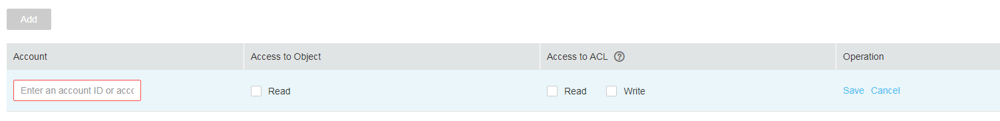

# Configuring Object ACL

## Procedure

1.  In the bucket list, click the bucket to be operated. The  **Summary**  page of the bucket is displayed.
2.  In the navigation pane on the left, click  **Objects**.
3.  Click the object to be operated.
4.  On the  **Object ACL**  tab, click  **Edit**  to set ACL permissions of the  **Owner**,  **Anonymous User**, and  **Registered User**  for the target object.

    > **NOTE:**   
    >If the object is encrypted, the ACL permission cannot be configured for registered users and anonymous users.  

5.  **Optional**: Click  **Add**. For details, see  [Figure 1](#fig3474335195326).

    Enter a value of  **Account ID**  or  **Account Name**  of a specific user and set the user's ACL permissions. You can obtain  **Account ID**  or  **Account Name**  on the  **My Credentials**  page.  **Account ID**  and  **Account Name**  correspond to the  **Domain ID**  and  **Domain Name**  respectively on the  **My Credential**  page..

    **Figure  1**  Adding ACL permissions for objects  
    

6.  Click  **Save**.

