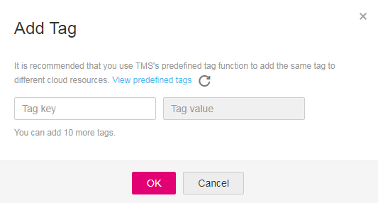

# Configuring Tags

You can add tags to a bucket when creating the bucket. For details, see  [Creating a Bucket](creating-a-bucket-(getting-started).md). Also you can add tags to a bucket after it has been created. This topic describes how to add tags to a bucket after it has been created.

## Procedure

1.  In the bucket list, click the bucket to be operated. The  **Summary**  page of the bucket is displayed.
2.  In the  **Basic Configurations**  area, click the  **Tags**  label. The  **Tags**  page is displayed.

    Alternatively, you can choose  **Basic Configurations**  \>  **Tags**  in the navigation pane on the left.

3.  Click  **Add Tag**. The  **Add Tag**  dialog box is displayed. See  [Figure 1](#fig8687910182820)  for details.

    **Figure  1**  Add Tag  
    

4.  Set the key and value based on  [Table 1](#table13674114016216).

    **Table  1**  Parameter description

    
    <table><thead align="left"><tr id="row1467464018219"><th class="cellrowborder" valign="top" width="18.8%" id="mcps1.2.3.1.1">
Parameter

    </th>
    <th class="cellrowborder" valign="top" width="81.2%" id="mcps1.2.3.1.2">
Description

    </th>
    </tr>
    </thead>
    <tbody><tr id="row1674164010218"><td class="cellrowborder" valign="top" width="18.8%" headers="mcps1.2.3.1.1 ">
Key

    </td>
    <td class="cellrowborder" valign="top" width="81.2%" headers="mcps1.2.3.1.2 ">
Specifies the key of the tag. Each tag of a bucket has a unique key. The value of the key can be self-defined or predefined by TMS.

    
A tag key must comply with the following naming rules:

    <ul id="ul1868918402218"><li>Must contain 1 to 36 characters.</li><li>Only digits, letters, underscores (_), hyphens (-) are allowed.</li></ul>
    </td>
    </tr>
    <tr id="row1668974010210"><td class="cellrowborder" valign="top" width="18.8%" headers="mcps1.2.3.1.1 ">
Value

    </td>
    <td class="cellrowborder" valign="top" width="81.2%" headers="mcps1.2.3.1.2 ">
Specifies the value of the tag. Tags of a bucket can have repetitive or blank values.

    
The tag value must comply with the following naming rules:

    <ul id="ul96891340162118"><li>Must contain 0 to 43 characters.</li><li>Only digits, letters, underscores (_), hyphens (-) are allowed.</li></ul>
    </td>
    </tr>
    </tbody>
    </table>

5.  Click  **OK**.

    It takes approximately 3 minutes for the tag to take effect.

## Related Operations

To modify the tag configuration, edit  **Value**  of the tag. You can also click  **Delete**  next to a tag to delete the tag.

