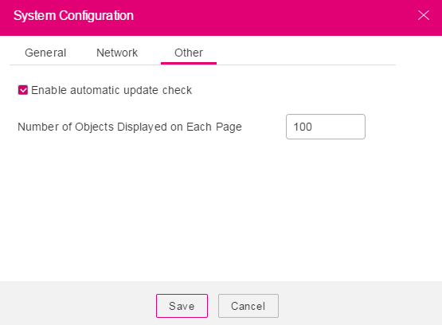

# Configuring the System

This section describes how to modify system configurations.

## Procedure

1.  Log in to OBS Browser.
2.  In the upper right corner of OBS Browser, click    and choose  **System Configuration**. The  **System Configuration**  dialog box is displayed, see  [Figure 1](#fig42068739173655).

    **Figure  1**  Configuring the system  
    

3.  Click  **General**  and modify basic parameters as required.

    [Table 1](#t5b000a761ce742d3a008e78296aa7e23)  describes the parameters that can be modified.

    **Table  1**  General configuration parameters

    
    <table><thead align="left"><tr id="rfc94c5f5c90a40ad972e6d88fa20f45b"><th class="cellrowborder" valign="top" width="28.000000000000004%" id="mcps1.2.3.1.1">
Parameter

    </th>
    <th class="cellrowborder" valign="top" width="72%" id="mcps1.2.3.1.2">
Description

    </th>
    </tr>
    </thead>
    <tbody><tr id="rdb7f5ea2a4d74adf91a7682afdb7f55a"><td class="cellrowborder" valign="top" width="28.000000000000004%" headers="mcps1.2.3.1.1 ">
Enable HTTPS

    </td>
    <td class="cellrowborder" valign="top" width="72%" headers="mcps1.2.3.1.2 ">
If this option is selected, all communication information is encrypted and transferred to OBS over HTTPS.

    </td>
    </tr>
    <tr id="row4738349017324"><td class="cellrowborder" valign="top" width="28.000000000000004%" headers="mcps1.2.3.1.1 ">
Enable certificate verification

    </td>
    <td class="cellrowborder" valign="top" width="72%" headers="mcps1.2.3.1.2 ">
When this option is selected, the client will verify the server certificate.

    </td>
    </tr>
    <tr id="row19413122016318"><td class="cellrowborder" valign="top" width="28.000000000000004%" headers="mcps1.2.3.1.1 ">
Enable KMS encryption

    </td>
    <td class="cellrowborder" valign="top" width="72%" headers="mcps1.2.3.1.2 ">
When <strong id="a22ebe824789d43b597a5225cea7fc452">Enable HTTPS</strong> and <strong id="a2444a51a15c24295b5cc3d329a370b7e">Enable KMS encryption</strong> are selected, KMS encryption will be implemented for all objects uploaded to OBS.

    </td>
    </tr>
    <tr id="r9d15bd3a61304c50b4a10db1b16925a0"><td class="cellrowborder" valign="top" width="28.000000000000004%" headers="mcps1.2.3.1.1 ">
Multipart Upload, Part Size (MB)

    </td>
    <td class="cellrowborder" valign="top" width="72%" headers="mcps1.2.3.1.2 ">
Objects whose size is larger than the specified part size (5 MB by default) are segmented and uploaded at the OBS background. The size of each part can be set in this dialog box. The value of <strong id="b2101885531161958">Part Size (MB)</strong> can range from 5 MB to 5 GB.

    
 NOTE: 

Multipart upload is used by default. Recommended settings of <strong id="b35010965113018">Part Size (MB)</strong> are as follows:

    
To maximize client performance, set <strong id="a4b013af2e67c4b0a9010deead1b30e9b">Part Size (MB)</strong> based on the upload speed. You are advised to set the <strong id="b1353816100111817">Part Size (MB)</strong> value larger than the maximum upload speed. For example, if the maximum upload speed is 10 MB/s, set <strong id="a7d866fbffd3a406794b97a2bc6280517">Part Size (MB)</strong> to an integer greater than 10 MB. It is recommended that the part size be set to a value two to three times the maximum upload speed.

    

    </td>
    </tr>
    <tr id="r88b5ad2d934b424f8e157781e9436d43"><td class="cellrowborder" valign="top" width="28.000000000000004%" headers="mcps1.2.3.1.1 ">
Max Number of Upload Tasks

    </td>
    <td class="cellrowborder" valign="top" width="72%" headers="mcps1.2.3.1.2 ">
Specifies the maximum number of upload tasks. Enter an integer ranging from 2 to 20.

    </td>
    </tr>
    <tr id="rb637bccab7c44ddcb9b24df68c58d0ec"><td class="cellrowborder" valign="top" width="28.000000000000004%" headers="mcps1.2.3.1.1 ">
Max Number of Download Tasks

    </td>
    <td class="cellrowborder" valign="top" width="72%" headers="mcps1.2.3.1.2 ">
Specifies the maximum number of download tasks. Enter an integer ranging from 5 to 50.

    </td>
    </tr>
    </tbody>
    </table>

4.  Click  **Network**  and set proxy server information as required. See  [Figure 2](#fig543149173827).

    **Figure  2**  Network configurations  
    

    **Table  2**  Network configuration parameters

    
    <table><thead align="left"><tr id="r0490806c5cb5479da3ea9bc271e9302b"><th class="cellrowborder" valign="top" width="26%" id="mcps1.2.3.1.1">
Parameter

    </th>
    <th class="cellrowborder" valign="top" width="74%" id="mcps1.2.3.1.2">
Description

    </th>
    </tr>
    </thead>
    <tbody><tr id="r5d619d0924594f0ea5a7e192c9512dce"><td class="cellrowborder" valign="top" width="26%" headers="mcps1.2.3.1.1 ">
Enable proxy

    </td>
    <td class="cellrowborder" valign="top" width="74%" headers="mcps1.2.3.1.2 ">
If this option is selected, the <strong id="ada6624bfe80a43b5a6acf143ba321586">Authentication</strong> option is displayed. Set the following parameters to access OBS through the proxy server:

    <ul id="u12af2c34ad70412eb298ce10202467ec"><li>Address: domain name or IP address of the proxy server</li><li>Port: port of the proxy server (default port is <strong id="a99cd61de49444b87b58e1a743cf16cd2">8080</strong>)</li></ul>
    </td>
    </tr>
    </tbody>
    </table>

5.  Click  **Other**  and set the parameters as required. For details, see  [Figure 3](#fig2876079495946).

    **Figure  3**  Other configurations  
    

    **Table  3**  Other parameters

    
    <table><thead align="left"><tr id="rb8a4d9d54d524899bcc64f29d2f08ff2"><th class="cellrowborder" valign="top" width="50%" id="mcps1.2.3.1.1">
Parameter

    </th>
    <th class="cellrowborder" valign="top" width="50%" id="mcps1.2.3.1.2">
Description

    </th>
    </tr>
    </thead>
    <tbody><tr id="re13f6930f0be4e25bd9c8468b8047b12"><td class="cellrowborder" valign="top" width="50%" headers="mcps1.2.3.1.1 ">
Enable automatic update check

    </td>
    <td class="cellrowborder" valign="top" width="50%" headers="mcps1.2.3.1.2 ">
If this option is selected, each time when you log in to OBS Browser, a check will be automatically performed to determine whether the current software version is the latest.

    </td>
    </tr>
    <tr id="re936197711a94bde9f51b425081d8979"><td class="cellrowborder" valign="top" width="50%" headers="mcps1.2.3.1.1 ">
Number of Objects Displayed on Each Page

    </td>
    <td class="cellrowborder" valign="top" width="50%" headers="mcps1.2.3.1.2 ">
Set the number of objects that are displayed on each page. The default value is 100. The value ranges from 50 to 300. After setting the value, click the  button in the upper right corner of the page so that the setting takes effect.

    </td>
    </tr>
    </tbody>
    </table>

6.  Click  **Save**  to save the system configuration.

