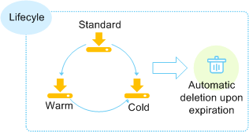

# Lifecycle Management Overview

Lifecycle management means periodically deleting objects in a bucket or transitioning between object storage classes by configuring rules.

**Figure  1**  Lifecycle management  

Lifecycle management applies to the following scenarios:

-   Some periodically uploaded files need only to be retained for one week or one month, and can be deleted once they have expired.
-   Documents are seldom accessed after a certain period of time. These files need to be transitioned to  **Warm**  or  **Cold**  storage or be deleted.

You can define lifecycle rules for identifying objects and manage lifecycles of the objects based on the rules.

Objects that are no longer frequently accessed can be transitioned to  **Warm**  or  **Cold**, saving your costs. In short, transition basically means that the object storage class is altered without copying the object. You can also manually change the storage class of an object on the Objects page. For details, see  [Uploading a File](uploading-a-file.md).

Lifecycle rules have two key elements:

-   Configuration policy:

    You can also specify the prefix of object names so that objects whose names have this prefix are restricted by the rules. You can configure a lifecycle rule for a bucket so that all objects in the bucket can be restricted by the lifecycle rule.

-   Time: You can specify the number of days after which objects that have been last updated and meet specified conditions are automatically transitioned to Warm, Cold, or expire and are then automatically deleted.
    -   **Transition to Warm**: You can specify the number of days after which objects that have been last updated and meet specified conditions are automatically transitioned to  **Warm**.
    -   **Transition to Cold**: You can specify the number of days after which objects that have been last updated and meet specified conditions are automatically transitioned to  **Cold**.
    -   Expiration time: You can specify the number of days after which objects are automatically deleted or the day after which an object that matches with a rule is deleted.

The previous number of days for objects to be transitioned to  **Warm**  is at least 30. If objects are configured to be transitioned to both  **Warm**  and  **Cold**, the number of days for transition to  **Cold**  must be at least 30 days later than that for transition to  **Warm**. For example, if the number of days for transition to  **Warm**  is 33, that for transition to  **Cold**  must be 63 at least. If only transition to  **Cold**  is enabled and transition to  **Warm**  is disabled, there is no limit on the number of days for transition. The expiration time must be greater than the two transition times.

