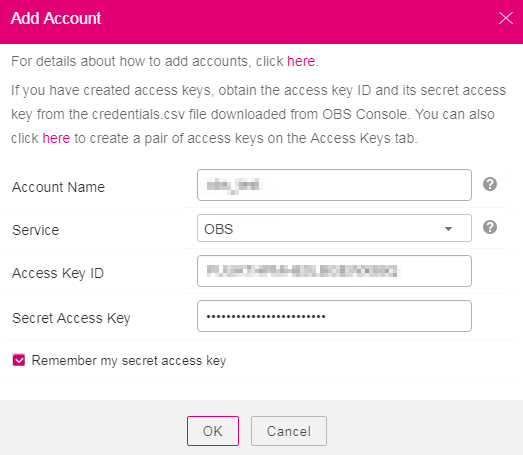
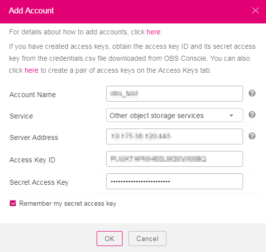

# Managing Accounts

Account names on OBS Browser are used to distinguish one from another, which are irrelevant to the registered cloud service account. An OBS Browser account has one pair of AK and SK, but a pair of AK and SK can be used by multiple OBS Browser accounts. A maximum of 10 accounts can be added to OBS Browser.

OBS Browser uses the AK and SK for identity authentication. AKs and SKs are the access keys created by on the management console \(on  **My Credential**  page\) by cloud service accounts and IAM users. For details, see  [Creating Access Keys \(AK and SK\)](creating-access-keys-(ak-and-sk).md).

1.  AKs and SKs are required for logging in to OBS Browser to access OBS resources.
2.  Once an AK and SK are entered, IAM receives the AK and SK, finds the cloud service account or IAM user that own the pair of AK and SK, and checks which OBS permissions the account or IAM user has.
3.  Then IAM authorizes the user who tries to log in to OBS Browser the OBS permissions accordingly.
4.  The user can access OBS resources through OBS Browser.

## Add an Account

1.  Log in to OBS Browser.
2.  In the upper right corner of OBS Browser, click the account name, and select  **Manage Account**.
3.  In the  **Manage Account**  dialog box that is displayed, click  **Add Account**.
4.  In the  **Add Account**  dialog box, enter the account information.

    The account information includes the following parameters:

    -   Account name: The account name is used only to uniquely identify an account and can be different from the OBS account registered with the cloud services. The account name cannot exceed 50 characters.
    -   Service: OBS Browser can connect to  **OBS**  or  **Other object storage services**.
        -   When accessing OBS, select  **OBS**. For details, see  [Figure 1](#f7b99ff29dc1543b4b16e69c9db5bd5af).

            **Figure  1**  Add a new account - OBS  
            

        -   When connecting to other object storage services, select  **Other object storage services**. For details, see  [Figure 2](#f8c588f27619148c78257359a12e609a7).

            Specify  **Server Address**. You can enter the IP address or domain name in the following format:  _server IP address or domain name:server port_  \(the protocol port of HTTPS is  **443**  and that of HTTP is  **80**\). The HTTPS server is used by default. If you want to use the HTTP server, click    in the upper right corner and click  **System Configuration**. In the  **System Configuration**  dialog box that is displayed, deselect  **Enable HTTPS**.

            **Figure  2**  Adding a new account - Other object storage services  
            

    -   AK and SK: Enter the AK and SK created on the  **My Credential**  page after you register with a cloud service. For details about how to obtain AKs and SKs, see  [Creating Access Keys \(AK and SK\)](creating-access-keys-(ak-and-sk).md).
    -   **Remember my secret access key**  is selected by default. If you do not select  **Remember my secret access key**, you must input the secret access key each time you log in to OBS Browser.

5.  Click  **OK**.

    After saving the account information, you can click the account name in the upper corner of the page and the newly added account is displayed in the account name drop-down list. You can click the desired account to switch to that account from the current login account.

## Edit an Account

1.  Log in to OBS Browser.
2.  In the upper right corner of OBS Browser, click the account name, and select  **Manage Account**.
3.  Click  **Edit**  in the row where the desired account resides.
4.  Modify account information as required.
5.  Click  **OK**  to save the modification.

## Deleting an Account

1.  Log in to OBS Browser.
2.  In the upper right corner of OBS Browser, click the account name, and select  **Manage Account**.
3.  Click  **Delete**  in the row where the desired account resides.
4.  Click  **OK**  and the account is deleted.

