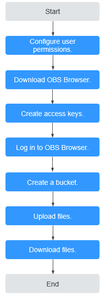

# Process Description

The follow-up sections describe how to complete the following tasks illustrated in  [Figure 1](#fig161520481729).

**Figure  1**  OBS Browser flowchart  

Click    in the upper right of the page, or right-click the bucket list or object list and choose  **Refresh**  to refresh the OBS Browser page.

