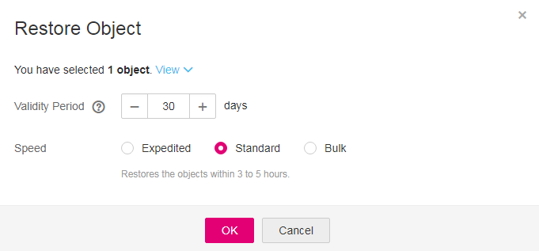

# Restoring a Cold File on OBS

You need to restore a  **Cold**  object before downloading it, accessing it using its URL, or setting ACL permissions or object metadata for it.

## Restrictions and Limitations

-   If a  **Cold**  object is in the  **Restoring**  state, you cannot suspend or delete the restoration task.
-   You cannot re-restore an object that is in the  **Restoring**  state.
-   After an object is restored, a copy of the object is generated and saved in the Standard storage class. In this way, the object in the Cold storage class and its copy in the Standard storage class co-exist in the bucket. The copy will be automatically deleted upon expiration of its validity period.

## Procedure

1.  In the bucket list, click the bucket to be operated. The  **Summary**  page of the bucket is displayed.
2.  In the navigation pane on the left, click  **Objects**.
3.  Select the file you want to restore, and click  **Restore**  on the right. The following dialog box shown in  [Figure 1](#fig37793164192736)  is displayed.

    You can select multiple files and click  **Restore**  above the file list to batch restore the files.

    > **NOTE:**   
    >Objects that are being restored cannot be added for batch restoration.  

    **Figure  1**  Restoring an object  
    

4.  Before restoring objects, you need to configure the validity period and restoration speed of the objects. The following table describes the parameters.

    **Table  1**  Parameters for restoring objects

    
    <table><thead align="left"><tr id="row20202933164622"><th class="cellrowborder" valign="top" width="23.68%" id="mcps1.2.3.1.1">
Parameter

    </th>
    <th class="cellrowborder" valign="top" width="76.32%" id="mcps1.2.3.1.2">
Description

    </th>
    </tr>
    </thead>
    <tbody><tr id="row63287564164622"><td class="cellrowborder" valign="top" width="23.68%" headers="mcps1.2.3.1.1 ">
Validity Period

    </td>
    <td class="cellrowborder" valign="top" width="76.32%" headers="mcps1.2.3.1.2 ">
Time duration when an object remains in the <strong id="b105713101419">Restored</strong> state after being restored. The timing starts as the object restoration is completed. The value is an integer ranging from 1 to 30 (days). The default value is 30.

    
For example, you set <strong id="b39195835171853">Validity Period</strong> to <strong id="b17218197171853">20</strong> when restoring an object. After 20 days starting from the time when the object is successfully restored, the object's status will change from <strong id="b34084818146">Restored</strong> to <strong id="b193925342113658">Unrestored</strong>.

    </td>
    </tr>
    <tr id="row53182611164622"><td class="cellrowborder" valign="top" width="23.68%" headers="mcps1.2.3.1.1 ">
Speed

    </td>
    <td class="cellrowborder" valign="top" width="76.32%" headers="mcps1.2.3.1.2 ">
Restoration speed of an object.

    <ul id="ul20730162164622"><li><strong id="b1582157145911">Expedited</strong>: Allows you to restore the Cold objects within 1 to 5 minutes.</li><li><strong id="b0591717204614">Standard</strong>: Allows you to restore your cold objects within 3 to 5 hours.</li><li><strong id="b1759418742113726">Bulk</strong>: Bulk retrievals are the lowest-cost retrieval option of OBS, enabling you to retrieve large amounts, even petabytes, of data in a day at a low cost. Bulk retrievals typically complete within 5 to 12 hours.</li></ul>
    </td>
    </tr>
    </tbody>
    </table>

5.  Click  **OK**.

    The  **Restoration Status**  column in the objects list displays the restoration statuses of objects.

    You can click the    to manually refresh the restoration status.

    > **NOTE:**   
    >The system checks the file restoration status once a day at UTC 00:00. The expiration time is counted starting from the time when the last check is complete.  

## Follow-up Procedure

Within the validity period of an object, you can repeatedly restore the object. The validity period of the object is counted starting from the time when the latest restoration is completed. By doing so, you can prolong the validity period of an object.

> **NOTE:**   
>If an object is to be restored for a second time, the expiration time set for the second restoration must be later than that set for the first restoration.  

