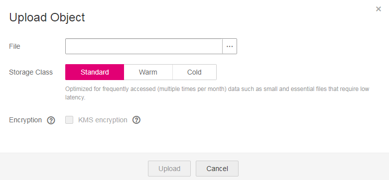

# Uploading a File

This section describes how to upload local files to OBS over the Internet. These files can be texts, images, videos, or any other type of files.

> **NOTE:**   
>You can upload a file of up to 50 MB using OBS Console.  
>If versioning is disabled and the name of a newly uploaded file is the same as that of a file in the bucket, the newly uploaded file automatically overwrites the existing file and does not retain the ACL information of the existing file. If the name of the newly uploaded folder is the same as that of a folder in the bucket, the two folders will be merged, and files in the new folder will overwrite namesake files in the old folder.  
>If versioning is enabled and the name of a newly uploaded file is the same as that of a file in the bucket, a new version is added to the existing file. For details about versioning, see  [Versioning Overview](versioning-overview.md).  

## Prerequisites

-   At least one bucket has been created.
-   If you want to classify files, you can create folders and upload files to different folders. For details about how to create a folder, see  [Creating a Folder](creating-a-folder-(console).md)

## Procedure

1.  In the bucket list, click the bucket to be operated. The  **Summary**  page of the bucket is displayed.
2.  In the navigation pane on the left, click  **Objects**.
3.  Go to the folder to which objects are uploaded. Click  **Upload Object**. The  **Upload Object**  dialog box is displayed.

    > **NOTE:**   
    >If the files to be uploaded to OBS are stored in Microsoft OneDrive, it is recommended that the names of these files contain a maximum of 32 characters.  

    **Figure  1**  Uploading objects  
    

4.  Click    to open the local file browser dialog box.
5.  Select the file that you want to upload and click  **Open**.
6.  Select a storage class. If no storage class is selected, the file will inherit the storage class of the bucket.
7.  **Optional**: Select KMS encryption to encrypt the uploaded file. For details, see  [Uploading a File with Server-Side Encryption](uploading-a-file-with-server-side-encryption-(console).md).
8.  Click  **Upload**.

