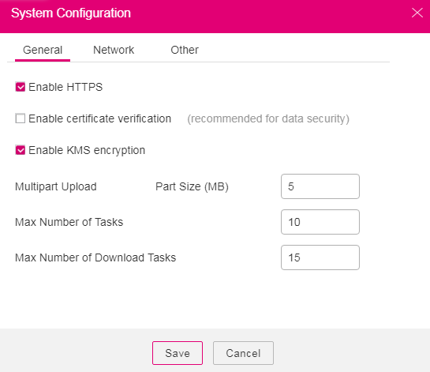
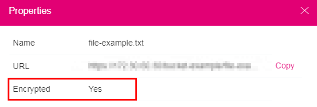

# Uploading a File with Server-Side Encryption

OBS allows users to encrypt objects using server-side encryption so that the objects can be securely stored in OBS.

## Prerequisites

In the region where the OBS is deployed, add the  **KMS Administrator**  permission to the user group. For details about how to add permissions, see the  _IAM User Guide_.

## Procedure

1.  Log in to OBS Browser.
2.  In the upper right corner on the page, click  .
3.  Choose  **System Configuration**  \>  **General**. For details, see  [Figure 1](#fdd58a926a65c4dc39d5a7be42a9bb60c).

    **Figure  1**  Configuring KMS encryption  
    

4.  Select  **Enable HTTPS**  and  **Enable KMS encryption**.
5.  Click  **Save**.
6.  Verify the encryption status.

    After HTTPS and KMS encryption are enabled, objects uploaded to OBS are encrypted with keys provided by KMS. By default, the key  **obs/default**  is selected for encryption.

    After objects are uploaded, click    on the right of the object list. In the  **Properties**  dialog box that is displayed, you can view the object encryption status.  **Yes**  indicates that server-side encryption has been implemented for the object.  **No**  indicates that server-side encryption has not been implemented for the object. The object encryption status cannot be changed.

    > **NOTE:**   
    >HTTPS must be enabled when you enable KMS encryption to upload objects. Therefore, if you deselect  **Enable HTTPS**,  **Enable KMS encryption**  is deselected automatically.  

    **Figure  2**  Encryption status  
    

    > **NOTE:**   
    >-   Server-side encryption does not support HTTP. To use server-side encryption, enable HTTPS.  
    >-   A key in use cannot be deleted. Otherwise, the object encrypted with this key cannot be downloaded.  

