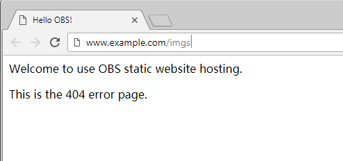

# Using a User-Defined Domain Name to Configure Static Website Hosting<a name="obs_03_0338"></a>

OBS allows you to access static websites hosted by OBS using user-defined domain names. This section uses a specific scenario as an example to describe how to use a user-defined domain name to configure static website hosting. For a basic understanding of the concepts and operations about the static website hosting on OBS, see  [Configuring Static Website Hosting](configuring-static-website-hosting.md).

## Scenario<a name="section9519744162048"></a>

Company  **A**  has a large number of files to archive but it does not want to put the time and effort into its storage resources. Therefore, the company subscribes to OBS for hosting static websites and expects that the usernames under the company account can access the static resources through a user-defined domain name. See  [Figure 1](#fig4961082014460).

**Figure  1**  Using a user-defined domain name to access hosted static website<a name="fig4961082014460"></a>  


## Operation Process<a name="section66351230165353"></a>

You need to create a bucket named with a user-defined domain name on OBS Console to store static website resources, enable the static website hosting for the bucket, and create and configure domain name hosting using the Domain Name Service \(DNS\). The following describes details about the process:

1.  [Register a domain name.](#li60359246145535)
2.  [Create a bucket.](#li3389392914569)
3.  [Upload static website files.](#li40840329145633)
4.  [Configure static website hosting on OBS.](#li55012967145655)
5.  [Create and configure domain name hosting.](#li25854022145746)
6.  [Verification](#li52936006101225)

## Data Planning<a name="section25592940165428"></a>

[Table 1](#table519146461490)  describes the data to be planned before this configuration.

**Table  1**  Data planning

<a name="table519146461490"></a>
<table><thead align="left"><tr id="row609262061490"><th class="cellrowborder" valign="top" width="26.94269426942694%" id="mcps1.2.4.1.1"><p id="p562454241490"><a name="p562454241490"></a><a name="p562454241490"></a>Item</p>
</th>
<th class="cellrowborder" valign="top" width="39.72397239723972%" id="mcps1.2.4.1.2"><p id="p595854991490"><a name="p595854991490"></a><a name="p595854991490"></a>Description</p>
</th>
<th class="cellrowborder" valign="top" width="33.33333333333333%" id="mcps1.2.4.1.3"><p id="p616960901490"><a name="p616960901490"></a><a name="p616960901490"></a>Example:</p>
</th>
</tr>
</thead>
<tbody><tr id="row183939011490"><td class="cellrowborder" valign="top" width="26.94269426942694%" headers="mcps1.2.4.1.1 "><p id="p135109821490"><a name="p135109821490"></a><a name="p135109821490"></a>User-defined domain name</p>
</td>
<td class="cellrowborder" valign="top" width="39.72397239723972%" headers="mcps1.2.4.1.2 "><p id="p49414949141215"><a name="p49414949141215"></a><a name="p49414949141215"></a>User's own domain name</p>
</td>
<td class="cellrowborder" valign="top" width="33.33333333333333%" headers="mcps1.2.4.1.3 "><p id="p618525371490"><a name="p618525371490"></a><a name="p618525371490"></a>www.example.com</p>
</td>
</tr>
<tr id="row198019231490"><td class="cellrowborder" valign="top" width="26.94269426942694%" headers="mcps1.2.4.1.1 "><p id="p604519691490"><a name="p604519691490"></a><a name="p604519691490"></a>Bucket name</p>
</td>
<td class="cellrowborder" valign="top" width="39.72397239723972%" headers="mcps1.2.4.1.2 "><p id="p647713311490"><a name="p647713311490"></a><a name="p647713311490"></a>The bucket name must be consistent with the user-defined domain name.</p>
</td>
<td class="cellrowborder" valign="top" width="33.33333333333333%" headers="mcps1.2.4.1.3 "><p id="p119864821490"><a name="p119864821490"></a><a name="p119864821490"></a>www.example.com</p>
</td>
</tr>
<tr id="row407694771490"><td class="cellrowborder" valign="top" width="26.94269426942694%" headers="mcps1.2.4.1.1 "><p id="p139933781490"><a name="p139933781490"></a><a name="p139933781490"></a>Static website homepage</p>
</td>
<td class="cellrowborder" valign="top" width="39.72397239723972%" headers="mcps1.2.4.1.2 "><p id="p29426482142545"><a name="p29426482142545"></a><a name="p29426482142545"></a>Indicates the index page that is returned when you access a static website, that is, the homepage.</p>
</td>
<td class="cellrowborder" valign="top" width="33.33333333333333%" headers="mcps1.2.4.1.3 "><p id="p56294761490"><a name="p56294761490"></a><a name="p56294761490"></a>index.html</p>
</td>
</tr>
<tr id="row4170134916222"><td class="cellrowborder" valign="top" width="26.94269426942694%" headers="mcps1.2.4.1.1 "><p id="p1717117492222"><a name="p1717117492222"></a><a name="p1717117492222"></a>404 error page</p>
</td>
<td class="cellrowborder" valign="top" width="39.72397239723972%" headers="mcps1.2.4.1.2 "><p id="p917154919221"><a name="p917154919221"></a><a name="p917154919221"></a>When an incorrect static website path is accessed, the 404 error page is returned.</p>
</td>
<td class="cellrowborder" valign="top" width="33.33333333333333%" headers="mcps1.2.4.1.3 "><p id="p8171124916224"><a name="p8171124916224"></a><a name="p8171124916224"></a>error.html</p>
</td>
</tr>
</tbody>
</table>

-   For example, the content of the  **index.html**  file is as follows:

    ```
    <html>
      <head>
          <title>Hello OBS!</title>
          <meta charset="utf-8">
      </head>
      <body>
          <p>Welcome to use OBS static website hosting.</p>
          <p>This is the homepage.</p>
      </body>
    </html>
    ```

-   For example, the content of the  **error.html**  file is as follows:

    ```
    <html>
      <head>
          <title>Hello OBS!</title>
          <meta charset="utf-8">
      </head>
      <body>
          <p>Welcome to use OBS static website hosting.</p>
          <p>This is the 404 error page.</p>
      </body>
    </html>
    ```


## Procedure<a name="section61661470165443"></a>

1.  <a name="li60359246145535"></a>Register a domain name.

    If you have a registered domain name, skip this step.

    If you do not have a registered domain name, register one with a registrar of your choice. In this scenario, the example domain name  **www.example.com**  is used. In practice, you need to replace the domain name with the one you actually planned.

2.  <a name="li3389392914569"></a>Create a bucket.

    The bucket name must be consistent with the user-defined domain name. Take the  **www.example.com**  domain name in the data plan as an example. You need to create a bucket named  **www.example.com**  by performing the following steps:

    1.  Log in to OBS Console.
    2.  Click  **Create Bucket**  in the upper part of the page.
    3.  Set the following parameters in the dialog box that is displayed:

        -   **Region**: Select a region at your own choice.
        -   **Storage Class**: It is recommended that you select  **Standard**.

            > **NOTE:**   
            >According to different website access frequency and response speed requirements, you can also choose Warm or Cold. For details about storage classes, see  [Storage Classes Overview](storage-classes-overview-(console).md).  

        -   **Bucket Name**: Enter  **www.example.com**.
        -   **Bucket Policy**: Select  **Public Read**  to allow any user to access objects in the bucket.

        [Figure 2](#fig4006065717314)  shows the configuration details.

        **Figure  2**  Creating a bucket<a name="fig4006065717314"></a>  
        

    4.  Click  **Create Now**  to complete the creation.

3.  <a name="li40840329145633"></a>Upload static website files to the bucket.

    Prepare the static website files to be uploaded and repeat the following steps until all static website files are uploaded to bucket  **www.example.com**.

    1.  Click bucket  **www.example.com**  to go to the bucket's  **Overview**  page, and then click  **Objects**  in the navigation pane on the left.
    2.  Click  **Upload Object**. A dialog box is displayed. See  [Figure 3](#fig1759204213351).

        **Figure  3**  Uploading objects<a name="fig1759204213351"></a>  
        

    3.  Click    and select the file to be uploaded.

        > **NOTE:**   
        >-   The static website files cannot be encrypted for upload.  
        >-   Homepage files and 404 error pages must be stored in the root directory of the bucket.  
        >-   If the storage class of a static website file is Cold, you need to restore the static website file before accessing it. For details, see  [Restoring a Cold File on OBS](restoring-a-cold-file-on-obs.md).  

    4.  Click  **OK**  to complete the upload.

4.  <a name="li55012967145655"></a>Configure static website hosting.

    After uploading the static website files, you need to configure the static website hosting function for the bucket.

    > **NOTE:**   
    >You can also redirect the entire static website to another bucket or domain name. For details, see  [Configuring Redirection](configuring-redirection.md).  

    1.  Click the bucket name to go to the  **Overview**  page.
    2.  In the navigation pane on the left, choose  **Basic Configurations**  \>  **Static Website Hosting**. The  **Static Website Hosting**  page is displayed.
    3.  Click  **Configure Static Website Hosting**  to open the dialog box.
    4.  Enable it by turning on the status switch.
    5.  Set  **Hosting By**  to  **Current bucket**. For details, see  [Figure 4](#fig1131112528711).

        **Figure  4**  Configuring static website hosting<a name="fig1131112528711"></a>  
        

        > **NOTE:**   
        >You can also configure redirection rules based on service requirements to implement website content redirection. For details, see  [Configuring Static Website Hosting](configuring-static-website-hosting.md).  

    6.  Set the  **Home Page**  to  **index.html**  as planned, and the  **404 Error Page**  to  **error.html**.
    7.  Click  **OK**.

5.  <a name="li25854022145746"></a>Create and configure domain name hosting.

    To facilitate unified management of your user-defined domain names and static websites and implement cloud-based services, directly manage your user-defined domain names on DNS. After the hosting is configured, you can perform subsequent management of the domain name on DNS, including managing record sets and PTR records, as well as creating wildcard DNS records.

    To create and configure domain name hosting on DNS, perform the following steps:

    1.  Add a public zone.

        Use the root domain name  **example.com**  created in  [Step 1](#li60359246145535)  as the name of the public zone to be created. For details, see the description about "Creating a Public Zone" in section "Managing Public Zones" of the  _Domain Name Service User Guide_.

    2.  Add a CNAME record.

        In DNS, add a record set for the sub-domain name  **www.example.com**  of the hosted domain name, to map the CNAME of the sub-domain name to the static website domain name hosted by OBS.

        -   **Name**: Enter  **www**.
        -   **Type**: Select  **CNAME-Canonical name**.
        -   **TTL\(s\)**: Set it to its default value.

        For details, see the description about "Adding a Record Set" in section "Managing Record Sets" of the  _Domain Name Service User Guide_.

    3.  Change the DNS server address at your domain name registrar.

        At your domain name registrar, change the DNS server address in the NS record of the root domain name to the cloud DNS server address. The specific address is the NS value of the public zone in DNS.

        For details about how to change the addresses of the DNS servers, see the description about "Updating the NS addresses" in section "Public Zone" of the  _Domain Name Service User Guide_.

        > **NOTE:**   
        >The address change will be effective within 48 hours. The actual time taken varies depending on the domain name registrar.  


6.  <a name="li52936006101225"></a>Verify that the configuration is successful.

    -   Enter the following URL in the address box of the browser:  **www.example.com**, to check whether the default homepage can be accessed. See  [Figure 5](#fig37569995102120).

        **Figure  5**  Default homepage<a name="fig37569995102120"></a>  
        

    -   In the web browser, enter a static file access address that does not exist in a bucket. For example:  **www.example.com/imgs**  to verify that the 404 error page \(error.html\) can be returned.  [Figure 6](#fig117531153115316)  displays the error page.

        **Figure  6**  404 error page<a name="fig117531153115316"></a>  
        

    > **NOTE:**   
    >In some conditions, you may need to clear the browser cache before the expected results are displayed.  


## Website Update<a name="section521481451418"></a>

If you need to update a static file, such as a picture, a piece of music, an HTML file, or a CSS file, you can re-upload the static file.

By default, if two files in a path share one name, the newly uploaded file overwrites the original one. To prevent files being overwritten, you can enable the versioning function. Versioning allows you to keep multiple versions of a static file, so that you can retrieve and restore history versions conveniently. With versioning enabled, data can be restored rapidly when accidental operations or application faults occur. For detailed information about versioning, see chapter  [Versioning Overview](versioning-overview.md).

