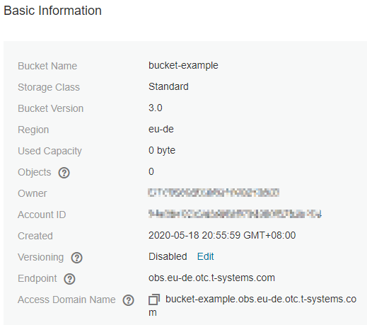

# Viewing Basic Information of a Bucket

On OBS Console, you can view bucket information.

## Procedure

1.  In the bucket list, click the bucket to be operated. The  **Overview**  page of the bucket is displayed.
2.  Under  **Basic Information**, view the basic information of the bucket. For details, see  [Figure 1](#fig4178468919236).

    **Figure  1**  Basic information about the bucket  
    

    **Table  1**  Parameter description

    
    <table><thead align="left"><tr id="row17234060"><th class="cellrowborder" valign="top" width="27%" id="mcps1.2.3.1.1">
Parameter

    </th>
    <th class="cellrowborder" valign="top" width="73%" id="mcps1.2.3.1.2">
Description

    </th>
    </tr>
    </thead>
    <tbody><tr id="row54972569161944"><td class="cellrowborder" valign="top" width="27%" headers="mcps1.2.3.1.1 ">
Bucket Name

    </td>
    <td class="cellrowborder" valign="top" width="73%" headers="mcps1.2.3.1.2 ">
Name of the bucket.

    </td>
    </tr>
    <tr id="row5135578495148"><td class="cellrowborder" valign="top" width="27%" headers="mcps1.2.3.1.1 ">
Storage Class

    </td>
    <td class="cellrowborder" valign="top" width="73%" headers="mcps1.2.3.1.2 ">
Storage class of the bucket, which can be <strong id="b5108171311145">Standard</strong>, <strong id="b122331118131411">Warm</strong>, or <strong id="b3611327121415">Cold</strong>.

    </td>
    </tr>
    <tr id="row5013506492057"><td class="cellrowborder" valign="top" width="27%" headers="mcps1.2.3.1.1 ">
Bucket Version

    </td>
    <td class="cellrowborder" valign="top" width="73%" headers="mcps1.2.3.1.2 ">
Version ID of a bucket. <strong id="b15682102319106">3.0</strong> indicates the latest bucket version, and <strong id="b173851322104">--</strong> indicates versions earlier than 3.0.

    </td>
    </tr>
    <tr id="row2643712415712"><td class="cellrowborder" valign="top" width="27%" headers="mcps1.2.3.1.1 ">
Region

    </td>
    <td class="cellrowborder" valign="top" width="73%" headers="mcps1.2.3.1.2 ">
Region where the bucket resides.

    </td>
    </tr>
    <tr id="row42335644"><td class="cellrowborder" valign="top" width="27%" headers="mcps1.2.3.1.1 ">
Used Capacity

    </td>
    <td class="cellrowborder" valign="top" width="73%" headers="mcps1.2.3.1.2 ">
Total capacity used by objects in the bucket.

    </td>
    </tr>
    <tr id="row5194094"><td class="cellrowborder" valign="top" width="27%" headers="mcps1.2.3.1.1 ">
Objects

    </td>
    <td class="cellrowborder" valign="top" width="73%" headers="mcps1.2.3.1.2 ">
The total number of folders and files, including all versions.

    </td>
    </tr>
    <tr id="row64708738162040"><td class="cellrowborder" valign="top" width="27%" headers="mcps1.2.3.1.1 ">
Owner

    </td>
    <td class="cellrowborder" valign="top" width="73%" headers="mcps1.2.3.1.2 ">
Owner refers to the account that created the bucket.

    </td>
    </tr>
    <tr id="row42411395"><td class="cellrowborder" valign="top" width="27%" headers="mcps1.2.3.1.1 ">
Account ID

    </td>
    <td class="cellrowborder" valign="top" width="73%" headers="mcps1.2.3.1.2 ">
Unique identity of the bucket owner. It is the same as <strong id="b70445470315114">Domain ID</strong> on the <strong id="b188391761615114">My Credential</strong> page.

    </td>
    </tr>
    <tr id="row48992040"><td class="cellrowborder" valign="top" width="27%" headers="mcps1.2.3.1.1 ">
Created

    </td>
    <td class="cellrowborder" valign="top" width="73%" headers="mcps1.2.3.1.2 ">
Time when the creation of a bucket is completed.

    </td>
    </tr>
    <tr id="row015713406208"><td class="cellrowborder" valign="top" width="27%" headers="mcps1.2.3.1.1 ">
Versioning

    </td>
    <td class="cellrowborder" valign="top" width="73%" headers="mcps1.2.3.1.2 ">
Versioning status

    </td>
    </tr>
    <tr id="row43167051153945"><td class="cellrowborder" valign="top" width="27%" headers="mcps1.2.3.1.1 ">
Endpoint

    </td>
    <td class="cellrowborder" valign="top" width="73%" headers="mcps1.2.3.1.2 ">
This parameter specifies the endpoint of the region where the bucket is located. OBS provides an endpoint for each region. An endpoint is a domain name to access OBS in a region and is used to process access requests of that region.

    </td>
    </tr>
    <tr id="row3949727593952"><td class="cellrowborder" valign="top" width="27%" headers="mcps1.2.3.1.1 ">
Access Domain Name

    </td>
    <td class="cellrowborder" valign="top" width="73%" headers="mcps1.2.3.1.2 ">
OBS allocates a default access domain name to each bucket. A domain name is the internet address of a bucket and can be used to access the bucket over the internet. It is applicable to cloud application development and data sharing scenarios.

    
Structure: <em id="i514691914387">BucketName.Endpoint</em>

    </td>
    </tr>
    </tbody>
    </table>

    > **NOTE:** 
    >The statistics of  **Used Capacity**  and  **Objects**  are not real-time data, which are usually updated 15 minutes in delay.

