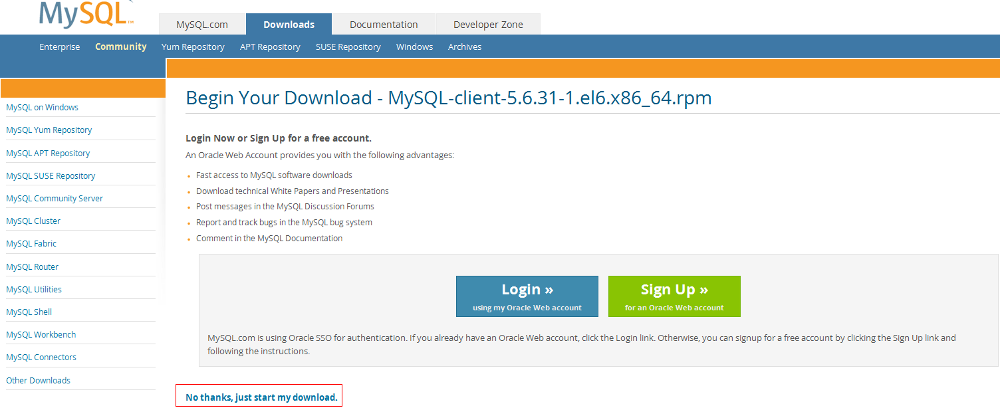

# How Can I Install the MySQL Client?<a name="rds_faq_0027"></a>

MySQL provides client installation packages for different OSs on its official website. MySQL 5.6 is used as an example. Click  [here](http://dev.mysql.com/downloads/mysql/5.6.html#downloads)  to download the MySQL 5.6 client installation package or click  [here](http://downloads.mysql.com/archives/community/)  to download other versions of the packages. The following procedure uses Red Hat Linux OS as an example to illustrate how to obtain the required installation package and install the MySQL client.

## Procedure<a name="s161bbd959f38465787089af10a2d0190"></a>

1.  Obtain the installation package.

    Find the  [link](http://dev.mysql.com/downloads/file/?id=463159)  to the required version on the download page. MySQL-client-5.6.31-1.el6.x86\_64.rpm is used as an example in the following figure.

    **Figure  1**  Procedure<a name="f40223ae411b74068bbe28b35e2c4ba3e"></a>  
    

    > **NOTE:**   
    >Click  **[No thanks, just start my download.](http://dev.mysql.com/get/Downloads/MySQL-5.6/MySQL-client-5.6.31-1.el6.x86_64.rpm)**  to download the installation package.  

2.  Upload the installation package to the ECS.

    > **NOTE:**   
    >When you create an ECS, select an OS, such as Red Hat 6.6, and bind an EIP to it. Then, upload the installation package to the ECS using a remote tool, and use PuTTY to connect to the ECS.  

3.  Run the following command to install the MySQL client:

    ```
    sudo rpm -ivh MySQL-client-5.6.31-1.el6.x86_64.rpm
    ```

    > **NOTE:**   
    >-   If any conflicts occur during the installation, add the  **replacefiles**  parameter to the command and try to install the client again. Example:  
    >    ```  
    >    rpm -ivh --replacefiles MySQL-client-5.6.31-1.el6.x86_64.rpm  
    >    ```  
    >-   If a message is displayed prompting you to install a dependency package, you can add the  **nodeps**  parameter to the command and install the client again. Example:  
    >    ```  
    >    rpm -ivh --nodeps MySQL-client-5.6.31-1.el6.x86_64.rpm  
    >    ```  


