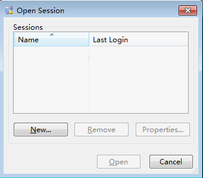

# Step 4: Connect to a DB Instance Through a Public Network<a name="en-us_topic_connect_instance"></a>

You can connect to a DB instance through a common connection or an SSL connection. The  SSL connection encrypts data  and is more secure.

## Preparations<a name="en-us_topic_0154555358_en-us_topic_0153118658_section367520762117"></a>

1.  Bind an EIP to the target DB instance and configure security group rules.
    1.  <a name="en-us_topic_0154555358_en-us_topic_0153118658_li1728416257345"></a>Bind an EIP to the target DB instance.

        For details about how to bind an EIP, see section  [Step 3: Bind an EIP](step-3-bind-an-eip.md).

    2.  <a name="en-us_topic_0154555358_en-us_topic_0153118658_li85977812411"></a>Obtain the IP address of the local device.
    3.  Configure security group rules.

        Add the IP address and port obtained in  [1.b](#en-us_topic_0154555358_en-us_topic_0153118658_li85977812411)  to the inbound rule of the security group.

        For details about how to configure a security group rule, see section  [Step 2: Configure Security Group Rules](step-2-configure-security-group-rules-2.md).

    4.  Run the  **ping**  command to connect the EIP that has been bound to the target DB instance in  [1.a](#en-us_topic_0154555358_en-us_topic_0153118658_li1728416257345)  to check that the local device can connect to the EIP.

2.  Use a database client to connect to the target DB instance.

    You can use a database client to connect to the target DB instance in the Linux or Windows operating system \(OS\).

    -   In the Linux OS, you need to install a MySQL client on the ECS. It is recommended that you download a MySQL client running a version later than that of the DB instance.

        For details about how to obtain and install the MySQL client, see section  [How Can I Install the MySQL Client?](how-can-i-install-the-mysql-client.md)

    -   In the Windows OS, you can use any common database client to connect to the target DB instance in a similar way.

        The database client MySQL-Front is used as an example in  [Using MySQL-Front to Connect to a DB Instance](#en-us_topic_0154555358_en-us_topic_0153118658_section8112152217539).


## Using MySQL-Front to Connect to a DB Instance<a name="en-us_topic_0154555358_en-us_topic_0153118658_section8112152217539"></a>

1.  Start MySQL-Front.
2.  In the displayed dialog box, click  **New**.

    **Figure  1**  Connection management<a name="en-us_topic_0154555358_fig221381114711"></a>  
    

3.  Enter the information of the target DB instance to be connected and click  **Ok**, as shown in  [Figure 2](#en-us_topic_0154555358_fig4664143131112).

    **Figure  2**  Adding an account<a name="en-us_topic_0154555358_fig4664143131112"></a>  
    

    **Table  1**  Parameter description

    <a name="en-us_topic_0154555358_table19344113119498"></a>
    <table><thead align="left"><tr id="en-us_topic_0154555358_row93441531194919"><th class="cellrowborder" valign="top" width="21%" id="mcps1.2.3.1.1"><p id="en-us_topic_0154555358_p77919310509"><a name="en-us_topic_0154555358_p77919310509"></a><a name="en-us_topic_0154555358_p77919310509"></a><strong id="b191112564312"><a name="b191112564312"></a><a name="b191112564312"></a>Parameter</strong></p>
    </th>
    <th class="cellrowborder" valign="top" width="79%" id="mcps1.2.3.1.2"><p id="en-us_topic_0154555358_p1779116320501"><a name="en-us_topic_0154555358_p1779116320501"></a><a name="en-us_topic_0154555358_p1779116320501"></a><strong id="a97668864bf874d57b57a1c1492147784"><a name="a97668864bf874d57b57a1c1492147784"></a><a name="a97668864bf874d57b57a1c1492147784"></a>Description</strong></p>
    </th>
    </tr>
    </thead>
    <tbody><tr id="en-us_topic_0154555358_row193441314499"><td class="cellrowborder" valign="top" width="21%" headers="mcps1.2.3.1.1 "><p id="en-us_topic_0154555358_p534403184920"><a name="en-us_topic_0154555358_p534403184920"></a><a name="en-us_topic_0154555358_p534403184920"></a>Name</p>
    </td>
    <td class="cellrowborder" valign="top" width="79%" headers="mcps1.2.3.1.2 "><p id="en-us_topic_0154555358_p1534413154913"><a name="en-us_topic_0154555358_p1534413154913"></a><a name="en-us_topic_0154555358_p1534413154913"></a>Indicates the name of the database connection task. If you do not set this parameter, it will be the same as <strong id="b1522629172412"><a name="b1522629172412"></a><a name="b1522629172412"></a>Host</strong> by default.</p>
    </td>
    </tr>
    <tr id="en-us_topic_0154555358_row963955716472"><td class="cellrowborder" valign="top" width="21%" headers="mcps1.2.3.1.1 "><p id="en-us_topic_0154555358_p18640157164714"><a name="en-us_topic_0154555358_p18640157164714"></a><a name="en-us_topic_0154555358_p18640157164714"></a>Host</p>
    </td>
    <td class="cellrowborder" valign="top" width="79%" headers="mcps1.2.3.1.2 "><p id="en-us_topic_0154555358_p6640205719477"><a name="en-us_topic_0154555358_p6640205719477"></a><a name="en-us_topic_0154555358_p6640205719477"></a>Indicates the EIP of the DB instance to be connected.</p>
    </td>
    </tr>
    <tr id="en-us_topic_0154555358_row234513154910"><td class="cellrowborder" valign="top" width="21%" headers="mcps1.2.3.1.1 "><p id="en-us_topic_0154555358_p73451831134915"><a name="en-us_topic_0154555358_p73451831134915"></a><a name="en-us_topic_0154555358_p73451831134915"></a>Port</p>
    </td>
    <td class="cellrowborder" valign="top" width="79%" headers="mcps1.2.3.1.2 "><p id="en-us_topic_0154555358_p162470367519"><a name="en-us_topic_0154555358_p162470367519"></a><a name="en-us_topic_0154555358_p162470367519"></a>Indicates the private network port of the DB instance.</p>
    </td>
    </tr>
    <tr id="en-us_topic_0154555358_row17345103164918"><td class="cellrowborder" valign="top" width="21%" headers="mcps1.2.3.1.1 "><p id="en-us_topic_0154555358_p9345193114915"><a name="en-us_topic_0154555358_p9345193114915"></a><a name="en-us_topic_0154555358_p9345193114915"></a>User</p>
    </td>
    <td class="cellrowborder" valign="top" width="79%" headers="mcps1.2.3.1.2 "><p id="en-us_topic_0154555358_p1634511315492"><a name="en-us_topic_0154555358_p1634511315492"></a><a name="en-us_topic_0154555358_p1634511315492"></a>Indicates the name of the user who will access the DB instance. The default user is <strong id="b842352706104956"><a name="b842352706104956"></a><a name="b842352706104956"></a>root</strong>.</p>
    </td>
    </tr>
    <tr id="en-us_topic_0154555358_row165789172519"><td class="cellrowborder" valign="top" width="21%" headers="mcps1.2.3.1.1 "><p id="en-us_topic_0154555358_p957918174514"><a name="en-us_topic_0154555358_p957918174514"></a><a name="en-us_topic_0154555358_p957918174514"></a>Password</p>
    </td>
    <td class="cellrowborder" valign="top" width="79%" headers="mcps1.2.3.1.2 "><p id="en-us_topic_0154555358_p18579717195113"><a name="en-us_topic_0154555358_p18579717195113"></a><a name="en-us_topic_0154555358_p18579717195113"></a>Indicates the password of the RDS database account.</p>
    </td>
    </tr>
    </tbody>
    </table>

4.  In the displayed window, select the connection that you have created in  [Figure 3](#en-us_topic_0154555358_fig3870144665113)  and click  **Open**.

    If the connection information is correct, the DB instance is successfully connected.

    **Figure  3**  Opening a session<a name="en-us_topic_0154555358_fig3870144665113"></a>  
    

    > **NOTE:**   
    >If the connection fails, ensure that preparations have been correctly made in  [Preparations](#en-us_topic_0154555358_en-us_topic_0153118658_section367520762117)  and try again.  


## Using SSL to Connect to a DB Instance<a name="en-us_topic_0154555358_en-us_topic_0153118658_section335618164205"></a>

1.  Log in to the management console.
2.  Click    in the upper left corner and select a region and a project.
3.  Click  **Service List**. Under  **Database**, click  **Relational Database Service**  to go to the RDS console. The RDS console is displayed.
4.  In the  **DB Information**  area on the  **Basic Information**  page, click    in the  **SSL**  field to download the root certificate or certificate bundle.
5.  Import the root certificate to the Linux OS on the ECS. For details, see section  [How Can I Import the Root Certificate to the Windows or Linux OS?](how-can-i-import-the-root-certificate-to-the-windows-or-linux-os.md)

    > **NOTE:**   
    >-   Since April 2017, RDS has offered a new root certificate that has a 20-year validation period. The new certificate takes effect after DB instances are rebooted. Replace the old certificate before it expires to improve system security.  
    >    For details, see section  [How Can I Identify the Validity Period of the SSL Root Certificate?](how-can-i-identify-the-validity-period-of-the-ssl-root-certificate.md)  
    >-   You can also download the certificate bundle, which contains both the new certificate provided since April 2017 and the old certificate.  

6.  Run the following command to connect to an RDS DB instance. The Linux OS is used as an example.

    **mysql -h **<_hostName_\>  **-P **_<port\>_ **-u **<_userName_\>  **-p** **--ssl-ca=**<_caName_\>

    **Table  2**  Parameter description

    <a name="en-us_topic_0154555358_table385819434338"></a>
    <table><thead align="left"><tr id="en-us_topic_0154555358_row1285974314331"><th class="cellrowborder" valign="top" width="21.2%" id="mcps1.2.3.1.1"><p id="en-us_topic_0154555358_p13859124323319"><a name="en-us_topic_0154555358_p13859124323319"></a><a name="en-us_topic_0154555358_p13859124323319"></a><strong id="b13128205317440"><a name="b13128205317440"></a><a name="b13128205317440"></a>Parameter</strong></p>
    </th>
    <th class="cellrowborder" valign="top" width="78.8%" id="mcps1.2.3.1.2"><p id="en-us_topic_0154555358_p88598436331"><a name="en-us_topic_0154555358_p88598436331"></a><a name="en-us_topic_0154555358_p88598436331"></a><strong id="b1883195454410"><a name="b1883195454410"></a><a name="b1883195454410"></a>Description</strong></p>
    </th>
    </tr>
    </thead>
    <tbody><tr id="en-us_topic_0154555358_row128591243133311"><td class="cellrowborder" valign="top" width="21.2%" headers="mcps1.2.3.1.1 "><p id="en-us_topic_0154555358_p128591843133314"><a name="en-us_topic_0154555358_p128591843133314"></a><a name="en-us_topic_0154555358_p128591843133314"></a>&lt;<em id="en-us_topic_0154555358_i11472201511342"><a name="en-us_topic_0154555358_i11472201511342"></a><a name="en-us_topic_0154555358_i11472201511342"></a>hostName</em>&gt;</p>
    </td>
    <td class="cellrowborder" valign="top" width="78.8%" headers="mcps1.2.3.1.2 "><p id="en-us_topic_0154555358_p946502435610"><a name="en-us_topic_0154555358_p946502435610"></a><a name="en-us_topic_0154555358_p946502435610"></a>Indicates the EIP of the DB instance to be connected.</p>
    </td>
    </tr>
    <tr id="en-us_topic_0154555358_row885918436335"><td class="cellrowborder" valign="top" width="21.2%" headers="mcps1.2.3.1.1 "><p id="en-us_topic_0154555358_p1985934313335"><a name="en-us_topic_0154555358_p1985934313335"></a><a name="en-us_topic_0154555358_p1985934313335"></a><em id="en-us_topic_0154555358_i148916198347"><a name="en-us_topic_0154555358_i148916198347"></a><a name="en-us_topic_0154555358_i148916198347"></a>&lt;port&gt;</em></p>
    </td>
    <td class="cellrowborder" valign="top" width="78.8%" headers="mcps1.2.3.1.2 "><p id="en-us_topic_0154555358_p6859104373314"><a name="en-us_topic_0154555358_p6859104373314"></a><a name="en-us_topic_0154555358_p6859104373314"></a>Indicates the port of the DB instance to be connected.</p>
    </td>
    </tr>
    <tr id="en-us_topic_0154555358_row14859174318331"><td class="cellrowborder" valign="top" width="21.2%" headers="mcps1.2.3.1.1 "><p id="en-us_topic_0154555358_p20859184323316"><a name="en-us_topic_0154555358_p20859184323316"></a><a name="en-us_topic_0154555358_p20859184323316"></a>&lt;<em id="en-us_topic_0154555358_i1310372463412"><a name="en-us_topic_0154555358_i1310372463412"></a><a name="en-us_topic_0154555358_i1310372463412"></a>userName</em>&gt;</p>
    </td>
    <td class="cellrowborder" valign="top" width="78.8%" headers="mcps1.2.3.1.2 "><p id="en-us_topic_0154555358_p4859143123318"><a name="en-us_topic_0154555358_p4859143123318"></a><a name="en-us_topic_0154555358_p4859143123318"></a>Indicates the username of the RDS database account. The default administrator is <strong id="b436813920322"><a name="b436813920322"></a><a name="b436813920322"></a>root</strong>.</p>
    </td>
    </tr>
    <tr id="en-us_topic_0154555358_row63981620153510"><td class="cellrowborder" valign="top" width="21.2%" headers="mcps1.2.3.1.1 "><p id="en-us_topic_0154555358_p7399182018357"><a name="en-us_topic_0154555358_p7399182018357"></a><a name="en-us_topic_0154555358_p7399182018357"></a>&lt;<em id="en-us_topic_0154555358_i9263152720352"><a name="en-us_topic_0154555358_i9263152720352"></a><a name="en-us_topic_0154555358_i9263152720352"></a>caName</em>&gt;</p>
    </td>
    <td class="cellrowborder" valign="top" width="78.8%" headers="mcps1.2.3.1.2 "><p id="en-us_topic_0154555358_p16399920103511"><a name="en-us_topic_0154555358_p16399920103511"></a><a name="en-us_topic_0154555358_p16399920103511"></a>Indicates the name of the SSL certificate file, which should be stored in the same directory where the command is executed.</p>
    </td>
    </tr>
    </tbody>
    </table>

    For example, to connect to a DB instance through an SSL connection as user  **root**, run the following command:

    **mysql -h 172.16.0.31 -P 3306 -u root -p --ssl-ca=ca.pem**

    Enter the password of the database account if the following information is displayed:

    ```
    Enter password:
    ```

    > **NOTE:**   
    >If the connection fails, ensure that preparations have been correctly made in  [Preparations](#en-us_topic_0154555358_en-us_topic_0153118658_section367520762117)  and try again.  


