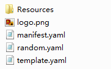

# Template Package Structure<a name="EN-US_TOPIC_0076468619"></a>

You need to prepare a .zip package. For the package structure, see  [Figure 1](#fig56857421).

**Figure  1**  Package structure<a name="fig56857421"></a>  


1.  **Resources**  Directory

    This directory is used to store the files referenced by template files in the root directory. You can save the template files, configuration files, and script files used by the template in this directory. Templates of a nested stack must be placed in this directory. Do not change the name and structure of the directory.

    **Figure  2**  Structure of  **Resources**  directory<a name="fig03221255182115"></a>  
    

2.  File  **logo.png**

    The default file name  **logo**  is recommended, and there are no restrictions on the logo file name. However, if the file name is different from the default  **logo.png**  file, you need to ensure that the logo file name in the package is consistent with the  **Logo**  value in file  **manifest.yaml**.

    > **NOTE:**   
    >File  **logo.png**  is not supported and will be supported in later versions.  

3.  File  **manifest.yaml**

    File  **manifest. yaml**  describes basic information of the package. The default file format is recommended. The following is an example file:

    ```
    Format: Heat.HOT/1.0
    Type: Application
    FullName: Reserved
    Name: Auto Scaling Group
    Description: "Heat template to deploy a stack."
    Author: RTS
    Tags:
      - hot-based
    Logo: logo.png
    ```

    > **NOTE:**   
    >The file name is fixed and cannot be user-defined.  

4.  **random.yaml**  and  **template.yaml**

    **random.yaml**  and  **template.yaml**  are two example templates. You can define your own template based on these example templates.  **random.yaml**  is a template file that can be used to create random strings. This file can be used to create two random strings.  **template.yaml**  is a nested template file, which contains a nested template \(**random1.yaml**\). The sub-template is in the  **Resources/HotFiles**  directory.

    The following is an example  **manifest.yaml**  file:

    ```
    heat_template_version: 2014-10-16
    description: Create a serious of random string
    
    parameters:
      length:
        type: number
        default: 4
    
    resources:
      random1:
        type: OS::Heat::RandomString
        properties:
          length: {get_param: length}
      random2:
        type: OS::Heat::RandomString
        properties:
          length: {get_param: length}
    
    ```

    The following is an example  **template.yaml**  file:

    ```
    heat_template_version: 2014-10-16
    description: Create a serious of random string
    
    parameters:
      length:
        type: number
        default: 4
    
    resources:
      random1:
        type: OS::Heat::RandomString
        properties:
          length: {get_param: length}
      random2:
        type: OS::Heat::RandomString
        properties:
          length: {get_param: length}
      random3:
        type: random1.yaml
    ```


> **NOTE:**   
>1.  A valid package name contains a maximum of 32 characters, including letters, digits, hyphens \(-\), and underscores \(\_\). The name must start with a letter and end with .zip.  
>2.  The structure of directory  **Resources/HotFiles**  is fixed and cannot be changed.  
>3.  When you use a .zip package, all template files in the root directory are displayed on the console, and you can select any template to create a stack.  
>4.  If necessary, you can add a file named  **environment.yaml**  to the root directory configured on the console.  
>5.  The logo file and the  **manifest.yaml**  file are mandatory and must be stored in the root directory.  
>6.  If file  **get\_file:** _abc_**.txt**  is used in the template, this file must be placed in directory  **Resources/HotFiles**.  
>7.  Other restrictions are as follows:  
>    -   The maximum size of a template file is 100 KB.  
>    -   The maximum size of a .zip package cannot exceed 80 KB.  
>    -   The maximum nesting depth is restricted to seven.  
>    -   The maximum number of files is 50.  

