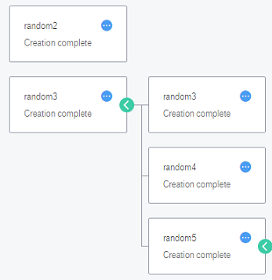

# Viewing Details of a Stack

1.  Log in to the management console.
2.  Click    in the upper left corner to select the desired region and project.
3.  Under  **Management & Deployment**, click  **Resource Template Service**.
4.  In the stack list, locate the target stack and click its name.

    The stack details page is displayed.

5.  View stack information, such as the name, ID, stack description, creation time, and status.

    If  **Parameter**  and  **Output**  are not empty, you can click  **View Details**  to see more information.

6.  You can also click  **Resources**,  **Events**, and  **Template**  to view stack details.
    -   **Resources**: displays information about each resource included in the stack.

        You can move your mouse    to view resource details. If the created resources are nested, you can view the resources in the topology.

        **Figure  1**  Viewing stack details  
        

    -   **Events**: displays each event that occurred in the stack life cycle. Any operation on the stack is recorded in  **Events**, including creation, deletion, and update.
    -   **Template**: displays information of the template used in the stack.

