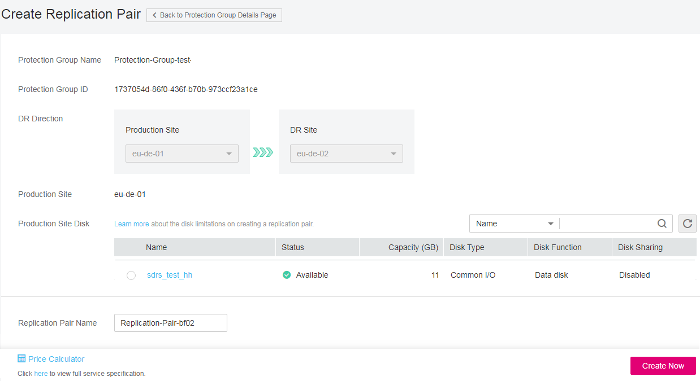

# Creating a Replication Pair

## Scenarios

You can create replication pairs for desired disks and add the replication pairs to a specified protection group. When you create a replication pair:

-   If the protection group is in the  **Available**  state, protection is disabled. The production site disk and DR site disk have formed a replication pair, but data synchronization is not started. To start data synchronization, enable protection.
-   If the protection group is in the  **Protecting**  state, protection is enabled. After you create a replication pair, data synchronization is automatically started.

> **NOTE:**   
>After a replication pair is created, the default name of the DR site disk is the same as the name of the production site disk, but their IDs are different.  
>To modify a disk name, click the disk name on the replication pair details page to switch to the disk details page and modify it.  

## **Prerequisites**

-   The protection group is in the  **Available**  or  **Protecting**  state.
-   If  **Server Type**  of the protection group is  **ECS**, the disks used to create the replication pair are in the  **Available**  state.

## Procedure

1.  Log in to the management console.
2.  Click  **Service List**  and choose  **Storage**  \>  **Storage Disaster Recovery Service**.

    The  **Storage Disaster Recovery Service**  page is displayed.

3.  In the pane of the protection group for which replication pairs are to be added, click  **Replication Pairs**.

    The operation page for the protection group is displayed.

4.  On the  **Replication Pairs**  tab, click  **Create Replication Pair**.

    The  **Create Replication Pair**  page is displayed.

    **Figure  1**  Creating a replication pair  
    

5.  Configure the basic information about the replication pair listed in  [Table 1](#table14113172215131).

    **Table  1**  Parameter description

    
    <table><thead align="left"><tr id="row711682216134"><th class="cellrowborder" valign="top" width="33.33333333333333%" id="mcps1.2.4.1.1">
<strong id="b842352706211121">Parameter</strong>

    </th>
    <th class="cellrowborder" valign="top" width="33.33333333333333%" id="mcps1.2.4.1.2">
<strong id="b84235270611218">Description</strong>

    </th>
    <th class="cellrowborder" valign="top" width="33.33333333333333%" id="mcps1.2.4.1.3">
<strong>Example Value</strong>

    </th>
    </tr>
    </thead>
    <tbody><tr id="row16116152218134"><td class="cellrowborder" valign="top" width="33.33333333333333%" headers="mcps1.2.4.1.1 ">
Protection Group Name

    </td>
    <td class="cellrowborder" valign="top" width="33.33333333333333%" headers="mcps1.2.4.1.2 ">
Indicates the name of the protection group to which the replication pair to be created belongs. You do not need to configure it.

    </td>
    <td class="cellrowborder" valign="top" width="33.33333333333333%" headers="mcps1.2.4.1.3 ">
Protection-Group-test

    </td>
    </tr>
    <tr id="row13973165510190"><td class="cellrowborder" valign="top" width="33.33333333333333%" headers="mcps1.2.4.1.1 ">
Protection Group ID

    </td>
    <td class="cellrowborder" valign="top" width="33.33333333333333%" headers="mcps1.2.4.1.2 ">
Specifies the ID of a protection group.

    </td>
    <td class="cellrowborder" valign="top" width="33.33333333333333%" headers="mcps1.2.4.1.3 ">
619c57e9-3927-48f8-ad14-3e293260b8a0

    </td>
    </tr>
    <tr id="row2116722191312"><td class="cellrowborder" valign="top" width="33.33333333333333%" headers="mcps1.2.4.1.1 ">
DR Direction

    </td>
    <td class="cellrowborder" valign="top" width="33.33333333333333%" headers="mcps1.2.4.1.2 ">
Indicates the replication direction of the protection group to which the replication pair to be created belongs. You do not need to configure it.

    </td>
    <td class="cellrowborder" valign="top" width="33.33333333333333%" headers="mcps1.2.4.1.3 ">
eu-de-01 -&gt; eu-de-02

    </td>
    </tr>
    <tr id="row10720384287"><td class="cellrowborder" valign="top" width="33.33333333333333%" headers="mcps1.2.4.1.1 ">
Production Site

    </td>
    <td class="cellrowborder" valign="top" width="33.33333333333333%" headers="mcps1.2.4.1.2 ">
Specifies the AZ of the production site. 

    </td>
    <td class="cellrowborder" valign="top" width="33.33333333333333%" headers="mcps1.2.4.1.3 ">
eu-de-01

    </td>
    </tr>
    <tr id="row0405151012192"><td class="cellrowborder" valign="top" width="33.33333333333333%" headers="mcps1.2.4.1.1 ">
Production Site Disk

    </td>
    <td class="cellrowborder" valign="top" width="33.33333333333333%" headers="mcps1.2.4.1.2 ">
This parameter is mandatory.

    
Select a disk.

    </td>
    <td class="cellrowborder" valign="top" width="33.33333333333333%" headers="mcps1.2.4.1.3 ">
volume-01

    </td>
    </tr>
    <tr id="row1498954271619"><td class="cellrowborder" valign="top" width="33.33333333333333%" headers="mcps1.2.4.1.1 ">
Replication Pair Name

    </td>
    <td class="cellrowborder" valign="top" width="33.33333333333333%" headers="mcps1.2.4.1.2 ">
Indicates the replication pair name. This parameter is mandatory.

    
Configure this parameter when you create a replication pair. Then, you can use this name to classify and search this replication pair.

    </td>
    <td class="cellrowborder" valign="top" width="33.33333333333333%" headers="mcps1.2.4.1.3 ">
replication_001

    </td>
    </tr>
    </tbody>
    </table>

6.  Click  **Create Now**.
7.  On the  **Confirm**  page, you can confirm the replication pair information.
    -   If you do not need to modify the information, click  **Submit**.
    -   If you need to modify the information, click  **Previous**.

8.  Click  **Back to Protection Group Details Page**  and query the replication pairs of the protection group.

    If the replication pair status changes to  **Available**  or  **Protecting**, the replication pair has been created successfully.

