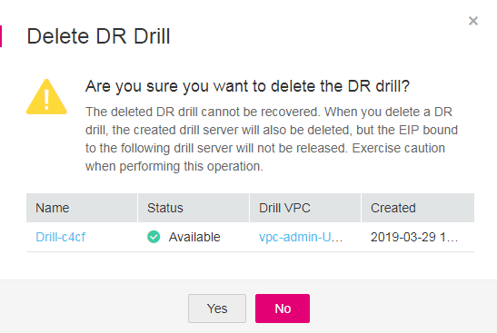

# Deleting a DR Drill

## Scenarios

If a DR drill is no longer used, you can release the virtual resources by deleting the DR drill from the system. When you delete a DR drill, all the drill servers in it are automatically deleted.

## **Prerequisites**

The DR drill is in the  **Available**,  **Creation failed**, or  **Deletion failed**  state.

## Procedure

1.  Log in to the management console. 
2.  Click  **Service List**  and choose  **Storage**  \>  **Storage Disaster Recovery Service**.

    The  **Storage Disaster Recovery Service**  page is displayed.

3.  In the pane of the protection group from which a DR drill is to be deleted, click  **DR Drills**.

    The operation page for the protection group is displayed.

4.  On the  **DR Drills**  tab, locate the row containing the DR drill to be deleted and click  **Delete**  in the  **Operation**  column.

    The  **Delete DR Drill**  dialog box is displayed.

    **Figure  1**  Deleting a DR drill  
    

    > **NOTE:**   
    >If you bind an EIP to a DR drill server, the EIP will be unbound from the DR drill server when you delete the DR drill but will not be deleted. You can bind the EIP to another server.  

5.  Click  **Yes**.

