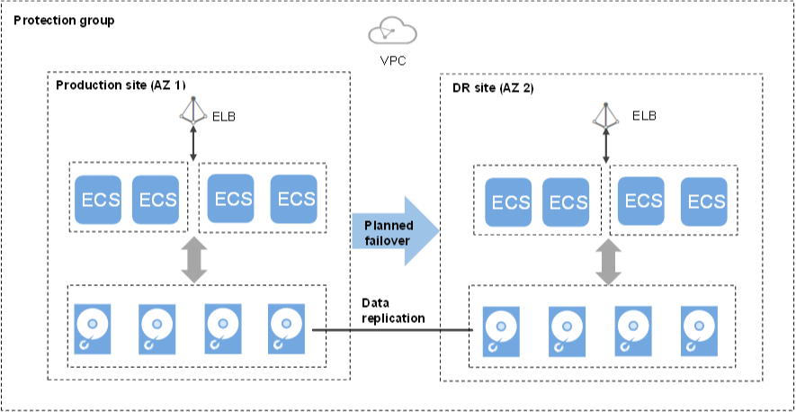

# Performing a Planned Failover

## Scenarios

After you perform a planned failover, services at the production site are failed over to the DR site, and services at the DR site are failed over to the production site.  [Table 1](#table938371263712)  shows the direction change.

**Table  1**  DR direction change after a planned failover

<table><thead align="left"><tr id="row12384181223713"><th class="cellrowborder" valign="top" width="33.33333333333333%" id="mcps1.2.4.1.1">
-

</th>
<th class="cellrowborder" valign="top" width="33.33333333333333%" id="mcps1.2.4.1.2">
Production Site

</th>
<th class="cellrowborder" valign="top" width="33.33333333333333%" id="mcps1.2.4.1.3">
DR Site

</th>
</tr>
</thead>
<tbody><tr id="row53859126375"><td class="cellrowborder" valign="top" width="33.33333333333333%" headers="mcps1.2.4.1.1 ">
Before

</td>
<td class="cellrowborder" valign="top" width="33.33333333333333%" headers="mcps1.2.4.1.2 ">
AZ1

</td>
<td class="cellrowborder" valign="top" width="33.33333333333333%" headers="mcps1.2.4.1.3 ">
AZ2

</td>
</tr>
<tr id="row16385312123720"><td class="cellrowborder" valign="top" width="33.33333333333333%" headers="mcps1.2.4.1.1 ">
After

</td>
<td class="cellrowborder" valign="top" width="33.33333333333333%" headers="mcps1.2.4.1.2 ">
AZ2

</td>
<td class="cellrowborder" valign="top" width="33.33333333333333%" headers="mcps1.2.4.1.3 ">
AZ1

</td>
</tr>
</tbody>
</table>

After the planned failover, data synchronization continues, but the DR direction is changed \(from the DR site to the production site\). You can perform a planned failover when you are certain that the production site will encounter an interruption. For example, if the production site \(AZ1\) is going to encounter a power failure, you can perform a planned failover to fail over services in AZ1 to the DR site \(AZ2\). The planned failover will not affect data synchronization of the protection group.

SDRS will migrate NICs on the server during the planned failover. After the planned failover, the IP, EIP, and MAC addresses of the production site server will be migrated to the DR site server, so that the IP, EIP, and MAC addresses remain the same .

> **NOTE:**   
>-   Check the status to ensure that all the servers in the protection group are stopped before the planned failover.   
>-   During the planned failover, do not start the servers in the protection group. Otherwise, the planned failover may fail.  
>-   Once a planned failover is complete, data synchronization will not stop, only the synchronization direction will reverse.  
>-   After the planned failover is complete, the status of the protection group changes to  **Protecting**. Then, you need to switch to the protected instance details page and start the production site server.  

**Figure  1**  Performing a planned failover  

## Notes

For Linux servers with Cloud-Init installed, if you have changed  **hostname**  of the production site server before you perform a planned failover for the first time, this modification will not synchronize to the DR site server.

To resolve this problem, see  [What Can I Do If hostname of the Production Site Server and DR Site Server Are Different After a Planned Failover or Failover?](what-can-i-do-if-hostname-of-the-production-site-server-and-dr-site-server-are-different-after-a-pla.md).

## **Prerequisites**

-   All the servers in the protection group are stopped.
-   The protection group has replication pairs.
-   Protection is enabled for the protection group, and the protection group is in the  **Protecting**  or  **Planned failover failed**  state.

## Procedure

1.  Log in to the management console. 
2.  Click  **Service List**  and choose  **Storage**  \>  **Storage Disaster Recovery Service**.

    The  **Storage Disaster Recovery Service**  page is displayed.

3.  In the pane of the desired protection group, click  **Protected Instances**. 
4.  On the operation page of the protection group, click  **Execute Planned Failover**  in the upper right corner.
5.  In the displayed dialog box, check whether all the servers in this protection group are stopped.
    -   If yes, go to step  [6](#li812255515532).
    -   If no, select the servers to be stopped and click  **Stop**.

6.  In the  **Execute Planned Failover**  dialog box, click  **Execute Planned Failover**.

    > **NOTE:**   
    >During the planned failover, do not start the servers in the protection group. Otherwise, the planned failover may fail.  

