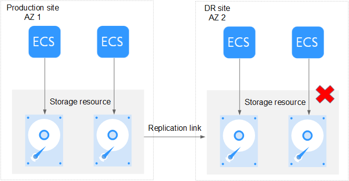

# Supported DR Scenarios

## Production Site Is Faulty

-   Description

    The production site has a fault. Services at the production site are affected and cannot be restored using the failover function. 

    **Figure  1**  Production site being faulty  
    

-   Solution

    You can use the DR drill function to create DR drill servers at the DR site to resume the services.

    For more information about the DR drill function, see  [Performing a DR Drill](performing-a-dr-drill.md).

## DR Site Is Faulty

-   Description

    The DR site has a fault. Services at the production site are not affected, but the planned failover cannot be performed. 

    **Figure  2**  DR site being faulty  
    

-   Solution

    Contact the customer service to obtain technical support.

## Replication Link Is Faulty

-   Description

    The replication link between the production site and DR site becomes faulty. Services at the production site are not affected, but the planned failover cannot be performed. 

    **Figure  3**  Replication link being faulty  
    

-   Solution

    You do not need to perform any operations. The DR protection will automatically restore once the replication link fault is rectified.

## Storage Resource at the Production Site Is Faulty

-   Description

    Services at the production site are affected because the storage resource at the production site has a fault.

    **Figure  4**  Storage resource at the production site is faulty  
    

-   Solution

    Use the failover function to start resources such as servers and disks at the DR site to resume the services.

    For more information about the failover function, see  [Performing a Failover](performing-a-failover.md).

## Storage Resource at the DR Site Is Faulty 

-   Description

    The storage resource at the DR site has a fault. Services at the production site are not affected, but the planned failover or failover cannot be performed. 

    **Figure  5**  Storage resource at the DR site being faulty   
    

-   Solution

    Contact the customer service to obtain technical support.

