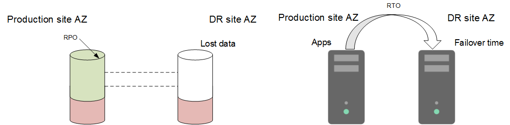

# What Are RPO and RTO?

Recovery Point Objective \(RPO\): the maximum data loss amount tolerated by the system.

Recovery Time Objective \(RTO\): the maximum service interruption duration tolerated by the system. It refers to the requirement for the recovery duration of an information system failure or service function failure caused by a disaster.

**Figure  1**  RPO and RTO  

