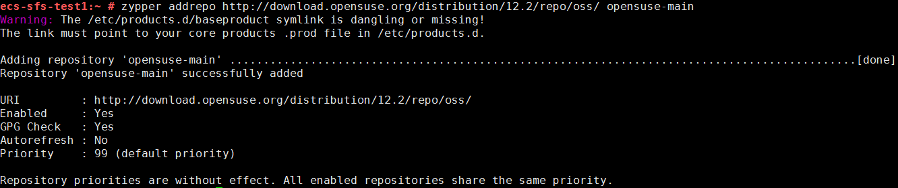
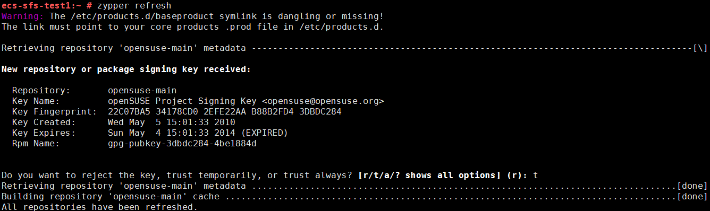
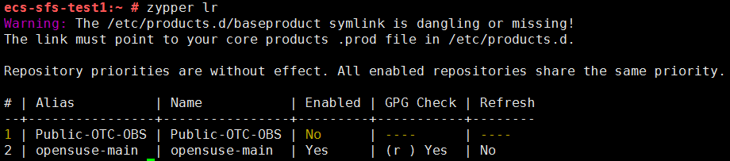
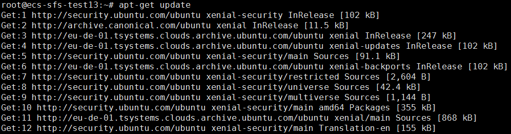

# Enabling or Adding a Software Repository

This section explains how to enable or add a software repository in CentOS, SUSE, and Ubuntu.

## CentOS

1.  Run the following command to check whether a software repository has been enabled.

    **yum repolist all**

    If  **status**  is  **disabled**, as shown in  [Figure 1](#fig50710110103819), no software repository has been enabled. Proceed to the next step.

    **Figure  1**  Checking software repositories  
    

2.  Run the following command to enable a software repository. This step uses  **Public-OTC-CentOS-7-Base**  as an example.

    **yum-config-manager --enable Public-OTC-CentOS-7-Base**

    **Figure  2**  Enabling a software repository  
    

3.  Run the following command to check whether the software repository described in step 2 has been enabled.

    **yum repolist all**

    If  **status**  is  **enabled**, as shown in  [Figure 3](#fig33842796104733), the software repository has been enabled.

    **Figure  3**  Checking whether the software repository has been enabled  
    

## SUSE

1.  Run the following command to check whether a software repository has been enabled.

    **zypper lr**

    If no software repository is detected, as shown in  [Figure 4](#en-us_topic_0077171435_en-us_topic_0077171435_fig50710110103819), proceed to the next step.

    **Figure  4**  Checking software repositories  
    

2.  Run the following command to add a software repository. This step uses  **opensuse12.2**  as an example.

    **zypper addrepo http://download.opensuse.org/distribution/12.2/repo/oss/ opensuse-main**

    **Figure  5**  Adding a software repository  
    

3.  Run the following command to update and add software repositories.

    **zypper refresh**

    **Figure  6**  Updating and adding repositories  
    

4.  Run the following command to check whether the software repository described in step 2 has been enabled.

    **zypper lr**

    If  **Enabled**  is  **Yes**, as shown in  [Figure 7](#en-us_topic_0077171435_en-us_topic_0077171435_fig33842796104733), the software repository has been enabled.

    **Figure  7**  Checking whether the software repository has been enabled  
    

## Ubuntu

1.  Run the following command to add a software repository.

    **apt-add-repository http://archive.canonical.com/ubuntu**

    **Figure  8**  Adding a software repository  
    

2.  Run the following command to update and add software repositories.

    **apt-get update**

    **Figure  9**  Updating and adding repositories  
    

