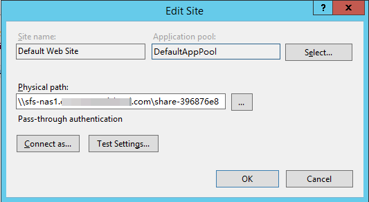

# Failure of Mounting an NFS File System to a Windows IIS Server

## Symptom

When an NFS file system is mounted to a Windows IIS server, an error message is displayed, indicating that the path format is not supported, and the mounting fails.

## Possible Causes

The physical path of the IIS Web server is incorrect.

## Fault Diagnosis

Take troubleshooting measures based on possible causes.

## Solution

1.  Log in to the ECS. The following operations use an ECS running Windows Server 2012 R2 as an example.
2.  Click  **Server Manager**  in the lower left corner.
3.  Choose  **Tools**  \>  **Internet Information Services\(IIS\) Manager**, expand  **Sites**, and select the target website.
4.  Click  **Basic Settings**  to check whether the  **Physical path**  is correct.
5.  The correct physical path is that of the shared path with the colon \(:\) deleted.

    [Figure 1](#fig047928192514)  shows the shared path of a file system. You need to enter the physical path  **\\\\sfs-nas1.XXXXXXXXX.com\\share-396876e8**, as shown in  [Figure 2](#fig1734814414346).

    **Figure  1**  Shared path  
    

    **Figure  2**  Physical path  
    

