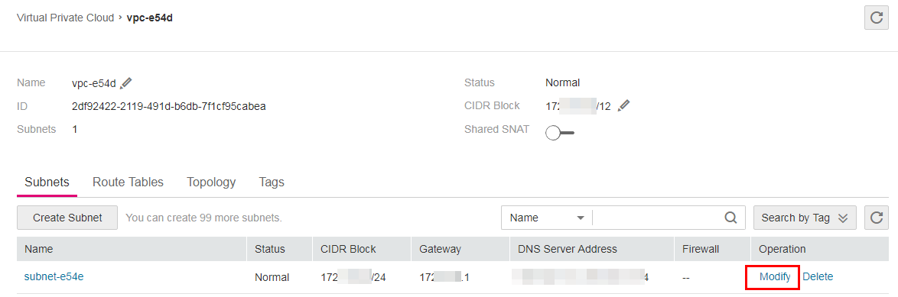

# Mounting a File System Times Out<a name="EN-US_TOPIC_0037934210"></a>

## Symptom<a name="section41158684111639"></a>

When running the  **mount**  command to mount the file system to the ECSs, the message  **timed out**  is displayed.

## Possible Causes<a name="section31326994111720"></a>

-   Cause 1: The network status is not stable.
-   Cause 2: The network connection is abnormal.
-   Cause 3: The DNS configuration of the ECS is incorrect. As a result, the domain name of the file system cannot be resolved and the mounting fails.
-   Cause 4: The operating system of the ECS where the file system is to be mounted is Ubuntu18 or a later version.

## Fault Diagnosis<a name="section34776262111735"></a>

After the network fault is excluded, run the  **mount**  command again.

## Solution<a name="section31191225111737"></a>

-   Cause 1 and Cause 2: The network status is not stable or the network connection is abnormal.

    Re-mount the file system after the network issue is addressed.

    -   If the patch is uninstalled successfully, no further action is required.
    -   If the problem persists, see the solution for cause 3.

-   Cause 3: The DNS configuration of the ECS is incorrect. As a result, the domain name of the file system cannot be resolved and the mounting fails.
    1.  Check the DNS configuration of the tenant and run the  **cat /etc/resolv.conf**  command.
        -   If the DNS has not been configured, configure it. For details about how to configure the DNS, see  [Configuring DNS](configuring-dns.md).
        -   If the DNS has been configured, run the following command to check whether the DNS is correct:

            **nslookup **_File system domain name_

            If the resolved IP address is in network segment  **100**, the DNS configuration is correct. If the IP address is in another network segment, the DNS configuration is incorrect. In this case, go to  [2](#li19881703916).

    2.  <a name="li19881703916"></a>Modify the  **/etc/resolv.conf**  configuration file, configure the correct tenant DNS, and run  **vi /etc/resolv.conf**  to edit the  **/etc/resolv.conf**  file. Add the DNS server IP address above the existing nameserver information.  The DNS server IP address is 100.125.4.25.

        **Figure  1**  Configuring DNS<a name="fig42120175393"></a>  
        

        The format is as follows:

        ```
        nameserver 100.125.4.25
        ```

        -   If the configuration succeeds, go to  [3](#li1340101763913).
        -   If the configuration fails, run the  **lsattr /etc/resolv.conf**  command. If the information shown in  [Figure 2](#fig93781793919)  is displayed, the file is locked.

            **Figure  2**  A locked file<a name="fig93781793919"></a>  
            

            Run the  **chattr -i/etc/resolv.conf**  command to unlock the file. Then, re-configure the DNS and go to  [3](#li1340101763913).

    3.  <a name="li1340101763913"></a>Press  **Esc**, input  **:wq**, and press  **Enter**  to save the changes and exit the vi editor.
    4.  The default DNS of the ECS applied by the user is inherited from the VPC to which the ECS belongs. Therefore, when the ECS restarts, the ECS changes synchronously. For this reason, changing configurations of the ECS does not settle the issue completely. You need to modify configurations in the VPC. Set a correct tenant DNS for the subnet of the VPC to which the ECS belongs. See  [Figure 3](#fig155441710394)  and  [Figure 4](#fig056217113912).

        **Figure  3**  VPC details<a name="fig155441710394"></a>  
        

        **Figure  4**  Modifying the DNS<a name="fig056217113912"></a>  
        

    5.  \(Optional\) Restart the ECS.
    6.  Run the  **mount**  command again.
        -   If the problem is solved, no further action is required.
        -   If the problem persists, see the solution for cause 4.


-   Cause 4: The operating system of the ECS where the file system is to be mounted is Ubuntu18 or a later version.
    1.  Reconfigure DNS by referring to  [Configuring DNS](configuring-dns.md).
    2.  Check whether the target ECS running Ubuntu18 or a later version is a private image.
        -   If yes, go to  [4](#li199471275217).
        -   If no, go to  [3](#li107041047680).

    3.  <a name="li107041047680"></a>Convert the public image ECS to a private image.
        1.  <a name="li57046472083"></a>To create a private image based on an existing ECS, see section "Creating an Image" in the  _Elastic Cloud Server User Guide_.
        2.  Use the private image created in  [3.a](#li57046472083)  to create an ECS or switch the ECS to the private image created in  [3.a](#li57046472083)  by referring to section "Changing the OS" in the  _Elastic Cloud Server User Guide_.

    4.  <a name="li199471275217"></a>Log in to the ECS and mount the file system again.


