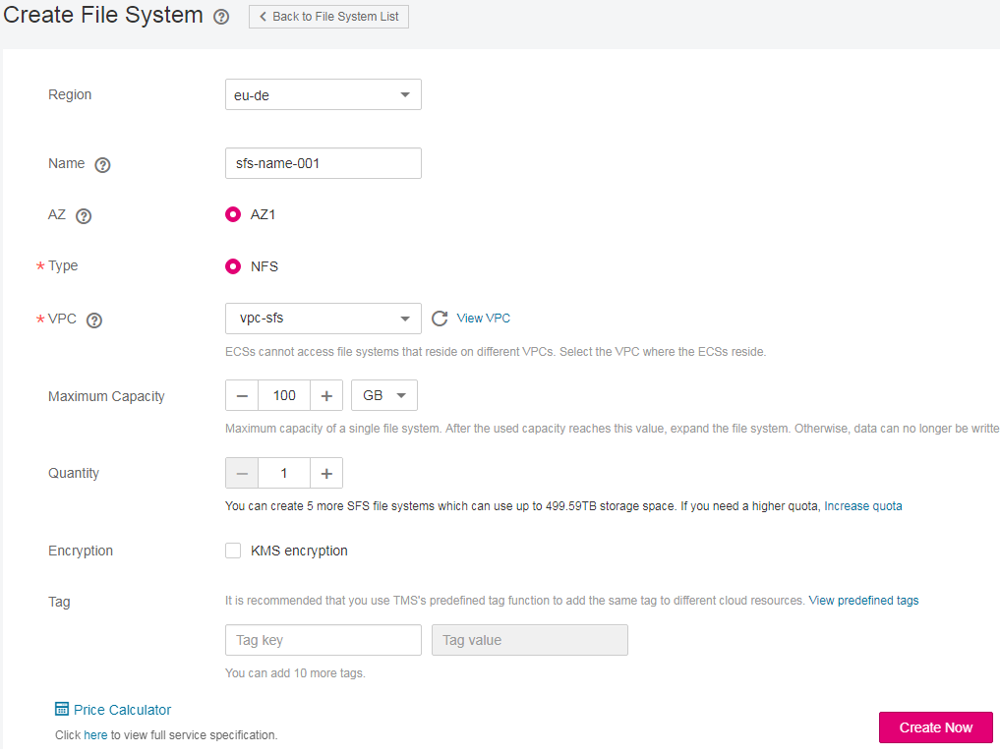

# Step 1: Create a File System

You can create a file system and mount it to multiple ECSs. Then the ECSs can share the file system. 

## Prerequisites

1.  Before creating a file system, ensure that a VPC is available.

    If no VPC is available, create a VPC by referring to section "Creating a VPC" in the  _VPC User Guide_.

2.  Before creating a file system, ensure that an ECS is available and the ECS belongs to the created VPC.

    If no ECS is available, create an ECS by referring to "Creating an ECS" in the  _Elastic Cloud Server User Guide_.

## Logging In to the Management Console

1.  Log in to the management console using a cloud account.
2.  From the drop-down list in front of  **Homepage**, select a region and a project.
3.  Choose  **Service List**  \>  **Storage**  \>  **Scalable File Service**. The console page is displayed.

## Creating an SFS File System

1.  In the upper right corner of the page, click  **Create File System**.
2.  In the dialog box shown in  [Figure 1](#fig18678655184217), set the parameters as described in  [Table 1](#table21372620111743).

    **Figure  1**  Creating a file system  
    

    **Table  1**  Parameter description

    
    <table><thead align="left"><tr id="row63053364111743"><th class="cellrowborder" valign="top" width="33%" id="mcps1.2.4.1.1">
<strong id="b842352706143129">Parameter</strong>

    </th>
    <th class="cellrowborder" valign="top" width="40%" id="mcps1.2.4.1.2">
<strong id="b842352706143138">Description</strong>

    </th>
    <th class="cellrowborder" valign="top" width="27%" id="mcps1.2.4.1.3">
<strong id="b842352706143150">Remarks</strong>

    </th>
    </tr>
    </thead>
    <tbody><tr id="row553014855911"><td class="cellrowborder" valign="top" width="33%" headers="mcps1.2.4.1.1 ">
Region

    </td>
    <td class="cellrowborder" valign="top" width="40%" headers="mcps1.2.4.1.2 ">
This parameter is mandatory.

    
Specifies the region of the tenant. Select the current region from the drop-down list in the upper left corner of the page.

    </td>
    <td class="cellrowborder" valign="top" width="27%" headers="mcps1.2.4.1.3 ">
You are advised to select the same region as that of the ECS.

    </td>
    </tr>
    <tr id="row42822021111743"><td class="cellrowborder" valign="top" width="33%" headers="mcps1.2.4.1.1 ">
AZ

    </td>
    <td class="cellrowborder" valign="top" width="40%" headers="mcps1.2.4.1.2 ">
A geographical area with an independent network and an independent power supply

    </td>
    <td class="cellrowborder" valign="top" width="27%" headers="mcps1.2.4.1.3 ">
You are advised to select the same AZ as that of the ECS.

    </td>
    </tr>
    <tr id="row13728109142946"><td class="cellrowborder" valign="top" width="33%" headers="mcps1.2.4.1.1 ">
Protocol Type

    </td>
    <td class="cellrowborder" valign="top" width="40%" headers="mcps1.2.4.1.2 ">
SFS supports NFS (only the NFSv3 protocol currently) for file system access.

    </td>
    <td class="cellrowborder" valign="top" width="27%" headers="mcps1.2.4.1.3 ">
-

    </td>
    </tr>
    <tr id="row13094438111743"><td class="cellrowborder" valign="top" width="33%" headers="mcps1.2.4.1.1 ">
VPC

    </td>
    <td class="cellrowborder" valign="top" width="40%" headers="mcps1.2.4.1.2 ">
This parameter is mandatory.

    
An ECS cannot access file systems in a different VPC. Select the VPC to which the ECS belongs.

    
 NOTE: 
<ul id="ul8290124416475"><li>By default, all ECSs in a VPC have the same rights. You can modify the VPC in the future.</li><li>Upon creation, only one VPC can be added for each file system. After a file system is created, you can configure multiple VPCs by referring to <a href="configuring-vpcs.md">Configuring VPCs</a> for the SFS file system.</li></ul>
    

    </td>
    <td class="cellrowborder" valign="top" width="27%" headers="mcps1.2.4.1.3 ">
Click <b>View VPC</b> to view existing VPCs or create a new one.

    </td>
    </tr>
    <tr id="row8368765111743"><td class="cellrowborder" valign="top" width="33%" headers="mcps1.2.4.1.1 ">
Maximum Capacity

    </td>
    <td class="cellrowborder" valign="top" width="40%" headers="mcps1.2.4.1.2 ">
Maximum capacity of a single file system. When the used capacity of a file system reaches this value, no more data can be written to the file system. You need to expand the file system.

    </td>
    <td class="cellrowborder" valign="top" width="27%" headers="mcps1.2.4.1.3 ">
The value ranges from <strong id="b495219246465">1 GB</strong> to <strong id="b9294928174619">512,000 GB</strong>.

    </td>
    </tr>
    <tr id="row1142125917469"><td class="cellrowborder" valign="top" width="33%" headers="mcps1.2.4.1.1 ">
Encryption

    </td>
    <td class="cellrowborder" valign="top" width="40%" headers="mcps1.2.4.1.2 ">
This parameter is optional.

    
This parameter specifies whether a file system is encrypted. You can create either an encrypted or an unencrypted file system, but you cannot change the encryption settings of an existing file system. If <strong id="b842352706173224">Encryption</strong> is selected, the following parameters will be displayed:

    <ul id="ul20582533113110"><li><strong id="b7111113015479">Create Agency</strong>
If the KMS access rights are not granted to SFS, this button will be displayed. Otherwise, this button will not be displayed.

    
Click <b>Create Agency</b> to grant SFS the permissions to access KMS. The system automatically creates an agency and names it <b>SFSAccessKMS</b>. When <b>SFSAccessKMS</b> is displayed for <b>Agency Name</b>, the KMS access rights have been granted to SFS, and SFS can obtain KMS keys for encrypting or decrypting the file system. After the rights are granted, follow-up operations do not need granting rights again.

    </li></ul>
    <ul id="ul25502347165536"><li><strong id="b422813416558">Agency Name</strong><ul id="ul8513134614618"><li>Agency: An agency is a trust relationship between two tenants or services. A tenant can create an agency to grant resource access rights to another tenant or service.</li><li><strong id="b89331140113116">SFSAccessKMS</strong>: If <b>Agency Name</b> is <b>SFSAccessKMS</b>, KMS keys have been assigned to SFS to encrypt or decrypt the file system.</li></ul>
    </li><li><strong id="b1150162925716">KMS key name</strong>
 NOTE: 

<strong id="b842352706194528">KMS key name</strong> is displayed only after the agency named <strong id="b842352706194644">SFSAccessKMS</strong> has been created. For details, see <strong id="b12408124923211">Create Agency</strong> above.

    

    
<b>KMS key name</b> is the identifier of the key, and you can use <b>KMS key name</b> to specify the KMS key that is to be used for encryption. You can select one of the following keys:

    <ul id="ul9529539104319"><li><strong id="b629161014814">Default master key</strong>: After the KMS access rights have been granted to SFS, the system automatically creates a <strong id="b169851153484">Default master key</strong> and names it <b>sfs/default</b>.</li><li><strong id="b20291822134818">Customer master keys (CMKs)</strong>: Existing or newly created keys. For details, see "Creating a CMK" in the <em id="i2897237181">Key Management Service User Guide</em>.</li></ul>
    
 NOTE: 

Before you use the encryption function, the KMS access rights must be granted to SFS. If you have the right to grant the permission, grant SFS the permissions to access KMS directly. Otherwise, you need to contact the system administrator to obtain the "Security Administrator" rights first. For more operations, see <a href="file-system-encryption.md">File System Encryption</a>.

    

    </li></ul>
    </td>
    <td class="cellrowborder" valign="top" width="27%" headers="mcps1.2.4.1.3 ">
-

    </td>
    </tr>
    <tr id="row17188105215312"><td class="cellrowborder" valign="top" width="33%" headers="mcps1.2.4.1.1 ">
Name

    </td>
    <td class="cellrowborder" valign="top" width="40%" headers="mcps1.2.4.1.2 ">
User-defined name of the file system. If you create more than one file system, a name suffix is added to each file system name automatically. For example, if you set the name to <strong id="b842352706101053">sfs-name</strong> for two new file systems, the two file system names will be <strong id="b842352706101232">sfs-name-001</strong> and <strong id="b842352706101237">sfs-name-002</strong>.

    </td>
    <td class="cellrowborder" valign="top" width="27%" headers="mcps1.2.4.1.3 ">
The value can contain only letters, digits, underscores (_), and hyphens (-). When creating a single file system, the value can contain a maximum of 255 characters. When creating file systems in batches, enter 1 to 251 characters.

    </td>
    </tr>
    <tr id="row1519101812360"><td class="cellrowborder" valign="top" width="33%" headers="mcps1.2.4.1.1 ">
Quantity

    </td>
    <td class="cellrowborder" valign="top" width="40%" headers="mcps1.2.4.1.2 ">
Number of file systems to be created.

    </td>
    <td class="cellrowborder" valign="top" width="27%" headers="mcps1.2.4.1.3 ">
Each cloud account can have a total of 512,000 GB for its file systems. Each cloud account can create a maximum of 10 file systems, one by one or in a batch.

    
If the quantity or total capacity of the file systems you are creating exceeds the upper limit, contact customer service to apply for a higher quota. For details, see <a href="https://docs.otc.t-systems.com/en-us/faq/iaas/en-us_topic_0040259342.html" target="_blank" rel="noopener noreferrer">How Can I Apply for a Higher Quota?</a>

    </td>
    </tr>
    <tr id="row41746319498"><td class="cellrowborder" valign="top" width="33%" headers="mcps1.2.4.1.1 ">
Tag

    </td>
    <td class="cellrowborder" valign="top" width="40%" headers="mcps1.2.4.1.2 ">
This parameter is optional.

    
When creating a file system, you can bind tags to it. Tags are used to identify file system resources, and you can classify and search for file system resources by tag.

    
Tags are composed of key-value pairs.<ul id="ul2476942816573"><li>Key: Mandatory if the file system is going to be tagged.
A tag key can contain a maximum of 36 characters. It can only contain letters, digits, hyphens (-), and underscores (_).

    </li><li>Value: Optional if the file system is going to be tagged. It can be an empty character string. A tag value can contain a maximum of 43 characters. It can only contain letters, digits, hyphens (-), and underscores (_).
 NOTE: 
<ul id="ul3674004916573"><li>A maximum of 10 tags can be added to one file system.</li><li>The tag keys of the same file system must be unique.</li><li>Except for tagging the file system during disk creation, you can also add, modify, or delete tags for existing file systems.</li></ul>
    

    </li></ul>
    

    </td>
    <td class="cellrowborder" valign="top" width="27%" headers="mcps1.2.4.1.3 ">
-

    </td>
    </tr>
    </tbody>
    </table>

3.  Click  **Create Now**  after the configuration is complete.
4.  Confirm the file system information and click  **Submit**.
5.  Go back to the file system list.

    If the status of the created file system is  **Available**, the file system is created successfully. If the status is  **Creation Failed**, contact the administrator.

