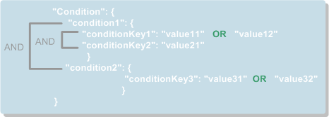

# Advanced Mode<a name="en-us_topic_0043394868"></a>

The advanced mode provides a more flexible topic policy. You can specify which users and cloud services can perform which topic operations, for example, querying topic details, modifying topics, publishing messages, and deleting topics.

## Introduction to Topic Policies<a name="section14511343122012"></a>

A topic policy is configured by a topic creator to allow or disallow other users or cloud services to perform specified operations to a topic.  [Table 1](#table53240944112753)  lists the elements consisting of a topic policy.

**Table  1**  Topic policy elements

<a name="table53240944112753"></a>
<table><thead align="left"><tr id="row21987414112753"><th class="cellrowborder" valign="top" width="15.1%" id="mcps1.2.4.1.1"><p id="p35443943112753"><a name="p35443943112753"></a><a name="p35443943112753"></a><strong>Parameter</strong></p>
</th>
<th class="cellrowborder" valign="top" width="31.45%" id="mcps1.2.4.1.2"><p id="p1722161112753"><a name="p1722161112753"></a><a name="p1722161112753"></a><strong id="b52387134112753"><a name="b52387134112753"></a><a name="b52387134112753"></a>Description</strong></p>
</th>
<th class="cellrowborder" valign="top" width="53.449999999999996%" id="mcps1.2.4.1.3"><p id="p47496205112753"><a name="p47496205112753"></a><a name="p47496205112753"></a><strong id="b5277356112753"><a name="b5277356112753"></a><a name="b5277356112753"></a>Constraint</strong></p>
</th>
</tr>
</thead>
<tbody><tr id="row44101580112753"><td class="cellrowborder" valign="top" width="15.1%" headers="mcps1.2.4.1.1 "><p id="p36150079112753"><a name="p36150079112753"></a><a name="p36150079112753"></a>Version</p>
</td>
<td class="cellrowborder" valign="top" width="31.45%" headers="mcps1.2.4.1.2 "><p id="p42475248112753"><a name="p42475248112753"></a><a name="p42475248112753"></a>Policy specification version</p>
</td>
<td class="cellrowborder" valign="top" width="53.449999999999996%" headers="mcps1.2.4.1.3 "><p id="p17943058112753"><a name="p17943058112753"></a><a name="p17943058112753"></a>Currently, only <strong id="b842352706145948"><a name="b842352706145948"></a><a name="b842352706145948"></a>2016-09-07</strong> is supported.</p>
</td>
</tr>
<tr id="row46405782112753"><td class="cellrowborder" valign="top" width="15.1%" headers="mcps1.2.4.1.1 "><p id="p61369906112753"><a name="p61369906112753"></a><a name="p61369906112753"></a>Id</p>
</td>
<td class="cellrowborder" valign="top" width="31.45%" headers="mcps1.2.4.1.2 "><p id="p4906500112753"><a name="p4906500112753"></a><a name="p4906500112753"></a>Policy ID, which uniquely identifies a policy</p>
</td>
<td class="cellrowborder" valign="top" width="53.449999999999996%" headers="mcps1.2.4.1.3 "><p id="p61882243112753"><a name="p61882243112753"></a><a name="p61882243112753"></a>The policy ID cannot be left blank.</p>
</td>
</tr>
<tr id="row39288912112753"><td class="cellrowborder" valign="top" width="15.1%" headers="mcps1.2.4.1.1 "><p id="p14998859112753"><a name="p14998859112753"></a><a name="p14998859112753"></a>Statement</p>
</td>
<td class="cellrowborder" valign="top" width="31.45%" headers="mcps1.2.4.1.2 "><p id="p1139155615212"><a name="p1139155615212"></a><a name="p1139155615212"></a>Statements used to configure which users and cloud services can perform specified operations in a topic policy. Each policy may contain one or more statements.</p>
</td>
<td class="cellrowborder" valign="top" width="53.449999999999996%" headers="mcps1.2.4.1.3 "><p id="p31968219112753"><a name="p31968219112753"></a><a name="p31968219112753"></a>A policy must contain at least one statement. For details about elements in a statement, see <a href="#section19563388474">Statement Elements</a>.</p>
</td>
</tr>
</tbody>
</table>

The following is an example topic policy, which contains two statements,  **Statement1**  and  **Statement2**.

```
{
    "Version": "2016-09-07",
    "Id": "access_policy_01",
    "Statement": [
       {Statement1},
       {Statement2}
    ]
}
```

## Statement Elements<a name="section19563388474"></a>

[Table 2](#table13574080155334)  lists the elements composed of a statement, as shown in the following example topic policy:

```
{
    "Version": "2016-09-07", 
    "Id": "__default_policy_ID", 
    "Statement": [
           //The first statement.
        {
            "Sid": "__user_pub_0", 
            "Effect": "Allow", 
            "Principal": {
                "CSP": [
                    "urn:csp:iam::123456789:root",
                    "urn:csp:iam::987654321:root"
                ]
            }, 
            "Action": [
                "SMN:Publish", 
                "SMN:QueryTopicDetail"
            ], 
            "Resource": "urn:smn:regionId:e23bf08ebb924730b452426c60849564:ECM_BKS_Topic"
        }, 
        //The second statement
       {
            "Sid": "__service_pub_0", 
            "Effect": "Allow", 
            "Principal": {
                "Service": [
                    "obs"
                ]
            }, 
            "Action": [
                "SMN:Publish", 
                "SMN:QueryTopicDetail"
            ], 
            "Resource": "urn:smn:regionId:e23bf08ebb924730b452426c60849564:ECM_BKS_Topic"
        }
    ]
}
```

**Table  2**  Statement elements description

<a name="table13574080155334"></a>
<table><thead align="left"><tr id="row2428006155334"><th class="cellrowborder" valign="top" width="17%" id="mcps1.2.4.1.1"><p id="p66371740155519"><a name="p66371740155519"></a><a name="p66371740155519"></a><strong id="b43082088194323"><a name="b43082088194323"></a><a name="b43082088194323"></a>Element</strong></p>
</th>
<th class="cellrowborder" valign="top" width="33%" id="mcps1.2.4.1.2"><p id="p66616597155519"><a name="p66616597155519"></a><a name="p66616597155519"></a><strong id="b62678468155519"><a name="b62678468155519"></a><a name="b62678468155519"></a>Description</strong></p>
</th>
<th class="cellrowborder" valign="top" width="50%" id="mcps1.2.4.1.3"><p id="p43791157155519"><a name="p43791157155519"></a><a name="p43791157155519"></a><strong id="b58576097155519"><a name="b58576097155519"></a><a name="b58576097155519"></a>Constraint</strong></p>
</th>
</tr>
</thead>
<tbody><tr id="row5501174215551"><td class="cellrowborder" valign="top" width="17%" headers="mcps1.2.4.1.1 "><p id="p2745813215551"><a name="p2745813215551"></a><a name="p2745813215551"></a>Sid</p>
</td>
<td class="cellrowborder" valign="top" width="33%" headers="mcps1.2.4.1.2 "><p id="p951625815551"><a name="p951625815551"></a><a name="p951625815551"></a>Statement ID</p>
</td>
<td class="cellrowborder" valign="top" width="50%" headers="mcps1.2.4.1.3 "><p id="p3261944415551"><a name="p3261944415551"></a><a name="p3261944415551"></a>The statement ID must be unique, for example, <strong id="b84235270620952"><a name="b84235270620952"></a><a name="b84235270620952"></a>statement01</strong> or <strong id="b39889324202233"><a name="b39889324202233"></a><a name="b39889324202233"></a>statement02</strong>.</p>
</td>
</tr>
<tr id="row2102549615551"><td class="cellrowborder" valign="top" width="17%" headers="mcps1.2.4.1.1 "><p id="p2303739015551"><a name="p2303739015551"></a><a name="p2303739015551"></a>Effect</p>
</td>
<td class="cellrowborder" valign="top" width="33%" headers="mcps1.2.4.1.2 "><p id="p5408933915551"><a name="p5408933915551"></a><a name="p5408933915551"></a>Statement effect</p>
</td>
<td class="cellrowborder" valign="top" width="50%" headers="mcps1.2.4.1.3 "><p id="p1916032815551"><a name="p1916032815551"></a><a name="p1916032815551"></a>The value can be <strong id="b84235270615257"><a name="b84235270615257"></a><a name="b84235270615257"></a>Allow</strong> or <strong id="b8423527061530"><a name="b8423527061530"></a><a name="b8423527061530"></a>Deny</strong>.</p>
</td>
</tr>
<tr id="row233616615551"><td class="cellrowborder" valign="top" width="17%" headers="mcps1.2.4.1.1 "><p id="p923559515551"><a name="p923559515551"></a><a name="p923559515551"></a>Principal</p>
<p id="p143555201842"><a name="p143555201842"></a><a name="p143555201842"></a>NotPrincipal</p>
</td>
<td class="cellrowborder" valign="top" width="33%" headers="mcps1.2.4.1.2 "><a name="ul56995346416"></a><a name="ul56995346416"></a><ul id="ul56995346416"><li><strong id="b842352706123826"><a name="b842352706123826"></a><a name="b842352706123826"></a>Principal</strong>: object to which the statement applies</li><li><strong id="b842352706123922"><a name="b842352706123922"></a><a name="b842352706123922"></a>NotPrincipal</strong>: object to which the statement does not apply<p id="p716351816"><a name="p716351816"></a><a name="p716351816"></a>There are currently two supported values:</p>
<a name="ul64637189213"></a><a name="ul64637189213"></a><ul id="ul64637189213"><li><strong id="b842352706103025"><a name="b842352706103025"></a><a name="b842352706103025"></a>CSP</strong>: Specify one or more cloud users.</li><li><strong id="b842352706103143"><a name="b842352706103143"></a><a name="b842352706103143"></a>Service</strong>: Specify one or more cloud services.</li></ul>
</li></ul>
</td>
<td class="cellrowborder" valign="top" width="50%" headers="mcps1.2.4.1.3 "><p id="p44931755164956"><a name="p44931755164956"></a><a name="p44931755164956"></a>Either the <strong id="b842352706185140"><a name="b842352706185140"></a><a name="b842352706185140"></a>Principal</strong> or <strong id="b842352706185145"><a name="b842352706185145"></a><a name="b842352706185145"></a>NotPrincipal</strong> element must be configured.</p>
<p id="p5690725519382"><a name="p5690725519382"></a><a name="p5690725519382"></a>If you enter <strong id="b842352706185224"><a name="b842352706185224"></a><a name="b842352706185224"></a>CSP</strong>, you must specify user information in the format <strong id="b842352706185337"><a name="b842352706185337"></a><a name="b842352706185337"></a>urn:csp:iam::domainId:root</strong>. You need to obtain the domain ID of each user you specify.</p>
<p id="p36629932194152"><a name="p36629932194152"></a><a name="p36629932194152"></a>If you enter <strong id="b842352706185631"><a name="b842352706185631"></a><a name="b842352706185631"></a>Service</strong>, you must specify the cloud service names in lower case.</p>
</td>
</tr>
<tr id="row2239846215551"><td class="cellrowborder" valign="top" width="17%" headers="mcps1.2.4.1.1 "><p id="p5316167715551"><a name="p5316167715551"></a><a name="p5316167715551"></a>Action</p>
<p id="p586515126814"><a name="p586515126814"></a><a name="p586515126814"></a>NotAction</p>
</td>
<td class="cellrowborder" valign="top" width="33%" headers="mcps1.2.4.1.2 "><a name="ul139511146291"></a><a name="ul139511146291"></a><ul id="ul139511146291"><li><strong id="b84235270612425"><a name="b84235270612425"></a><a name="b84235270612425"></a>Action</strong>: allowed statement action</li></ul>
<a name="ul16815171817"></a><a name="ul16815171817"></a><ul id="ul16815171817"><li><strong id="b84235270614829"><a name="b84235270614829"></a><a name="b84235270614829"></a>NotAction</strong>: statement action not allowed<p id="p328452812317"><a name="p328452812317"></a><a name="p328452812317"></a>You can use a wildcard character to configure a set of actions by type, for example, <strong id="b842352706104048_1"><a name="b842352706104048_1"></a><a name="b842352706104048_1"></a>SMN:Update*</strong> and <strong id="b842352706104054_1"><a name="b842352706104054_1"></a><a name="b842352706104054_1"></a>SMN:Delete*</strong>. If you only enter a wildcard character (*) in a statement, all supported actions are configured.</p>
</li></ul>
</td>
<td class="cellrowborder" valign="top" width="50%" headers="mcps1.2.4.1.3 "><p id="p58838218165112"><a name="p58838218165112"></a><a name="p58838218165112"></a>Either the <strong id="b36039682201848"><a name="b36039682201848"></a><a name="b36039682201848"></a>Action</strong> or <strong id="b55921686201848"><a name="b55921686201848"></a><a name="b55921686201848"></a>NotAction</strong> element must be configured.</p>
<p id="p2900090715551"><a name="p2900090715551"></a><a name="p2900090715551"></a>The following actions are supported:</p>
<a name="ul5968157515551"></a><a name="ul5968157515551"></a><ul id="ul5968157515551"><li>SMN:UpdateTopic</li><li>SMN:DeleteTopic</li><li>SMN:QueryTopicDetail</li><li>SMN:ListTopicAttributes</li><li>SMN:UpdateTopicAttribute</li><li>SMN:DeleteTopicAttributes</li><li>SMN:DeleteTopicAttributeByName</li><li>SMN:ListSubscriptionsByTopic</li><li>SMN:Subscribe</li><li>SMN:Unsubscribe</li><li>SMN:Publish</li></ul>
<p id="p722296915551"><a name="p722296915551"></a><a name="p722296915551"></a>For details about mappings between actions and APIs, see section <a href="mappings-between-smn-operations-and-apis.md">Mappings Between SMN Operations and APIs</a>.</p>
</td>
</tr>
<tr id="row3341670315551"><td class="cellrowborder" valign="top" width="17%" headers="mcps1.2.4.1.1 "><p id="p129519266014"><a name="p129519266014"></a><a name="p129519266014"></a>Resource</p>
<p id="p840677215551"><a name="p840677215551"></a><a name="p840677215551"></a>NotResource</p>
</td>
<td class="cellrowborder" valign="top" width="33%" headers="mcps1.2.4.1.2 "><a name="ul72911752161111"></a><a name="ul72911752161111"></a><ul id="ul72911752161111"><li><strong id="b2036232883"><a name="b2036232883"></a><a name="b2036232883"></a>Resource</strong>: topic to which a statement applies</li><li><strong id="b990198955"><a name="b990198955"></a><a name="b990198955"></a>NotResource</strong>: topic to which the statement does not apply</li></ul>
</td>
<td class="cellrowborder" valign="top" width="50%" headers="mcps1.2.4.1.3 "><p id="p14977997165224"><a name="p14977997165224"></a><a name="p14977997165224"></a>Either the <strong id="b842352706194447_5"><a name="b842352706194447_5"></a><a name="b842352706194447_5"></a>Resource</strong> or <strong id="b84235270619452_5"><a name="b84235270619452_5"></a><a name="b84235270619452_5"></a>NotResource</strong> element must be configured.</p>
<p id="p6045376015551"><a name="p6045376015551"></a><a name="p6045376015551"></a>You need to enter a topic URN.</p>
</td>
</tr>
<tr id="row4349478515551"><td class="cellrowborder" valign="top" width="17%" headers="mcps1.2.4.1.1 "><p id="p5659329615551"><a name="p5659329615551"></a><a name="p5659329615551"></a>Condition</p>
</td>
<td class="cellrowborder" valign="top" width="33%" headers="mcps1.2.4.1.2 "><p id="p34939215141849"><a name="p34939215141849"></a><a name="p34939215141849"></a>(Optional) Condition under which a policy statement takes effect</p>
</td>
<td class="cellrowborder" valign="top" width="50%" headers="mcps1.2.4.1.3 "><p id="p176783435519"><a name="p176783435519"></a><a name="p176783435519"></a>Enter supported condition operators and key words.</p>
<p id="p6238177815551"><a name="p6238177815551"></a><a name="p6238177815551"></a>For details, see <a href="#section14635144017214">Condition Elements</a>.</p>
</td>
</tr>
</tbody>
</table>

## Condition Elements<a name="section14635144017214"></a>

Conditions determine whether a statement takes effect. They enable you to configure more fine-grained control over topic permissions.  [Table 3](#table101491067599)  lists elements in a condition.

**Table  3**  Condition elements

<a name="table101491067599"></a>
<table><thead align="left"><tr id="row114915625917"><th class="cellrowborder" valign="top" width="18.86%" id="mcps1.2.4.1.1"><p id="p91495655920"><a name="p91495655920"></a><a name="p91495655920"></a><strong>Parameter</strong></p>
</th>
<th class="cellrowborder" valign="top" width="39.34%" id="mcps1.2.4.1.2"><p id="p41497665913"><a name="p41497665913"></a><a name="p41497665913"></a><strong id="b51651569599"><a name="b51651569599"></a><a name="b51651569599"></a>Description</strong></p>
</th>
<th class="cellrowborder" valign="top" width="41.8%" id="mcps1.2.4.1.3"><p id="p16165176155917"><a name="p16165176155917"></a><a name="p16165176155917"></a><strong id="b1516576115919"><a name="b1516576115919"></a><a name="b1516576115919"></a>Constraint</strong></p>
</th>
</tr>
</thead>
<tbody><tr id="row1116517695917"><td class="cellrowborder" valign="top" width="18.86%" headers="mcps1.2.4.1.1 "><p id="p61701541203038"><a name="p61701541203038"></a><a name="p61701541203038"></a>Condition operator</p>
</td>
<td class="cellrowborder" valign="top" width="39.34%" headers="mcps1.2.4.1.2 "><p id="p1181269593"><a name="p1181269593"></a><a name="p1181269593"></a>Character string, numeral, date, or time to be matched</p>
</td>
<td class="cellrowborder" valign="top" width="41.8%" headers="mcps1.2.4.1.3 "><p id="p1018113695913"><a name="p1018113695913"></a><a name="p1018113695913"></a>The time you entered must comply with ISO 8601 specifications. For details, see <a href="#table5968190619132">Table 4</a>.</p>
</td>
</tr>
<tr id="row1418113615597"><td class="cellrowborder" valign="top" width="18.86%" headers="mcps1.2.4.1.1 "><p id="p61815605910"><a name="p61815605910"></a><a name="p61815605910"></a>Key word</p>
</td>
<td class="cellrowborder" valign="top" width="39.34%" headers="mcps1.2.4.1.2 "><p id="p8181126115919"><a name="p8181126115919"></a><a name="p8181126115919"></a>Object to which the condition operation applies</p>
</td>
<td class="cellrowborder" valign="top" width="41.8%" headers="mcps1.2.4.1.3 "><p id="p121817612594"><a name="p121817612594"></a><a name="p121817612594"></a>The key word cannot be left blank. For details, see <a href="#table2955116119132">Table 5</a>.</p>
</td>
</tr>
</tbody>
</table>

A statement allows the requested operation only when all conditions in the statement are met. Otherwise, the operation will be denied.

As shown in  [Figure 1](#fig47755643154052), when a condition contains multiple operators, for example,  **condition1**  and  **condition2**, an AND operation is executed.

When the operator  **condition1**  contains multiple key words, for example,  **conditionKey1**  and  **conditionKey2**, an AND operation is executed.

When the key word  **conditionKey1**  contains multiple values, for example,  **value11**  and  **value12**, an OR operation is executed.

**Figure  1**  Condition logic<a name="fig47755643154052"></a>  


An example condition is as follows:

```
"Condition": {
    "DateLessThan":{
         "csp:CurrentTime":"2016-11-07T15:35:00Z"
    },
    "StringLike": {
         "smn:Endpoint":["*@gmail.com","*@hotmail.com"]
    }
}
```

**Table  4**  Condition operators

<a name="table5968190619132"></a>
<table><thead align="left"><tr id="row4290733119132"><th class="cellrowborder" valign="top" width="16.17%" id="mcps1.2.4.1.1"><p id="p2506458319132"><a name="p2506458319132"></a><a name="p2506458319132"></a><strong id="b9871496104716"><a name="b9871496104716"></a><a name="b9871496104716"></a>Category</strong></p>
</th>
<th class="cellrowborder" valign="top" width="33.64%" id="mcps1.2.4.1.2"><p id="p1696531019132"><a name="p1696531019132"></a><a name="p1696531019132"></a><strong id="b61393674104716"><a name="b61393674104716"></a><a name="b61393674104716"></a>Operator</strong></p>
</th>
<th class="cellrowborder" valign="top" width="50.19%" id="mcps1.2.4.1.3"><p id="p3201289019132"><a name="p3201289019132"></a><a name="p3201289019132"></a><strong id="b6831713104716"><a name="b6831713104716"></a><a name="b6831713104716"></a>Description</strong></p>
</th>
</tr>
</thead>
<tbody><tr id="row314566219132"><td class="cellrowborder" rowspan="6" valign="top" width="16.17%" headers="mcps1.2.4.1.1 "><p id="p5294179219132"><a name="p5294179219132"></a><a name="p5294179219132"></a>String</p>
</td>
<td class="cellrowborder" valign="top" width="33.64%" headers="mcps1.2.4.1.2 "><p id="p4803328319132"><a name="p4803328319132"></a><a name="p4803328319132"></a>StringEquals</p>
</td>
<td class="cellrowborder" valign="top" width="50.19%" headers="mcps1.2.4.1.3 "><p id="p6549069019132"><a name="p6549069019132"></a><a name="p6549069019132"></a>Match a string (case-sensitive).</p>
</td>
</tr>
<tr id="row5796886519132"><td class="cellrowborder" valign="top" headers="mcps1.2.4.1.1 "><p id="p2831095819132"><a name="p2831095819132"></a><a name="p2831095819132"></a>StringNotEquals</p>
</td>
<td class="cellrowborder" valign="top" headers="mcps1.2.4.1.2 "><p id="p1148622319132"><a name="p1148622319132"></a><a name="p1148622319132"></a>Exclude a string (case-sensitive).</p>
</td>
</tr>
<tr id="row4881169119132"><td class="cellrowborder" valign="top" headers="mcps1.2.4.1.1 "><p id="p5195773919132"><a name="p5195773919132"></a><a name="p5195773919132"></a>StringEqualsIgnoreCase</p>
</td>
<td class="cellrowborder" valign="top" headers="mcps1.2.4.1.2 "><p id="p4782736919132"><a name="p4782736919132"></a><a name="p4782736919132"></a>Match a string (case-insensitive).</p>
</td>
</tr>
<tr id="row2298817019132"><td class="cellrowborder" valign="top" headers="mcps1.2.4.1.1 "><p id="p3665204219132"><a name="p3665204219132"></a><a name="p3665204219132"></a>StringNotEqualsIgnoreCase</p>
</td>
<td class="cellrowborder" valign="top" headers="mcps1.2.4.1.2 "><p id="p1602538919132"><a name="p1602538919132"></a><a name="p1602538919132"></a>Exclude a string (case-insensitive).</p>
</td>
</tr>
<tr id="row1747953819132"><td class="cellrowborder" valign="top" headers="mcps1.2.4.1.1 "><p id="p556694119132"><a name="p556694119132"></a><a name="p556694119132"></a>StringLike</p>
</td>
<td class="cellrowborder" valign="top" headers="mcps1.2.4.1.2 "><p id="p4826905719132"><a name="p4826905719132"></a><a name="p4826905719132"></a>Match a string. The value can contain one or more wildcard characters (*).</p>
</td>
</tr>
<tr id="row1491484719132"><td class="cellrowborder" valign="top" headers="mcps1.2.4.1.1 "><p id="p2309811419132"><a name="p2309811419132"></a><a name="p2309811419132"></a>StringNotLike</p>
</td>
<td class="cellrowborder" valign="top" headers="mcps1.2.4.1.2 "><p id="p5900795219132"><a name="p5900795219132"></a><a name="p5900795219132"></a>Exclude a string. The value can contain one or more wildcard characters (*).</p>
</td>
</tr>
<tr id="row3951699519132"><td class="cellrowborder" rowspan="6" valign="top" width="16.17%" headers="mcps1.2.4.1.1 "><p id="p1590319132"><a name="p1590319132"></a><a name="p1590319132"></a>Numeric</p>
</td>
<td class="cellrowborder" valign="top" width="33.64%" headers="mcps1.2.4.1.2 "><p id="p2937190419132"><a name="p2937190419132"></a><a name="p2937190419132"></a>NumericEquals</p>
</td>
<td class="cellrowborder" valign="top" width="50.19%" headers="mcps1.2.4.1.3 "><p id="p3031402519132"><a name="p3031402519132"></a><a name="p3031402519132"></a>Match an integer or decimal.</p>
</td>
</tr>
<tr id="row6388549019132"><td class="cellrowborder" valign="top" headers="mcps1.2.4.1.1 "><p id="p2010864219132"><a name="p2010864219132"></a><a name="p2010864219132"></a>NumericNotEquals</p>
</td>
<td class="cellrowborder" valign="top" headers="mcps1.2.4.1.2 "><p id="p1818730419132"><a name="p1818730419132"></a><a name="p1818730419132"></a>Exclude an integer or decimal.</p>
</td>
</tr>
<tr id="row5085256419132"><td class="cellrowborder" valign="top" headers="mcps1.2.4.1.1 "><p id="p3809850019132"><a name="p3809850019132"></a><a name="p3809850019132"></a>NumericLessThan</p>
</td>
<td class="cellrowborder" valign="top" headers="mcps1.2.4.1.2 "><p id="p6607966419132"><a name="p6607966419132"></a><a name="p6607966419132"></a>Match any numeral less than an integer or decimal.</p>
</td>
</tr>
<tr id="row698281619132"><td class="cellrowborder" valign="top" headers="mcps1.2.4.1.1 "><p id="p5501989919132"><a name="p5501989919132"></a><a name="p5501989919132"></a>NumericLessThanEquals</p>
</td>
<td class="cellrowborder" valign="top" headers="mcps1.2.4.1.2 "><p id="p2742685519132"><a name="p2742685519132"></a><a name="p2742685519132"></a>Match any numeral less than or equal to an integer or decimal.</p>
</td>
</tr>
<tr id="row1147489819132"><td class="cellrowborder" valign="top" headers="mcps1.2.4.1.1 "><p id="p6284534919132"><a name="p6284534919132"></a><a name="p6284534919132"></a>NumericGreaterThan</p>
</td>
<td class="cellrowborder" valign="top" headers="mcps1.2.4.1.2 "><p id="p5730847519132"><a name="p5730847519132"></a><a name="p5730847519132"></a>Match any numeral greater than an integer or decimal.</p>
</td>
</tr>
<tr id="row5018423919132"><td class="cellrowborder" valign="top" headers="mcps1.2.4.1.1 "><p id="p3616522119132"><a name="p3616522119132"></a><a name="p3616522119132"></a>NumericGreaterThanEquals</p>
</td>
<td class="cellrowborder" valign="top" headers="mcps1.2.4.1.2 "><p id="p4370179219132"><a name="p4370179219132"></a><a name="p4370179219132"></a>Match any numeral greater than or equal to an integer or decimal.</p>
</td>
</tr>
<tr id="row3189125619132"><td class="cellrowborder" rowspan="6" valign="top" width="16.17%" headers="mcps1.2.4.1.1 "><p id="p4900497019132"><a name="p4900497019132"></a><a name="p4900497019132"></a>Date</p>
</td>
<td class="cellrowborder" valign="top" width="33.64%" headers="mcps1.2.4.1.2 "><p id="p264380019132"><a name="p264380019132"></a><a name="p264380019132"></a>DateEquals</p>
</td>
<td class="cellrowborder" valign="top" width="50.19%" headers="mcps1.2.4.1.3 "><p id="p1282128619132"><a name="p1282128619132"></a><a name="p1282128619132"></a>Match a date.</p>
</td>
</tr>
<tr id="row498908719132"><td class="cellrowborder" valign="top" headers="mcps1.2.4.1.1 "><p id="p1858585519132"><a name="p1858585519132"></a><a name="p1858585519132"></a>DateNotEquals</p>
</td>
<td class="cellrowborder" valign="top" headers="mcps1.2.4.1.2 "><p id="p2905925019132"><a name="p2905925019132"></a><a name="p2905925019132"></a>Exclude a date.</p>
</td>
</tr>
<tr id="row5981550319132"><td class="cellrowborder" valign="top" headers="mcps1.2.4.1.1 "><p id="p4490178619132"><a name="p4490178619132"></a><a name="p4490178619132"></a>DateLessThan</p>
</td>
<td class="cellrowborder" valign="top" headers="mcps1.2.4.1.2 "><p id="p1316603019132"><a name="p1316603019132"></a><a name="p1316603019132"></a>Match any time earlier than a date and time point.</p>
</td>
</tr>
<tr id="row3901926819132"><td class="cellrowborder" valign="top" headers="mcps1.2.4.1.1 "><p id="p146861519132"><a name="p146861519132"></a><a name="p146861519132"></a>DateLessThanEquals</p>
</td>
<td class="cellrowborder" valign="top" headers="mcps1.2.4.1.2 "><p id="p5184899719132"><a name="p5184899719132"></a><a name="p5184899719132"></a>Match any time earlier than or equal to a date and time point.</p>
</td>
</tr>
<tr id="row18112519132"><td class="cellrowborder" valign="top" headers="mcps1.2.4.1.1 "><p id="p1562910019132"><a name="p1562910019132"></a><a name="p1562910019132"></a>DateGreaterThan</p>
</td>
<td class="cellrowborder" valign="top" headers="mcps1.2.4.1.2 "><p id="p5799755019132"><a name="p5799755019132"></a><a name="p5799755019132"></a>Match any time later than a date and time point.</p>
</td>
</tr>
<tr id="row2499068619132"><td class="cellrowborder" valign="top" headers="mcps1.2.4.1.1 "><p id="p163013219132"><a name="p163013219132"></a><a name="p163013219132"></a>DateGreaterThanEquals</p>
</td>
<td class="cellrowborder" valign="top" headers="mcps1.2.4.1.2 "><p id="p6493187719132"><a name="p6493187719132"></a><a name="p6493187719132"></a>Match any time later than or equal to a date and time point.</p>
</td>
</tr>
<tr id="row3414260819132"><td class="cellrowborder" valign="top" width="16.17%" headers="mcps1.2.4.1.1 "><p id="p4367769419132"><a name="p4367769419132"></a><a name="p4367769419132"></a>Bool</p>
</td>
<td class="cellrowborder" valign="top" width="33.64%" headers="mcps1.2.4.1.2 "><p id="p4823234819132"><a name="p4823234819132"></a><a name="p4823234819132"></a>Bool</p>
</td>
<td class="cellrowborder" valign="top" width="50.19%" headers="mcps1.2.4.1.3 "><p id="p1450609019132"><a name="p1450609019132"></a><a name="p1450609019132"></a>Match a Boolean value.</p>
</td>
</tr>
</tbody>
</table>

**Table  5**  Condition key words

<a name="table2955116119132"></a>
<table><thead align="left"><tr id="row5949074419132"><th class="cellrowborder" valign="top" width="39.1%" id="mcps1.2.3.1.1"><p id="p5987618819132"><a name="p5987618819132"></a><a name="p5987618819132"></a>Key Word</p>
</th>
<th class="cellrowborder" valign="top" width="60.9%" id="mcps1.2.3.1.2"><p id="p1813304819132"><a name="p1813304819132"></a><a name="p1813304819132"></a><strong id="b837318214354"><a name="b837318214354"></a><a name="b837318214354"></a>Description</strong></p>
</th>
</tr>
</thead>
<tbody><tr id="row2942941119132"><td class="cellrowborder" valign="top" width="39.1%" headers="mcps1.2.3.1.1 "><p id="p5402093219132"><a name="p5402093219132"></a><a name="p5402093219132"></a>csp:CurrentTime</p>
</td>
<td class="cellrowborder" valign="top" width="60.9%" headers="mcps1.2.3.1.2 "><p id="p1361939719132"><a name="p1361939719132"></a><a name="p1361939719132"></a>Current time</p>
</td>
</tr>
<tr id="row6040274319132"><td class="cellrowborder" valign="top" width="39.1%" headers="mcps1.2.3.1.1 "><p id="p6353811219132"><a name="p6353811219132"></a><a name="p6353811219132"></a>smn:Protocol</p>
</td>
<td class="cellrowborder" valign="top" width="60.9%" headers="mcps1.2.3.1.2 "><p id="p4631346019132"><a name="p4631346019132"></a><a name="p4631346019132"></a>Protocol of a subscription, which is valid only for the SMN:Subscribe action</p>
</td>
</tr>
<tr id="row1972393119132"><td class="cellrowborder" valign="top" width="39.1%" headers="mcps1.2.3.1.1 "><p id="p675378319132"><a name="p675378319132"></a><a name="p675378319132"></a>smn:Endpoint</p>
</td>
<td class="cellrowborder" valign="top" width="60.9%" headers="mcps1.2.3.1.2 "><p id="p1018555919132"><a name="p1018555919132"></a><a name="p1018555919132"></a>Endpoint of a subscription, which is valid only for the SMN:Subscribe action</p>
</td>
</tr>
</tbody>
</table>

