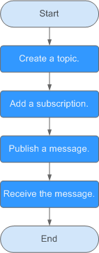
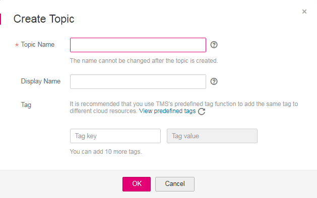
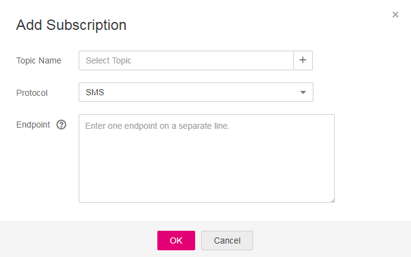
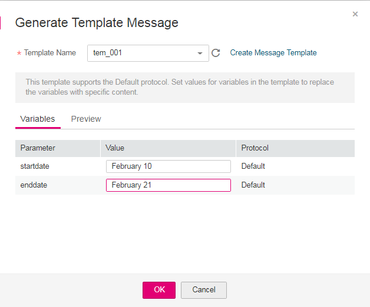
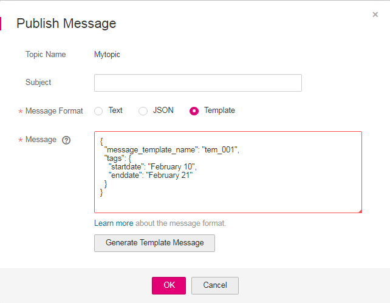
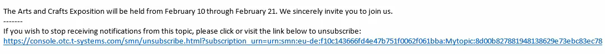

# Publishing a Message

After you learn the basic concepts in SMN, you can start to create a topic, add subscriptions to the topic, and publish messages on the SMN console or by calling RESTful APIs provided by SMN. For details about SMN APIs, see the  _Simple Message Notification API Reference_.

[Figure 1](#fig208091627152213)  shows the process to publish a message to a topic.

**Figure  1**  Process to publish a message  

## Scenario

If you need to send similar messages repeatedly, you can create a message template which contains fixed and changeable content. Every time you send messages using the template, you only have to replace changeable content. For example, your organization holds expositions regularly and needs to notify relevant people of the dates, you can create a message template containing date variables and other fixed content.

## Step 1. Create a Topic

1.  Log in to the management console.
2.  Click    on the upper left to select the desired region and project.
3.  In the  **Application**  category, click  **Simple Message Notification**.

    The SMN console is displayed.

4.  In the navigation pane, choose  **Topics**.

    The  **Topics**  page is displayed.

5.  Click  **Create Topic**.

    The  **Create Topic**  box is displayed.

    **Figure  2**  Create Topic  
    

6.  Enter a topic name and display name.

    **Table  1**  Information required for creating a topic

    
    <table><thead align="left"><tr id="en-us_topic_0043961401_en-us_topic_0043394871_row46643153153632"><th class="cellrowborder" valign="top" width="21%" id="mcps1.2.3.1.1">
<strong id="en-us_topic_0043961401_en-us_topic_0043394871_b4942326616041">Parameter</strong>

    </th>
    <th class="cellrowborder" valign="top" width="79%" id="mcps1.2.3.1.2">
<strong id="en-us_topic_0043961401_en-us_topic_0043394871_b4386163916041">Description</strong>

    </th>
    </tr>
    </thead>
    <tbody><tr id="en-us_topic_0043961401_en-us_topic_0043394871_row15993813153632"><td class="cellrowborder" valign="top" width="21%" headers="mcps1.2.3.1.1 ">
Topic Name

    </td>
    <td class="cellrowborder" valign="top" width="79%" headers="mcps1.2.3.1.2 ">
Topic name, which:

    <ul id="en-us_topic_0043961401_en-us_topic_0043394871_ul40971925153757"><li>Contains only letters, numerals, hyphens (-), and underscores (_) and starts with a letter or numeral.</li><li>Is a string of 1 to 255 characters.</li><li>Must be unique and cannot be modified once the topic is created.</li></ul>
    </td>
    </tr>
    <tr id="en-us_topic_0043961401_row1798615142421"><td class="cellrowborder" valign="top" width="21%" headers="mcps1.2.3.1.1 ">
Display Name

    </td>
    <td class="cellrowborder" valign="top" width="79%" headers="mcps1.2.3.1.2 ">
Message sender name, which must be less than 192 bytes.

    
 NOTE: 

After you specify a display name, the sender in email messages will be presented as <em id="en-us_topic_0043961401_i1306384680">Display name</em><strong id="en-us_topic_0043961401_b1698617597">&lt;username@example.com&gt;</strong>. Otherwise, the sender will be <strong id="en-us_topic_0043961401_b1444431809">username@example.com</strong>.

    

    </td>
    </tr>
    <tr id="en-us_topic_0043961401_row101210019315"><td class="cellrowborder" valign="top" width="21%" headers="mcps1.2.3.1.1 ">
Tag

    </td>
    <td class="cellrowborder" valign="top" width="79%" headers="mcps1.2.3.1.2 ">
Tags consist of keys and values. They identify cloud resources so that you can easily categorize and search for your resources.

    <ul id="en-us_topic_0043961401_ul584116317458"><li>A key or value is composed of letters, numerals, special characters -_@ and cannot start or end with a space. A key contains 36 characters at most, and a value contains 43 characters at most.</li><li>You can add up to 10 tags for each topic.</li></ul>
    </td>
    </tr>
    </tbody>
    </table>

7.  Click  **OK.**

    The topic you created is displayed in the topic list. The system generates a topic URN, which is the unique resource identifier of the topic and cannot be changed.

8.  Click the name of the topic to view its details, including the subscriptions, URN, and display name.

## Step 2. Add a Subscription

1.  Log in to the management console.
2.  Click    on the upper left to select the desired region and project.
3.  In the  **Application**  category, click  **Simple Message Notification**.

    The SMN console is displayed.

4.  In the navigation pane, choose  **Subscriptions**.

5.  Click  **Add Subscription**.

    The  **Add Subscription**  box is displayed.

    **Figure  3**  Add Subscription  
    

6.  Specify the required subscription information.
    1.  Click    beside the  **Topic Name**  box to select a topic.
    2.  Specify the subscription protocol and endpoints.

        **Table  2**  Required subscription information

        
        <table><thead align="left"><tr id="smn_ug_0008_row4550804216264"><th class="cellrowborder" valign="top" width="18.990000000000002%" id="mcps1.2.3.1.1">
<strong id="smn_ug_0008_b5030070116264">Parameter</strong>

        </th>
        <th class="cellrowborder" valign="top" width="81.01%" id="mcps1.2.3.1.2">
<strong id="smn_ug_0008_b2777129716264">Description</strong>

        </th>
        </tr>
        </thead>
        <tbody><tr id="smn_ug_0008_row9669750155910"><td class="cellrowborder" valign="top" width="18.990000000000002%" headers="mcps1.2.3.1.1 ">
Topic Name

        </td>
        <td class="cellrowborder" valign="top" width="81.01%" headers="mcps1.2.3.1.2 ">
Name of the topic to subscribe to

        </td>
        </tr>
        <tr id="smn_ug_0008_row153044716264"><td class="cellrowborder" valign="top" width="18.990000000000002%" headers="mcps1.2.3.1.1 ">
Protocol

        </td>
        <td class="cellrowborder" valign="top" width="81.01%" headers="mcps1.2.3.1.2 ">
Protocol the subscription endpoints support. The available options include <strong id="smn_ug_0008_b2041793552202137">SMS</strong>, <strong id="smn_ug_0008_b842352706202512">DMS</strong>, <strong id="smn_ug_0008_b84235270610165">Email</strong>, <strong id="smn_ug_0008_b842352706101613">HTTP</strong>, and <strong id="smn_ug_0008_b842352706101618">HTTPS</strong>.

        </td>
        </tr>
        <tr id="smn_ug_0008_row3620920716264"><td class="cellrowborder" valign="top" width="18.990000000000002%" headers="mcps1.2.3.1.1 ">
Endpoint

        </td>
        <td class="cellrowborder" valign="top" width="81.01%" headers="mcps1.2.3.1.2 ">
Subscription endpoint. You can enter up to 10 SMS, email, HTTP, or HTTPS endpoints, one in each line.

        <ul id="smn_ug_0008_ul4684327816264"><li><strong id="smn_ug_0008_b979883229152813">SMS</strong>: Enter one or more valid phone numbers.
The phone number is preceded by a plus sign (+) and a country code.

        
Example:

        
<strong id="smn_ug_0008_b84235270614502">+4900000000</strong>

        
<strong id="smn_ug_0008_b84235270614505">+4900000001</strong>

        
<strong id="smn_ug_0008_b84235270614509">+4900000002</strong>

        
<strong id="smn_ug_0008_b842352706145012">+4900000003</strong>

        </li><li><strong id="smn_ug_0008_b213535384154035">Email</strong>: Enter one or more valid email addresses.
Example:

        
<strong id="smn_ug_0008_b842352706145031">username1@example.com</strong>

        
<strong id="smn_ug_0008_b842352706145038">username2@example.com</strong>

        </li><li><strong id="smn_ug_0008_b84235270691358">HTTP</strong> or <strong id="smn_ug_0008_b8423527069146">HTTPS</strong>: Enter one or more public network URLs.
Example:

        
<strong id="smn_ug_0008_b842352706145047">http://example1.com/notification/action</strong>

        
<strong id="smn_ug_0008_b842352706145051">http://example2.com/notification/action</strong>

        </li><li><strong id="smn_ug_0008_b842352706203344">DMS</strong>: Click  to select a message queue. Ensure that the queue policy grants the <strong id="smn_ug_0008_b8423527061693">DMS:ProduceMessages</strong> permission to SMN. For details, see "Managing Queue Policies" in the <em id="smn_ug_0008_i842352697152551">Distributed Message Service User Guide</em>.</li></ul>
        </td>
        </tr>
        </tbody>
        </table>

7.  Click  **OK**.

    The subscription you added is displayed in the subscription list.

    > **NOTE:**   
    >-   To prevent malicious users from attacking subscription endpoints, SMN limits the number of confirmation messages that can be sent to an endpoint within a specified period of time. For details, see section  [Control on Subscription Confirmation Traffic](control-on-subscription-confirmation-traffic.md).  
    >-   SMN does not check whether subscription endpoints exist when you add subscriptions. However, subscribers will not receive notification messages until they confirm their subscriptions.  
    >-   The token is valid only for 48 hours. Therefore, subscribers must confirm subscriptions within that time.  

## Step 3. Create a Message Template

1.  Log in to the management console.
2.  Click    on the upper left to select the desired region and project.
3.  In the  **Application**  category, click  **Simple Message Notification**.

    The SMN console is displayed.

4.  In the navigation pane, choose  **Message Templates**.
5.  Click  **Create Message Template**.

    The  **Create Message Template**  box is displayed.

    **Figure  4**  Create Message Template  
    

6.  Specify the template name, protocol, and content.

    **Table  3**  Parameters required for creating a message template

    
    <table><thead align="left"><tr id="en-us_topic_0043394889_row46643153153632"><th class="cellrowborder" valign="top" width="19.74%" id="mcps1.2.3.1.1">
<strong id="en-us_topic_0043394889_b633727016234">Parameter</strong>

    </th>
    <th class="cellrowborder" valign="top" width="80.25999999999999%" id="mcps1.2.3.1.2">
<strong id="en-us_topic_0043394889_b4355688916234">Description</strong>

    </th>
    </tr>
    </thead>
    <tbody><tr id="en-us_topic_0043394889_row15993813153632"><td class="cellrowborder" valign="top" width="19.74%" headers="mcps1.2.3.1.1 ">
Template Name

    </td>
    <td class="cellrowborder" valign="top" width="80.25999999999999%" headers="mcps1.2.3.1.2 ">
Template name, which:

    <ul id="en-us_topic_0043394889_ul40971925153757"><li>Contains letters, numerals, underscores (_), and hyphens (-) and starts with a letter or numeral.</li><li>Is a character string 1 to 64 bytes long.</li><li>Cannot be modified once the template is created.</li></ul>
    </td>
    </tr>
    <tr id="en-us_topic_0043394889_row62778644153632"><td class="cellrowborder" valign="top" width="19.74%" headers="mcps1.2.3.1.1 ">
Protocol

    </td>
    <td class="cellrowborder" valign="top" width="80.25999999999999%" headers="mcps1.2.3.1.2 ">
Endpoint protocol of the template, which cannot be changed once the template is created

    
The value can be <strong id="en-us_topic_0043394889_b2108805878143347">Default</strong>, <strong id="en-us_topic_0043394889_b1095921216143347">SMS</strong>, <strong id="en-us_topic_0043394889_b218424467143347">HTTP</strong>, <strong id="en-us_topic_0043394889_b1369851447143347">HTTPS</strong>, <strong id="en-us_topic_0043394889_b84235270615203">DMS</strong>, or <strong id="en-us_topic_0043394889_b1100015765143347">Email</strong>.

    
If you do not specify a protocol, the <strong id="en-us_topic_0043394889_b842352706204357">Default</strong> protocol is used.

    </td>
    </tr>
    <tr id="en-us_topic_0043394889_row23418429162644"><td class="cellrowborder" valign="top" width="19.74%" headers="mcps1.2.3.1.1 ">
Content

    </td>
    <td class="cellrowborder" valign="top" width="80.25999999999999%" headers="mcps1.2.3.1.2 ">
Template content

    
You can use variables as placeholders. Before you send messages using the template, SMN replaces the variables with the message content you specify. A variable is a string of up to 21 characters. It may contain upper- or lower-case letters, numerals, hyphens (-), underscores (_), and periods (.) and must start with a letter or numeral.

    
The message template must meet the following requirements:

    <ul id="en-us_topic_0043394889_ul24327004104111"><li>The template supports plain text only.</li><li>The template content cannot be left blank and cannot exceed 256 KB.</li></ul>
    <ul id="en-us_topic_0043394889_ul36563140155946"><li>A template can contain up to 90 non-repeating variables or 256 variables counting the repeated ones. </li><li>When you send messages using a template, the message content you specify for each variable cannot exceed 1 KB.</li></ul>
    </td>
    </tr>
    </tbody>
    </table>

    For example, the template information is as follows:

    -   **Template Name**:  **tem\_001**
    -   **Protocol**:  **Default**
    -   **Content**:  **The Arts and Crafts Exposition will be held from \{startdate\} through \{enddate\}. We sincerely invite you to join us.** 

        **Figure  5**  Create Message Template  
        

7.  Click  **OK**.

    The template you created is displayed in the template list.

## Step 4. Publish a Template Message

1.  Log in to the management console.
2.  Click    on the upper left to select the desired region and project.
3.  In the  **Application**  category, click  **Simple Message Notification**.

    The SMN console is displayed.

4.  In the navigation pane, choose  **Topics**.

    The  **Topics**  page is displayed.

5.  In the topic list, locate the topic to which you need to publish a message and click  **Publish Message**  under  **Operation**.
6.  Configure the required parameters. The topic name is provided by default and cannot be changed.

    Select  **Template**  for  **Message Format**. Then, manually type the template content in the  **Message**  box or click  **Generate Template Message**  to generate it automatically. The template message content cannot exceed 256 KB.

    -   If you choose to manually type the template message, see  [Template Message Format](template-message-format.md)  for detailed requirements.
    -   If you choose to automatically generate the template message, proceed with steps  [7](#en-us_topic_0044170770_li37303092212221)  through  [10](#en-us_topic_0044170770_li3929025721230).

7.  Click  **Generate Template Message**.
8.  Select a template name, for example,  **tem\_001**, and enter values for the variables.

    The system replaces the variables with the message content you specified. The protocols configured in the template are displayed after each variable. In the example shown in the following figure, only the default protocol is specified in  **tem\_001**. Therefore, all confirmed subscribers in the topic will receive the message content in the default template. 

    **Figure  6**  Generate Template Message  
    

9.  Click the  **Preview**  tab to preview the message.

    In this example, the message generated is "The Arts and Crafts Exposition will be held from February 10 through February 21. We sincerely invite you to join us." 

    **Figure  7**  Previewing the template message  
    

10. Click  **OK**.

    The message that is generated contains the template name and variables.

    **Figure  8**  Template message example  
    

11. Click  **OK**.

    SMN delivers your message to all subscription endpoints. For details about messages for different protocols, see  [Messages of Different Protocols](messages-of-different-protocols.md).

## Step 5. Receive the Message

Subscription endpoints of different protocols receive different messages.

-   Email protocol

    Subscription endpoints are email addresses.

    Email messages contain the message subject, content, and a link to unsubscribe.

    **Figure  9**  Email message  
    

-   HTTP/HTTPS protocol

    Subscription endpoints are public network URLs. For details, see section "HTTP/HTTPS Messages" in the  _Simple Message Notification User Guide_.

-   SMS protocol

    Subscription endpoints are phone numbers.

    SMS messages contain only the message content.

-   DMS protocol

    Subscription endpoints are message queues.

    Message content is not displayed in message queues. You can access the DMS console and check the number of messages in a queue. After you publish a message to a message queue, the number in that queue will increase.

