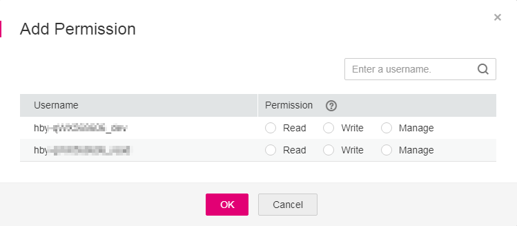

# Permissions Management

SWR categorizes user permissions into three types:

-   Read: Users can only pull images.
-   Write: Users can pull and push images, and edit image attributes.
-   Manage: Users can pull and push images, delete images or tags, edit image attributes, grant permissions, and share images with other users.

If the IAM policy  **SWR Administrator**  or  **Tenant Administrator**  is attached to a user, this user becomes an admin user of SWR. An SWR admin user can modify user permissions of images and organizations. If you are not an SWR admin user, contact an SWR admin user to grant you permissions to read, write, or manage a specific image or images in a specific organization.

You can add permissions to users in SWR by using either of the following methods:

-   To allow users to read, write, and manage a specific image, add corresponding permissions to them on the details page of this image.
-   To allow users to read, write, and manage all the images in an organization, add corresponding permissions to them on the details page of this organization.

## Granting Permissions for a Specific Image

To allow users to read, write, and manage a specific image, add corresponding permissions to them on the details page of this image.

1.  Log in to the SWR console.
2.  In the navigation pane, choose  **My Images**  and click the desired image.
3.  On the image details page, click the  **Permission Management**  tab.

    **Figure  1**  Permissions management  
    

4.  Click  **Add Permission**. On the page displayed, click  **Read**,  **Write**, or  **Manage**  in the row of the desired username. Click  **OK**  to confirm.

    **Figure  2**  Adding permissions for a specific image  
    

## Modifying or Deleting Permissions for a Specific Image

You can also modify or delete user permissions on the image details page.

-   To modify permissions, click  **Modify**  at the row of the desired username on the  **Permission Management**  tab page. Select a permission in the drop-down list of  **Permission**, and click  **Save**  in the  **Operation**  column.
-   To delete permissions, click  **Delete**  in the row of the desired username on the  **Permission Management**  tab page. In the dialog box displayed, enter  **DELETE**  as prompted and click  **Yes**.

## Granting Permissions for an Organization

To allow users to read, write, and manage all the images in an organization, add corresponding permissions to them on the details page of this organization.

Only users with the  **Manage**  permission can add permissions for other users.

1.  Log in to the SWR console.
2.  In the navigation pane, choose  **Organization Management**. Then click  **Details**  in the row of the desired organization.
3.  On the  **Users**  tab page, click  **Add Permission**. In the dialog box displayed, select permissions for the user and click  **OK**.

    **Figure  3**  Adding permissions for an organization  
    

## Modifying or Deleting Permissions for an Organization

You can also modify and delete user permissions of an organization.

-   To modify permissions, click  **Modify**  in the row of the desired username on the  **Users**  tab page. Select a permission in the drop-down list of  **Permission**, and click  **Save**  in the  **Operation**  column.
-   To delete permissions, click  **Delete**  in the row of the desired username on the  **Users**  tab page. In the dialog box displayed, enter  **DELETE**  as prompted and click  **Yes**.

