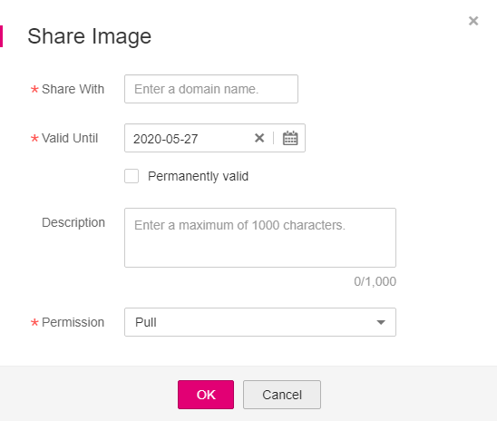

# Sharing Private Images

You can share your  private images  with other users and grant access permissions to them. The user with whom you shared the image can then log in to SWR console to view the image by clicking  **My Images \> Shared Images**. On the tab page, the user can click the target image to check its detailed information such as the image tag and image pull command.

## Prerequisite

Only the users authorized to manage the private images and domains can share images. The users with whom you share your images only have the read-only permission, which only allows them to pull the images.

## Procedure

1.  Log in to the SWR console.
2.  In the navigation pane, choose  **My Images**  and click the desired image.
3.  On the details page, click the  **Sharing**  tab.
4.  Click  **Share Image**. In the dialog box displayed, specify the domain with which you would like to share the image, the validity period of the sharing, and the permission you grant to the domain. Then click  **OK**.

    **Figure  1**  Sharing an image  
    

    **Table  1**  Sharing an image

    
    <table><thead align="left"><tr id="row362424415719"><th class="cellrowborder" valign="top" width="16%" id="mcps1.2.3.1.1">
Parameter

    </th>
    <th class="cellrowborder" valign="top" width="84%" id="mcps1.2.3.1.2">
Description

    </th>
    </tr>
    </thead>
    <tbody><tr id="row126241344125712"><td class="cellrowborder" valign="top" width="16%" headers="mcps1.2.3.1.1 ">
Share With

    </td>
    <td class="cellrowborder" valign="top" width="84%" headers="mcps1.2.3.1.2 ">
Enter a domain name to share the image with the domain.

    </td>
    </tr>
    <tr id="row1462434455710"><td class="cellrowborder" valign="top" width="16%" headers="mcps1.2.3.1.1 ">
Valid Until

    </td>
    <td class="cellrowborder" valign="top" width="84%" headers="mcps1.2.3.1.2 ">
Set a validity period. If you want the image to be permanently accessible to the domain you specified, tick <strong id="b6363987533">Permanently valid</strong>.

    </td>
    </tr>
    <tr id="row1362494415711"><td class="cellrowborder" valign="top" width="16%" headers="mcps1.2.3.1.1 ">
Description

    </td>
    <td class="cellrowborder" valign="top" width="84%" headers="mcps1.2.3.1.2 ">
Enter a maximum of 1,000 characters.

    </td>
    </tr>
    <tr id="row2034315951713"><td class="cellrowborder" valign="top" width="16%" headers="mcps1.2.3.1.1 ">
Permission

    </td>
    <td class="cellrowborder" valign="top" width="84%" headers="mcps1.2.3.1.2 ">
Only the <strong id="b0546142318551">Pull</strong> permission is supported currently.

    </td>
    </tr>
    </tbody>
    </table>

5.  To view all the images you shared, choose  **My Images**  in the navigation pane, click the  **Private Images**  tab, and tick  **Display only shared images**  above the image list.

