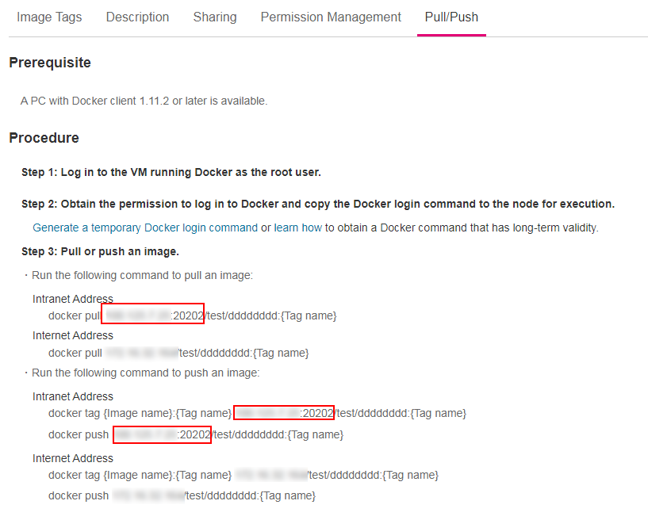
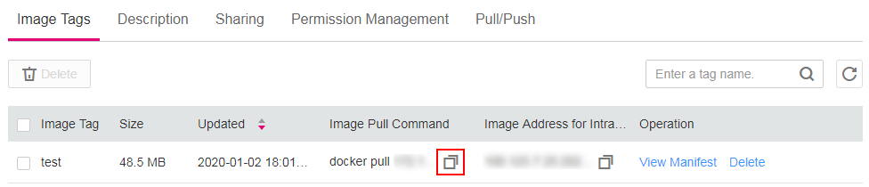

# Uploading an Image Through a Docker Client<a name="swr_01_0011"></a>

This section walks you through the steps of uploading an image to SWR, namely, running Docker commands to push an image to SWR image repository, taking the  **2048-demo:v1**  image as an example.

> **NOTICE:**   
>-   Each image layer uploaded through a Docker client cannot exceed 10 GB.  
>-   Your Docker client version must be 1.11.2 or later.  

## Prerequisite<a name="section1409154617177"></a>

-   You have created an organization in SWR. For details, see  [Creating an Organization](organization-management.md#section12921632181415).
-   The  **2048-demo:v1**  image has been pulled to your device where Docker is installed.
-   If you are using ECSs that are not created through CCE and want to access SWR image repositories using intranet addresses, configure  **insecure-registries**  first as follows:
    1.  Edit the  **daemon.json**  file, which is in the  **/etc/docker/daemon.json**  directory by default. If the file does not exist, create it. If the file does not contain any configurations, add the following lines to it.

        ```
        {
            "insecure-registries": [
                "{Intranet address}"
            ]
        }
        ```

        To obtain image intranet addresses, log in to the SWR console and enter the target image details page. On the  **Pull/Push**  tab page, you can find the image intranet address in  **Step 3: Pull** **or push an image**.

        **Figure  1**  Viewing an image intranet address<a name="fig63442497214"></a>  
        

        > **NOTE:**   
        >If the  **insecure-registry**  of  **DOCKER\_OPTS**  in the  **/etc/default/docker**  directory has been configured, you do not need to modify the  **daemon.json**  file in the  **/etc/docker/daemon.json**  directory.  
        >Run the following command to add the image intranet address to the end of the DOCKER\_OPTS="--insecure-registry=\{existing configurations\}" line:  
        >**vi /etc/default/docker**  
        >Expected settings:  
        >```  
        ># Use DOCKER_OPTS to modify the daemon startup options. DOCKER_OPTS="--insecure-registry={existing configurations} --insecure-registry={Intranet address}"  
        >```  

    2.  Restart the Docker to let the modification take effect.

        ```
        sudo systemctl daemon-reload
        sudo systemctl restart docker
        ```


## Procedure<a name="en-us_topic_0083050718_section862311112816"></a>

1.  Access SWR.
    1.  Log in to the SWR console.
    2.  In the navigation pane, choose  **My Images**  and then click  **Upload Through Docker Client**. On the page displayed, click  **Generate a temporary Docker login command**  and click    to copy the command. Then, record the domain name at the end of the  **docker login**  command. This is the address of the current image repository.

        **Figure  2**  Obtaining a  **docker login**  command<a name="en-us_topic_0112596104_fig157815441716"></a>  
        

        > **NOTE:**   
        >A temporary  **docker login**  command is valid for 24 hours. For details about how to obtain a  **docker login**  command that will remain valid for a long term, see  [Obtaining a Long-Term Valid Docker Login Command](obtaining-a-long-term-valid-docker-login-command.md).  

    3.  Run the  **docker login**  command on your Docker client.

        The message "login succeeded" will be displayed upon a successful login.

2.  Tag the  **2048-demo**  image by running the following command:

    **docker tag** **_\[_**_I__mage name_:_tag_**_\]_ _\[_**_Image repository address_**_\]_/_\[_**_Organization name_**_\]_/_\[_**_Image name_:_tag_**_\]_**

    Sample  **docker tag**  command:

    **docker tag 2048-demo:v1 \{**_Public image address_**\}/group/2048-demo:v1**

    In the sample command:

    -   **\{Public image address\}**  indicates the address of the SWR image repository. To obtain the address, click  **My Images**  in the navigation pane and select the desired image in the list. On the  **Pull/Push**  tab page, you can find the image repository address.
    -   **group**  indicates the organization name. When no existing organization matches this name, SWR automatically creates a new one with this name.
    -   **2048-demo:v1**  indicates the image name and tag.

3.  Push the image to the image repository  by running the following command:

    **docker push** **_\[_**_Image repository address_**_\]_/_\[_**_Organization name_**_\]_/_\[_**_Image name_:_tag_**_\]_**

    Sample  **docker push**  command:

    **docker push \{**_Public image address_**\}/group/2048-demo:v1**

    The following information will be returned upon a successful push:

    ```
    6d6b9812c8ae: Pushed 
    695da0025de6: Pushed 
    fe4c16cbf7a4: Pushed 
    v1: digest: sha256:eb7e3bbd8e3040efa71d9c2cacfa12a8e39c6b2ccd15eac12bdc49e0b66cee63 size: 948
    ```

    To view the pushed image, refresh the  **My Images**  page.


## Follow-up Procedure<a name="section2795183720459"></a>

When an image is pushed successfully, you can obtain its  address, and run the  **docker pull**  command to pull the image.

1.  Log in to the SWR console.
2.  In the navigation pane, choose  **My Images**  and click the desired image.
3.  In the same row as the desired image tag, click    in the column of  **Image Pull Command**  to copy its docker pull command.

    **Figure  3**  Obtaining the image pull command<a name="fig11734135815"></a>  
    


