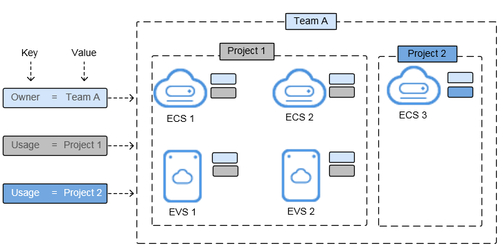

# Tag Management Service

Tag Management Service \(TMS\) is a visualized service for fast and unified cross-region tagging and categorization of cloud services.

Tags are used to identify cloud resources. When you have many cloud resources of the same type, you can use tags to classify cloud resources by dimension \(for example, use, owner, or environment\).

**Figure  1**  Examples of tags  

[Figure 1](#fig476135744)  shows how tags work. In this example, you assign two tags to each cloud resource. Each tag contains a key and a value that you define. The key of one tag is Owner, and the key of another tag is Use. Each tag has a value.

You can quickly search for and filter specific cloud resources based on the tags added to them. For example, you can define a set of tags for cloud resources in an account to track the owner and usage of each cloud resource, making resource management easier.

TMS provides the following functions:

-   Resource tag management: By adding tags to resources under your account, you can classify resources. TMS provides you with a visualized table to manage resource tags, including editing tags in batches.
-   Resource tag search: You can search for resources of all services in all regions by tag or by combination of tags.
-   Predefined tag management: You can create, import, or export predefined tags. By predefining tags, you can plan tags from the service perspective to effectively manage tags.

