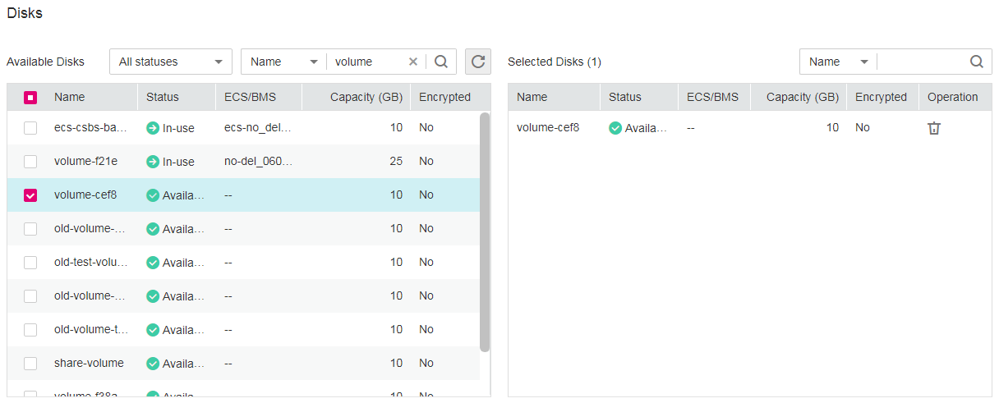

# Creating a VBS Backup

You can create backups for your EVS disks to protect the disk data through the VBS console or the EVS console.

## Precautions

An EVS disk can be backed up only when its status is  **Available**  or  **In-use**. If you have performed operations such as expanding, attaching, detaching, or deleting an EVS disk, refresh the page first to ensure the completion of the operation and then determine whether to back up the disk.

## Create a VBS Backup \(Method 1\)

1.  Log in to the management console.
2.  Click  . Under  **Storage**, click  **Volume Backup Service**.
3.  Click    in the upper left corner of the management console and select a region and a project.
4.  On the VBS page, click  **Create Backup**.
5.  From the EVS disk list on the left, click    to select the EVS disks you want to back up. Then they appear in the  **Selected Disks**  list on the right. See  [Figure 1](#fig64893544452). You can click    in the  **Operation**  column to delete EVS disks that do not need to be backed up.

    **Figure  1**  Selecting a disk  
    

    > **NOTE:**   
    >The system will identify whether the selected EVS disk is encrypted. If it is encrypted, its backup data will be stored in encrypted mode.  
    >In earlier versions, backup data of encrypted EVS disks is stored in non-encrypted mode. In the current version, newly generated backup data is stored in encrypted mode; however, historical non-encrypted backups will remain unchanged.  

6.  Confirm the EVS disks selected for backup are correct. Then in the  **Configure Backup**  area below, set  **Auto Backup**  or  **Immediate Backup**  or both. See  [Figure 2](#fig17436105514815).

    **Figure  2**  Configuring backup schemes  
    

    > **NOTE:**   
    >**Auto Backup**: The selected EVS disks will be associated with the backup policy. If the policy is enabled, the EVS disks will be automatically backed up according to the backup policy. If the selected EVS disks have been associated with another backup policy, they will be disassociated from that backup policy first and then associated with the new backup policy.  
    >**Immediate Backup**: backs up the selected EVS disks at once.  

    -   Select  **Auto Backup**: In the  **Backup Policy**  drop-down list, select an existing one. You can also click  **Create Policy**  to create a new one. For details, see  [Data Backup Using a Backup Policy](data-backup-using-a-backup-policy.md).
    -   Select  **Immediate Backup**: Enter the backup name and description.  [Table 1](#table11869527309)  describes the parameters.

        **Table  1**  Parameter description

        
        <table><thead align="left"><tr id="row138618523302"><th class="cellrowborder" valign="top" width="22.830000000000002%" id="mcps1.2.4.1.1">
Parameter

        </th>
        <th class="cellrowborder" valign="top" width="49.17%" id="mcps1.2.4.1.2">
Description

        </th>
        <th class="cellrowborder" valign="top" width="28.000000000000004%" id="mcps1.2.4.1.3">
Example Value

        </th>
        </tr>
        </thead>
        <tbody><tr id="row1786352123012"><td class="cellrowborder" valign="top" width="22.830000000000002%" headers="mcps1.2.4.1.1 ">
Name

        </td>
        <td class="cellrowborder" valign="top" width="49.17%" headers="mcps1.2.4.1.2 ">
The name can only contain letters, digits, underscores (_), and hyphens (-). It cannot contain special characters or start with <strong id="b842352706104426">auto</strong>. If you select only one EVS disk to back up, the backup name ranges from 1 to 64 characters. If you select more than one EVS disk to back up, the backup name ranges from 1 to 59 characters.

        </td>
        <td class="cellrowborder" valign="top" width="28.000000000000004%" headers="mcps1.2.4.1.3 ">
disk01_backup

        </td>
        </tr>
        <tr id="row158615214302"><td class="cellrowborder" valign="top" width="22.830000000000002%" headers="mcps1.2.4.1.1 ">
Description

        </td>
        <td class="cellrowborder" valign="top" width="49.17%" headers="mcps1.2.4.1.2 ">
The description consists of 0 to 64 characters and cannot contain a greater-than sign (&gt;) or less-than sign (&lt;).

        </td>
        <td class="cellrowborder" valign="top" width="28.000000000000004%" headers="mcps1.2.4.1.3 ">
for_test

        </td>
        </tr>
        </tbody>
        </table>

7.  Determine whether to select  **Enable**  next to  **Full Backup**. If  **Full Backup**  is enabled, the generated full backup and later generated incremental backups will support instant restoration. When you use Instant Restore for the first time through APIs and the to-be-restored disk has been backed up before the feature is enabled, enable full backup. After doing this, the disk backups generated through APIs will support instant restoration.
8.  Add tags to the backup.

    A tag is represented in the form of a key-value pair. Tags are used to identify, classify, and search for cloud resources. Tags are used to filter and manage backup resources only. A backup can have a maximum of 10 tags.

    [Table 2](#table191162312815)  describes parameters of a tag.

    **Table  2**  Parameter description

    
    <table><thead align="left"><tr id="row41151331884"><th class="cellrowborder" valign="top" width="15%" id="mcps1.2.4.1.1">
Parameter

    </th>
    <th class="cellrowborder" valign="top" width="66%" id="mcps1.2.4.1.2">
Description

    </th>
    <th class="cellrowborder" valign="top" width="19%" id="mcps1.2.4.1.3">
Example Value

    </th>
    </tr>
    </thead>
    <tbody><tr id="row51153313816"><td class="cellrowborder" valign="top" width="15%" headers="mcps1.2.4.1.1 ">
Key

    </td>
    <td class="cellrowborder" valign="top" width="66%" headers="mcps1.2.4.1.2 ">
Each tag of a backup has a unique key. The key of a tag is user-definable or is selected from those of existing tags in Tag Management Service (TMS).

    
The naming rules for a tag key are as follows:

    <ul id="ul20115438812"><li>It ranges from 1 to 36 Unicode characters.</li><li>It can contain only letters, digits, hyphens (-), and underscores (_).</li></ul>
    </td>
    <td class="cellrowborder" valign="top" width="19%" headers="mcps1.2.4.1.3 ">
Key_0001

    </td>
    </tr>
    <tr id="row21161531187"><td class="cellrowborder" valign="top" width="15%" headers="mcps1.2.4.1.1 ">
Value

    </td>
    <td class="cellrowborder" valign="top" width="66%" headers="mcps1.2.4.1.2 ">
The values of tags can be repetitive and can be blank.

    
The naming rules for a tag value are as follows:

    <ul id="ul211610318811"><li>It ranges from 0 to 43 Unicode characters.</li><li>It can contain only letters, digits, hyphens (-), and underscores (_).</li></ul>
    </td>
    <td class="cellrowborder" valign="top" width="19%" headers="mcps1.2.4.1.3 ">
Value_0001

    </td>
    </tr>
    </tbody>
    </table>

9.  Click  **Create Now**.
10. Confirm the VBS backup information and click  **Submit**.
11. Switch back to the VBS backup list.

    You can refresh the page after 10 seconds to view the backup creation status. When the  **Status**  of the backup changes to  **Available**, the VBS backup has been successfully created.

## Create a VBS Backup \(Method 2\)

1.  Log in to the management console.
2.  Click  . Under  **Storage**, click  **Volume Backup Service**.
3.  Click    in the upper left corner of the management console and select a region and a project.
4.  Locate the row that contains the target EVS disk, click  **More**  in the  **Operation**  column, and select  **Back Up**.
5.  From the EVS disk list on the left, click    to select the EVS disks you want to back up. Then they appear in the  **Selected Disks**  list on the right. See  [Figure 3](#fig19341916182310). You can click    in the  **Operation**  column to delete EVS disks that do not need to be backed up.

    **Figure  3**  Selecting a disk  
    

    > **NOTE:**   
    >The system will identify whether the selected EVS disk is encrypted. If it is encrypted, its backup data will be stored in encrypted mode.  
    >In earlier versions, backup data of encrypted EVS disks is stored in non-encrypted mode. In the current version, newly generated backup data is stored in encrypted mode; however, historical non-encrypted backups will remain unchanged.  

6.  Confirm the EVS disks selected for backup are correct. Then in the  **Configure Backup**  area below, set  **Auto Backup**  or  **Immediate Backup**  or both. See  [Figure 4](#fig22827152142).

    **Figure  4**  Configuring backup schemes  
    

    > **NOTE:**   
    >**Auto Backup**: The selected EVS disks will be associated with the backup policy and will be automatically backed up according to the backup policy. If the selected EVS disks have been associated with another backup policy, they will be disassociated from that backup policy first and then associated with the new backup policy.  
    >**Immediate Backup**: backs up the selected EVS disks at once.  

    -   Select  **Auto Backup**: In the  **Backup Policy**  drop-down list, select an existing one. You can also click  **Create Policy**  to create a new one. For details, see  [Data Backup Using a Backup Policy](data-backup-using-a-backup-policy.md).
    -   Select  **Immediate Backup**: Enter the backup name and description.  [Table 1](#table11869527309)  describes the parameters.

7.  Determine whether to select  **Enable**  next to  **Full Backup**. If  **Full Backup**  is enabled, the generated full backup and later generated incremental backups will support instant restoration. When you use Instant Restore for the first time through APIs and the to-be-restored disk has been backed up before the feature is enabled, enable full backup. After doing this, the disk backups generated through APIs will support instant restoration.
8.  Add tags to the VBS backup.  [Table 2](#table191162312815)  describes the parameters.

    A tag is represented in the form of a key-value pair. Tags are used to identify, classify, and search for cloud resources. Tags are used to filter and manage backup resources only. A backup can have a maximum of 10 tags.

9.  Click  **Create Now**.
10. Confirm the VBS backup information and click  **Submit**.
11. Switch back to the VBS backup list.

    You can refresh the page after 10 seconds to view the backup creation status. When the  **Status**  of the backup changes to  **Available**, the VBS backup has been successfully created.

