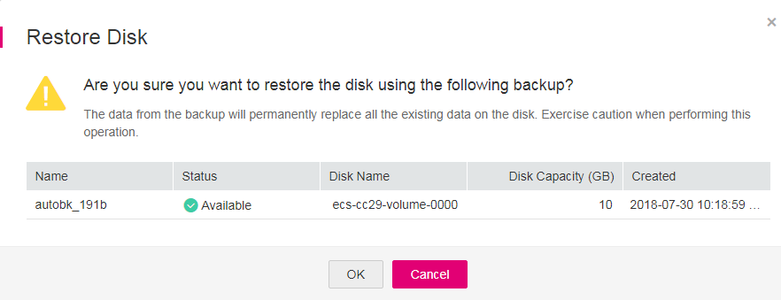

# Data Restoration Using a VBS Backup

You can use VBS backups to restore EVS disks to a given point in time or create EVS disks. Data on the EVS disks is equivalent to the backup data.

## Restore an EVS Disk Using a VBS Backup

You can use a VBS backup to restore an EVS disk to the time when the backup was created.

Before restoring the disk data, stop the server to which the EVS disk is attached and detach the EVS disk from the server. After the EVS disk data is restored, attach the EVS disk to the server and start the server.

> **NOTICE:**   
>-   If a server disk has been backed up and the operating system was changed after the backup, the backup may not be able to restore the disk because of the disk ID change. In this case, you can use the backup to create a new disk and mount the new disk as a data disk to the server.  
>-   Servers or disks at the disaster recovery \(DR\) site can be restored only when DR protection is disabled for servers deployed with Storage Disaster Recovery Service.  

Instant Restore is a feature that provides the instant restoration function for fast restoring disk data, greatly reducing the restoration time compared with the normal restoration function. For details, see  [Instant Restore](basic-concepts.md#section1713119814918).

Only VBS backups in the  **My backups**  list can be used for a restoration. Those VBS backups in the  **Backups shared with me**  list are unavailable for a restoration.

1.  Log in to the management console.
2.  Click    in the upper left corner of the management console and select a region and a project.
3.  Click  . Under  **Storage**, click  **Volume Backup Service**.
4.  On the  **Volume Backup Service**  page, if the  **Status**  of the VBS backup is  **Available**, click  **Restore Disk**  in the  **Operation**  column.
5.  Click  **OK**  as prompted. See  [Figure 1](#fig0824219012). Then, check whether the data is restored successfully.

    You can refresh the page after 10 seconds to view the data restoration status. When the  **Status**  of the backup changes back to  **Available**, the restoration has been successfully completed.

    **Figure  1**  Disk restoration  
    

## Create an EVS Disk Using a VBS Backup

You can use a VBS backup to create an EVS disk. After the EVS disk is created, the data on the new disk is the same as that in the VBS backup.

Instant Restore also supports fast disk creation using backups, saving your time. For details, see  [Instant Restore](basic-concepts.md#section1713119814918).

VBS backups in both the  **My backups**  and  **Backups shared with me**  lists can be used to create EVS disks.

1.  Log in to the management console.
2.  Click    in the upper left corner of the management console and select a region and a project.
3.  Click  . Under  **Storage**, click  **Volume Backup Service**.
4.  In the  **My Backups**  or  **Backups shared with me**  list, confirm the  **Status**  of the VBS backup is  **Available**  and click  **Create Disk**  in the  **Operation**  column. 
5.  Set the disk parameters.

    > **NOTE:**   
    >For details about these parameters, see the parameter description table in section Creating an EVS Disk in the  _Elastic Volume Service User Guide_.  
    >Note the following items when setting disk parameters:  
    >-   You can choose the same AZ to which the owning EVS disk of the backup data belongs, or you can choose a different AZ.  
    >-   The capacity of the newly created EVS disk cannot be smaller than that of the source EVS disk of the backup data.  
    >    If it is larger than the backup capacity, initialize the incremental disk space. For details, see section Initializing an EVS Disk \(Linux\) in the  _Elastic Volume Service User Guide_.  
    >-   You can create a disk of any type regardless of the backup's disk type.  
    >-   Batch creation is not supported when using backup data to create EVS disks. You can create only one EVS disk at a time.  

6.  Click  **Create Now**.
7.  Confirm the VBS backup information and click  **Submit**.
8.  Switch back to the  **Elastic Volume Service**  page. Check whether the EVS disk is successfully created.

    Instant restoration only takes several minutes to create a new disk by using a backup.

    This disk status changes from  **Creating**  to  **Available**,  **Restoring**, then  **Available**. Instant restoration is so fast that you may not notice the  **Restoring**  state. If the state changes from  **Creating**  to  **Available**, the new disk is successfully created. If the state changes from  **Restoring**  to  **Available**, backup data is successfully restored to the created EVS disk.

