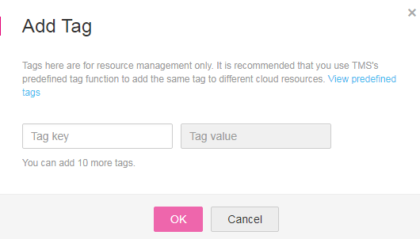
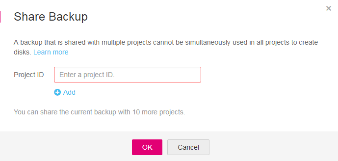

# VBS Backup Management

You can set filtering criteria to query wanted backups, add tags to backups for grouped management, and share your backups with other projects. 

CSBS backups of ECSs are also displayed on the VBS backup page and can be distinguished from VBS backups by  **Source**  in the backup details.

After Instant Restore is enabled, each backup will be marked with a letter  **C**  or  **E**  at the right of its name to show whether it supports instant restoration. A backup marked with letter  **C**  is a common backup and does not support instant restoration. A backup marked with letter  **E**  is an enhanced backup and supports instant restoration. For details, see  [Instant Restore](basic-concepts.md#section1713119814918).

## Search for a VBS Backup

1.  Log in to the management console.
2.  Click    in the upper left corner of the management console and select a region and a project.
3.  Click  . Under  **Storage**, click  **Volume Backup Service**.
4.  Search for backups.
    -   On the top of the list, select  **My backups**  and  **Backups shared with me**  in the drop-down list.
        -   On the  **My backups**  page, search for backups by backup name, backup ID, KMS key ID, or disk ID, and then click    to search. See  [Figure 1](#fig144211243155512).

            **Figure  1**  My backups  
            

        -   On the  **Backups shared with me**  page, you can see the time when the backup is shared in the  **Shared**  column. You can search for backups by backup name, backup ID, disk ID, or owner project ID, as shown in  [Figure 2](#fig1252813127211). Click    to search.

            **Figure  2**  Backups shared with me  
            

    -   Above the page, select a state to search for backups.
    -   In the upper right corner of the page, you can click the  **Search by Tag**  tab to search for backups.
        -   On the  **Search by Tag**  tab page that is displayed, enter a tag key and a tag value \(must be among existing keys and values\), click  , and then click  **Search**.
        -   You can use more than one tag for a combination search. Each time after a key and a value are entered, click  . The added tag search criteria are displayed under the text boxes. When more than one tag is added, they will be applied together for a combination search. A maximum of 10 tags can be added at the same time.
        -   You can click  **Reset**  under the search criteria to reset the search criteria.

5.  Click    in the row of a VBS backup to view its details.

    > **NOTE:**   
    >The  **Created**  column in the backup list indicates the time when the backup was created.  

## View the Status of a Backup Job

After creating backup jobs, you can view backup job status in  **Job Status**  above the backup list.

The backup job status can be:

-   **Processing**: a backup job is being executed
-   **Failed**: a backup job failed to be executed

    > **NOTE:**   
    >-   You can click the number next to  **Job Status**  to view details about the backup job creation. The  **Created**  column indicates the time when the backup job was started.  
    >-   If no backup jobs in either of the two states are displayed,  **Job Status**  is left blank.  

## Delete a VBS Backup

To delete unwanted VBS backups, ensure the backups' statuses are  **Available**  or  **Error**  and  **Source**  is  **VBS**.

Backups whose  **Source**  is  **CSBS**  can be deleted only on the CSBS management console.

1.  Log in to the management console.
2.  Click    in the upper left corner of the management console and select a region and a project.
3.  Click  . Under  **Storage**, click  **Volume Backup Service**.
4.  Locate the row that contains the target VBS backup in the backup list.
5.  Click  **Delete**  in the  **Operation**  column.
6.  In the dialog box that is displayed, confirm the information and click  **OK**. See  [Figure 3](#fig10847162913589).

    **Figure  3**  Deleting a backup  
    

7.  Optional: To delete multiple backups in a batch, click    to select them, and then click the  **Delete**  button above the list. In the dialog box that is displayed, confirm the deletion information and click  **OK**.

## Manage Tags of a VBS Backup

You can add tags to a backup as well as edit and delete these tags. Tags are used to filter and manage backup resources only.

1.  Log in to the management console.
2.  Click    in the upper left corner of the management console and select a region and a project.
3.  Click  . Under  **Storage**, click  **Volume Backup Service**.
4.  Click    in the row of a VBS backup to view its details.
5.  Click  **Tags**  in the details area to expand the tag management panel.

    The panel displays all tags of the VBS backup.

    -   Adding tags
        1.  Click  **Add Tag**  in the upper left corner.
        2.  In the dialog box that is displayed, set the key and value of the new tag. For details, see  [Figure 4](#fig0106181012912).

            A tag is represented in the form of a key-value pair. Tags are used to identify, classify, and search for cloud resources. A backup can have a maximum of 10 tags.

            [Table 1](#table870151884719)  describes parameters of a tag.

            **Table  1**  Parameter description

            
            <table><thead align="left"><tr id="row77012184476"><th class="cellrowborder" valign="top" width="18.55%" id="mcps1.2.4.1.1">
Parameter

            </th>
            <th class="cellrowborder" valign="top" width="65.61%" id="mcps1.2.4.1.2">
Description

            </th>
            <th class="cellrowborder" valign="top" width="15.840000000000002%" id="mcps1.2.4.1.3">
Example Value

            </th>
            </tr>
            </thead>
            <tbody><tr id="row5701918104720"><td class="cellrowborder" valign="top" width="18.55%" headers="mcps1.2.4.1.1 ">
Key

            </td>
            <td class="cellrowborder" valign="top" width="65.61%" headers="mcps1.2.4.1.2 ">
Each tag of a backup has a unique key. The key of a tag is user-definable or is selected from those of existing tags in TMS.

            
The naming rules for a tag key are as follows:

            <ul id="ul20115438812"><li>It ranges from 1 to 36 Unicode characters.</li><li>It can contain only letters, digits, hyphens (-), and underscores (_).</li></ul>
            </td>
            <td class="cellrowborder" valign="top" width="15.840000000000002%" headers="mcps1.2.4.1.3 ">
Key_0001

            </td>
            </tr>
            <tr id="row070718104714"><td class="cellrowborder" valign="top" width="18.55%" headers="mcps1.2.4.1.1 ">
Value

            </td>
            <td class="cellrowborder" valign="top" width="65.61%" headers="mcps1.2.4.1.2 ">
The values of tags can be repetitive and can be blank.

            
The naming rules for a tag value are as follows:

            <ul id="ul211610318811"><li>It ranges from 0 to 43 Unicode characters.</li><li>It can contain only letters, digits, hyphens (-), and underscores (_).</li></ul>
            </td>
            <td class="cellrowborder" valign="top" width="15.840000000000002%" headers="mcps1.2.4.1.3 ">
Value_0001

            </td>
            </tr>
            </tbody>
            </table>

            **Figure  4**  Adding tags  
            

        3.  Click  **OK**.

    -   Editing a tag
        1.  In the  **Operation**  column of the tag that you want to edit, click  **Edit**.
        2.  In the  **Edit Tag**  dialog box that is displayed, modify the tag value.  [Table 1](#table870151884719)  describes the parameters.

            If the updated tag is identical to an existing one, only one is retained.

        3.  Click  **OK**.

    -   Deleting a tag
        1.  In the  **Operation**  column of the tag that you want to delete, click  **Delete**.
        2.  In the dialog box that is displayed, confirm the deletion information.
        3.  Click  **OK**.

    -   Searching for backups by tag

        For details, see  [Search for a VBS Backup](#section3521024785717).

## Manage Shared VBS Backups

A tenant can share a backup with other tenants.

Encrypted backups cannot be shared. Backups of common I/O \(performance optimized I\) and ultra-high I/O \(latency optimized\) disks cannot be shared.

Backups cannot be shared across regions. This indicates that projects sharing a backup must be in the same region as the backup.

1.  Log in to the management console.
2.  Click    in the upper left corner of the management console and select a region and a project.
3.  Click  . Under  **Storage**, click  **Volume Backup Service**.
4.  Click    in the row of a backup.
5.  Click  **Shares**  in the backup details area to expand the share management panel.

    The panel displays the ID list of projects with which the backup is shared.

    -   Adding a share

    1.  In the upper left corner, click  **Share Backup**, and then the  **Share Backup**  dialog box is displayed. For details, see  [Figure 5](#fig6681214115510).

        **Figure  5**  Adding a share  
        

    2.  Enter the project ID of the target tenant.

        > **NOTE:**   
        >A project ID is a string of 32 characters that can contain letters and digits but cannot be digits only.  

    3.  Click  **Add**  in the dialog box to add another project ID. A tenant can share a backup with another 10 tenants.
    4.  Click  **OK**.

    -   Deleting a share

    1.  Select a share that you want to delete, and click  **Unshare**  in the  **Operation**  column.
    2.  In the dialog box that is displayed, confirm the deletion information.
    3.  Click  **OK**.

