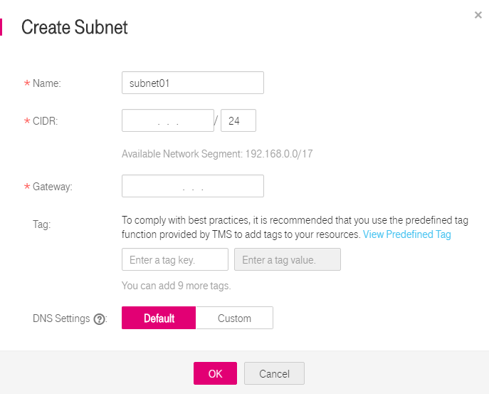

# Creating a Subnet for the VPC

## Scenarios

A subnet is automatically created when you create a VPC. If required, you can create another subnet in the VPC.

The created subnet is configured with DHCP by default. After an ECS using this VPC starts, the ECS automatically obtains an IP address using DHCP.

## Procedure

1.  Log in to the management console.
2.  Click    in the upper left corner and select the desired region and project.
3.  On the console homepage, under  **Network**, click **Virtual Private Cloud**.
4.  In the navigation pane on the left, click  **Virtual Private Cloud**.
5.  On the  **Virtual Private Cloud**  page, locate the VPC for which a subnet is to be created and click the VPC name.
6.  On the displayed  **Subnets** tab, click **Create Subnet**.
7.  In the  **Create Subnet**  area, set parameters as prompted.

    **Figure  1**  Create Subnet
    

    **Table  1**  Parameter description

    <table><thead align="left"><tr id="en-us_topic_0013748726_r243a457356d844a28b2c5dfcb381d3ca"><th class="cellrowborder" valign="top" width="19.24%" id="mcps1.2.4.1.1">
Parameter

    </th>
    <th class="cellrowborder" valign="top" width="55.7%" id="mcps1.2.4.1.2">
Description

    </th>
    <th class="cellrowborder" valign="top" width="25.06%" id="mcps1.2.4.1.3">
Example Value

    </th>
    </tr>
    </thead>
    <tbody><tr id="en-us_topic_0013748726_rc908647483fd4e478dc43fd83fcb6575"><td class="cellrowborder" valign="top" width="19.24%" headers="mcps1.2.4.1.1 ">
Name

    </td>
    <td class="cellrowborder" valign="top" width="55.7%" headers="mcps1.2.4.1.2 ">
Specifies the subnet name.

    </td>
    <td class="cellrowborder" valign="top" width="25.06%" headers="mcps1.2.4.1.3 ">
Subnet

    </td>
    </tr>
    <tr id="en-us_topic_0013748726_ra338f8572c2042b1909a2e07a43a1868"><td class="cellrowborder" valign="top" width="19.24%" headers="mcps1.2.4.1.1 ">
CIDR

    </td>
    <td class="cellrowborder" valign="top" width="55.7%" headers="mcps1.2.4.1.2 ">
Specifies the CIDR block for the subnet. This value must be within the VPC CIDR range.

    </td>
    <td class="cellrowborder" valign="top" width="25.06%" headers="mcps1.2.4.1.3 ">
192.168.0.0/24

    </td>
    </tr>
    <tr id="en-us_topic_0013748726_ra7655f6b0a5c4d13a2b144962179f7c7"><td class="cellrowborder" valign="top" width="19.24%" headers="mcps1.2.4.1.1 ">
Gateway

    </td>
    <td class="cellrowborder" valign="top" width="55.7%" headers="mcps1.2.4.1.2 ">
Specifies the gateway address of the subnet.

    </td>
    <td class="cellrowborder" valign="top" width="25.06%" headers="mcps1.2.4.1.3 ">
192.168.0.1

    </td>
    </tr>
    <tr id="en-us_topic_0013748726_row54331447162214"><td class="cellrowborder" valign="top" width="19.24%" headers="mcps1.2.4.1.1 ">
Tag

    </td>
    <td class="cellrowborder" valign="top" width="55.7%" headers="mcps1.2.4.1.2 ">
Specifies the subnet tag, which consists of a key and value pair. You can add a maximum of ten tags to each subnet.

    
The tag key and value must meet the requirements listed in <a href="#en-us_topic_0030971611__en-us_topic_0013748726_table4528555192814">Table 2</a>.

    </td>
    <td class="cellrowborder" valign="top" width="25.06%" headers="mcps1.2.4.1.3 "><ul id="en-us_topic_0013748726_ul42213484162216"><li id="en-us_topic_0013748726_li44377041162216">Key: subnet_key1</li><li id="en-us_topic_0013748726_li63849049162216">Value: subnet-01</li></ul>
    </td>
    </tr>
    </tbody>
    </table>

    **Table  2**  Subnet tag key and value requirements

    <table><thead align="left"><tr id="en-us_topic_0013748726_en-us_topic_0073603607_rd57708e01e6443a9805ca72f554fae7f"><th class="cellrowborder" valign="top" width="18.54%" id="mcps1.2.4.1.1">
<strong id="en-us_topic_0013748726_en-us_topic_0073603607_b842352706165123">Parameter</strong>

    </th>
    <th class="cellrowborder" valign="top" width="53.39%" id="mcps1.2.4.1.2">
<strong id="en-us_topic_0013748726_en-us_topic_0073603607_b842352706174218">Requirements</strong>

    </th>
    <th class="cellrowborder" valign="top" width="28.07%" id="mcps1.2.4.1.3">
<strong id="en-us_topic_0013748726_en-us_topic_0073603607_b842352706174227">Example Value</strong>

    </th>
    </tr>
    </thead>
    <tbody><tr id="en-us_topic_0013748726_en-us_topic_0073603607_r95612b479088487b99e620f90b71f798"><td class="cellrowborder" valign="top" width="18.54%" headers="mcps1.2.4.1.1 ">
Key

    </td>
    <td class="cellrowborder" valign="top" width="53.39%" headers="mcps1.2.4.1.2 "><ul id="en-us_topic_0013748726_en-us_topic_0073603607_uac40e19ce4ac49d0913d48b334564c45"><li id="en-us_topic_0013748726_en-us_topic_0073603607_l09e5379e37734886b85606e1a1512982">Cannot be left blank.</li><li id="en-us_topic_0013748726_en-us_topic_0073603607_lf627e2e989ad4bf8a759780682976c4a">Must be unique for each subnet.</li><li id="en-us_topic_0013748726_en-us_topic_0073603607_l740724b56b3948fdb336c21388d6e283">Can contain a maximum of 36 characters.</li><li id="en-us_topic_0013748726_en-us_topic_0073603607_lb10c975c495c4de1bc52fc96d084697c">Can contain only the following character types:<ul id="en-us_topic_0013748726_en-us_topic_0073603607_uccb317c6616b4445aa84b125e5aa017f"><li id="en-us_topic_0013748726_en-us_topic_0073603607_la4975a0b714d486381ef36c8599a4dae">Uppercase letters</li><li id="en-us_topic_0013748726_en-us_topic_0073603607_l05872030add74e7ab50152845826fa0a">Lowercase letters</li><li id="en-us_topic_0013748726_en-us_topic_0073603607_le70c062519174a9cae474c99c0f4f976">Digits</li><li id="en-us_topic_0013748726_en-us_topic_0073603607_li77869551443">Special characters, including hyphens (-) and underscores (_)</li></ul>
    </li></ul>
    </td>
    <td class="cellrowborder" valign="top" width="28.07%" headers="mcps1.2.4.1.3 ">
subnet_key1

    </td>
    </tr>
    <tr id="en-us_topic_0013748726_en-us_topic_0073603607_r32a79d8bde844fda8a6254383317e58f"><td class="cellrowborder" valign="top" width="18.54%" headers="mcps1.2.4.1.1 ">
Value

    </td>
    <td class="cellrowborder" valign="top" width="53.39%" headers="mcps1.2.4.1.2 "><ul id="en-us_topic_0013748726_en-us_topic_0073603607_uaf17b1ea9b9a4e58b95cafefa2898283"><li id="en-us_topic_0013748726_en-us_topic_0073603607_l88703260ac20431f961a641ebe7dbe00">Can contain a maximum of 43 characters.</li><li id="en-us_topic_0013748726_en-us_topic_0073603607_lf4772afe9a8143b086ea935ee84656f3">Can contain only the following character types:<ul id="en-us_topic_0013748726_en-us_topic_0073603607_ub74c759faad544c3b4428accc9c42b80"><li id="en-us_topic_0013748726_en-us_topic_0073603607_lf275cde186b24b9a9e3d4d52784a16ba">Uppercase letters</li><li id="en-us_topic_0013748726_en-us_topic_0073603607_l3a58e993d925444bb0eba6c38feeedfb">Lowercase letters</li><li id="en-us_topic_0013748726_en-us_topic_0073603607_l8679b69b2cd9428caecf8e14cafe5d4f">Digits</li><li id="en-us_topic_0013748726_en-us_topic_0073603607_li13827436174517">Special characters, including hyphens (-) and underscores (_)</li></ul>
    </li></ul>
    </td>
    <td class="cellrowborder" valign="top" width="28.07%" headers="mcps1.2.4.1.3 ">
subnet-01

    </td>
    </tr>
    </tbody>
    </table>

8.  The external DNS server address is used by default. If you need to change the DNS server address, select  **Custom** for **Advanced Settings**  and configure the DNS server addresses. You must ensure that the configured DNS server addresses are available.
9.  Click  **OK**.

## Precautions

After a subnet is created, five IP addresses in the subnet will be reserved and cannot be used. For example, in a subnet with CIDR block 192.168.0.0/24, the following five IP addresses are reserved:

-   192.168.0.0: Network address.
-   192.168.0.1: Gateway address.
-   192.168.0.253: DHCP service address.
-   192.168.0.254: Reserved for the system interface. This IP address is used by the VPC for external communication.
-   192.168.0.255: Network broadcast address.

If you set  **Advanced Settings** to **Custom**  during subnet creation, the reserved IP addresses may be different from the preceding default ones. The system will reserve five IP addresses based on your subnet settings.

