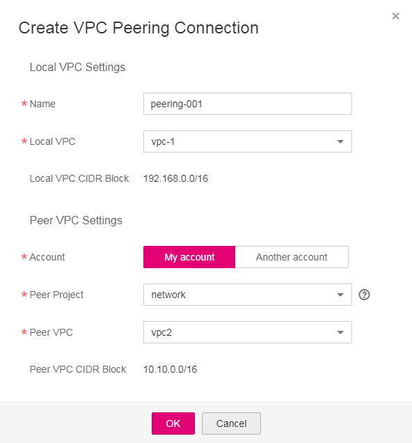
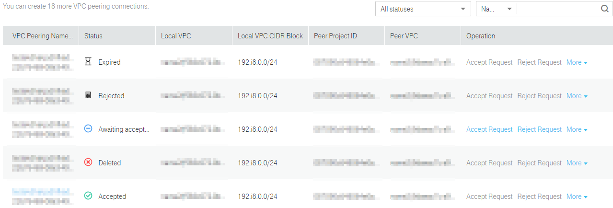
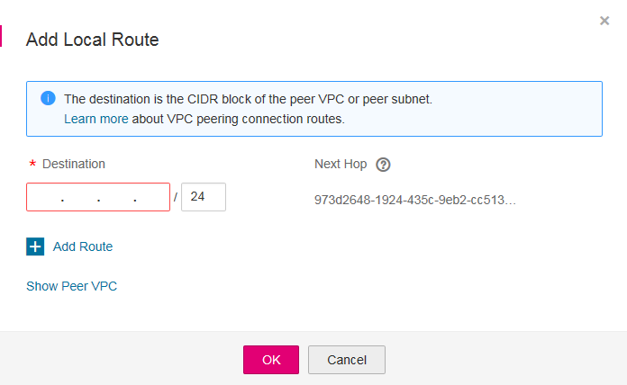

# Creating a VPC Peering Connection with Another VPC in Your Account

## Scenarios

To create a VPC peering connection, first create a request to peer with another VPC. You can request a VPC peering connection with another VPC in your account, but the two VPCs must be in the same region. The system automatically accepts the request.

## Prerequisites

Two VPCs in the same region have been created.

## Creating a VPC Peering Connection

1.  Log in to the management console.
2.  Click    in the upper left corner and select the desired region and project.
3.  On the console homepage, under  **Network**, click  **Virtual Private Cloud**.
4.  In the navigation pane on the left, click  **VPC Peering**.
5.  In the right pane displayed, click  **Create VPC Peering Connection**.
6.  Configure parameters as prompted. You must select  **My account**  for  **Account**.  [Table 1](#table1215761020244)  lists the parameters to be configured.

    **Figure  1**  Create VPC Peering Connection  
    

    **Table  1**  Parameter description

    
    <table><thead align="left"><tr id="row0156161072415"><th class="cellrowborder" valign="top" width="22.38223822382238%" id="mcps1.2.4.1.1">
Parameter

    </th>
    <th class="cellrowborder" valign="top" width="43.884388438843885%" id="mcps1.2.4.1.2">
Description

    </th>
    <th class="cellrowborder" valign="top" width="33.73337333733373%" id="mcps1.2.4.1.3">
Example Value

    </th>
    </tr>
    </thead>
    <tbody><tr id="row1115691072416"><td class="cellrowborder" valign="top" width="22.38223822382238%" headers="mcps1.2.4.1.1 ">
Name

    </td>
    <td class="cellrowborder" valign="top" width="43.884388438843885%" headers="mcps1.2.4.1.2 ">
Specifies the name of the VPC peering connection.

    
The name contains a maximum of 64 characters, which consist of letters, digits, hyphens (-), and underscores (_).

    </td>
    <td class="cellrowborder" valign="top" width="33.73337333733373%" headers="mcps1.2.4.1.3 ">
peering-001

    </td>
    </tr>
    <tr id="row141561910182419"><td class="cellrowborder" valign="top" width="22.38223822382238%" headers="mcps1.2.4.1.1 ">
Local VPC

    </td>
    <td class="cellrowborder" valign="top" width="43.884388438843885%" headers="mcps1.2.4.1.2 ">
Specifies the local VPC. You can select one from the drop-down list.

    </td>
    <td class="cellrowborder" valign="top" width="33.73337333733373%" headers="mcps1.2.4.1.3 ">
vpc_002

    </td>
    </tr>
    <tr id="row10156141092419"><td class="cellrowborder" valign="top" width="22.38223822382238%" headers="mcps1.2.4.1.1 ">
Local VPC CIDR Block

    </td>
    <td class="cellrowborder" valign="top" width="43.884388438843885%" headers="mcps1.2.4.1.2 ">
Specifies the CIDR block for the local VPC.

    </td>
    <td class="cellrowborder" valign="top" width="33.73337333733373%" headers="mcps1.2.4.1.3 ">
192.168.10.0/24

    </td>
    </tr>
    <tr id="row1015616108249"><td class="cellrowborder" valign="top" width="22.38223822382238%" headers="mcps1.2.4.1.1 ">
Account

    </td>
    <td class="cellrowborder" valign="top" width="43.884388438843885%" headers="mcps1.2.4.1.2 ">
Specifies the account to which the VPC to peer with belongs.

    <ul id="ul1815617101249"><li><strong id="b8557122464410">My account</strong>: The VPC peering connection will be created between two VPCs, in the same region, in your account.</li><li><strong id="b1881217261456">Another account</strong>: The VPC peering connection will be created between your VPC and a VPC in another account, in the same region.</li></ul>
    </td>
    <td class="cellrowborder" valign="top" width="33.73337333733373%" headers="mcps1.2.4.1.3 ">
My account

    </td>
    </tr>
    <tr id="row4157151017243"><td class="cellrowborder" valign="top" width="22.38223822382238%" headers="mcps1.2.4.1.1 ">
Peer Project

    </td>
    <td class="cellrowborder" valign="top" width="43.884388438843885%" headers="mcps1.2.4.1.2 ">
Specifies the peer project name. The project name of the current project is used by default. 

    </td>
    <td class="cellrowborder" valign="top" width="33.73337333733373%" headers="mcps1.2.4.1.3 ">
aaa

    </td>
    </tr>
    <tr id="row101571310132410"><td class="cellrowborder" valign="top" width="22.38223822382238%" headers="mcps1.2.4.1.1 ">
Peer VPC

    </td>
    <td class="cellrowborder" valign="top" width="43.884388438843885%" headers="mcps1.2.4.1.2 ">
Specifies the peer VPC. You can select one from the drop-down list if the VPC peering connection is created between two VPCs in your own account.

    </td>
    <td class="cellrowborder" valign="top" width="33.73337333733373%" headers="mcps1.2.4.1.3 ">
vpc_fab1

    </td>
    </tr>
    <tr id="row161571610102416"><td class="cellrowborder" valign="top" width="22.38223822382238%" headers="mcps1.2.4.1.1 ">
Peer VPC CIDR Block

    </td>
    <td class="cellrowborder" valign="top" width="43.884388438843885%" headers="mcps1.2.4.1.2 ">
Specifies the CIDR block for the peer VPC.

    
The local and peer VPCs cannot have matching or overlapping CIDR blocks. Otherwise, the routes added for the VPC peering connection may not take effect.

    </td>
    <td class="cellrowborder" valign="top" width="33.73337333733373%" headers="mcps1.2.4.1.3 ">
192.168.2.0/24

    </td>
    </tr>
    </tbody>
    </table>

7.  Click  **OK**.

## Adding Routes for a VPC Peering Connection 

If you request a VPC peering connection with another VPC in your own account, the system automatically accepts the request. To enable communication between the two VPCs, you need to add local and peer routes for the VPC peering connection.

1.  On the console homepage, under  **Network**, click  **Virtual Private Cloud**.
2.  In the navigation pane on the left, click  **VPC Peering**.
3.  Locate the target VPC peering connection in the connection list.

    **Figure  2**  VPC peering connection list  
    

4.  Click the name of the VPC peering connection to switch to the page showing details about the connection.
5.  On the displayed page, click the  **Local Routes**  tab.
6.  In the displayed  **Local Routes**  area, click  **Add Local Route**. In the displayed dialog box, add a local route.  [Table 2](#table1626072032518)  lists the parameters to be configured.

    **Figure  3**  Add Local Route  
    

    **Table  2**  Route parameter description

    
    <table><thead align="left"><tr id="row1260520192515"><th class="cellrowborder" valign="top" width="33.33333333333333%" id="mcps1.2.4.1.1">
Parameter

    </th>
    <th class="cellrowborder" valign="top" width="33.33333333333333%" id="mcps1.2.4.1.2">
Description

    </th>
    <th class="cellrowborder" valign="top" width="33.33333333333333%" id="mcps1.2.4.1.3">
Example Value

    </th>
    </tr>
    </thead>
    <tbody><tr id="row92601620142520"><td class="cellrowborder" valign="top" width="33.33333333333333%" headers="mcps1.2.4.1.1 ">
Destination

    </td>
    <td class="cellrowborder" valign="top" width="33.33333333333333%" headers="mcps1.2.4.1.2 ">
Specifies the destination address. Set it to the peer VPC or subnet CIDR block. 

    </td>
    <td class="cellrowborder" valign="top" width="33.33333333333333%" headers="mcps1.2.4.1.3 ">
192.168.2.0/24

    </td>
    </tr>
    <tr id="row19260102012518"><td class="cellrowborder" valign="top" width="33.33333333333333%" headers="mcps1.2.4.1.1 ">
Next Hop

    </td>
    <td class="cellrowborder" valign="top" width="33.33333333333333%" headers="mcps1.2.4.1.2 ">
Specifies the next hop address. The default value is the VPC peering connection ID. Keep the default value.

    </td>
    <td class="cellrowborder" valign="top" width="33.33333333333333%" headers="mcps1.2.4.1.3 ">
d1a7863b-9d5e-4d27-8eaf-ab14d2a9148b

    </td>
    </tr>
    </tbody>
    </table>

7.  Click  **OK**  to switch to the page showing the VPC peering connection details.
8.  On the displayed page, click the  **Peer Routes**  tab.
9.  In the displayed  **Peer Routes**  area, click  **Add Peer Route**  and add a route.
10. Click  **OK**  to add the route.

After a VPC peering connection is created, the two VPCs can communicate with each other through private IP addresses. You can run the  **ping**  command to check whether the two VPCs can communicate with each other. 

If two VPCs cannot communicate with each other, check the configuration by following the instructions provided in  [What Can I Do If VPCs in a VPC Peering Connection Cannot Communicate with Each Other?](what-can-i-do-if-vpcs-in-a-vpc-peering-connection-cannot-communicate-with-each-other.md).

