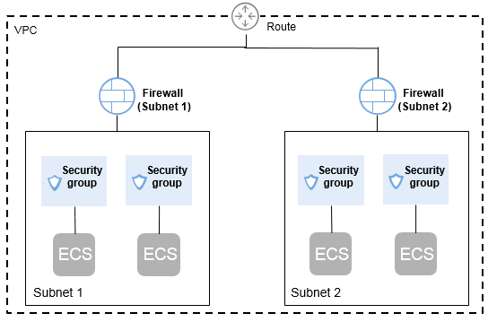

# Differences Between Security Groups and Firewalls

You can configure security groups and firewalls to increase the security of ECSs in your VPC.

-   Security groups protect ECSs.
-   Firewalls protect subnets.

For details, see  [Figure 1](#fig9582182315479).

**Figure  1**  Security groups and firewalls  

[Table 1](#table53053071174845)  describes the differences between security groups and firewalls.

**Table  1**  Differences between security groups and firewalls

<table><thead align="left"><tr id="row63488302174845"><th class="cellrowborder" valign="top" width="14.469999999999999%" id="mcps1.2.4.1.1">
Category

</th>
<th class="cellrowborder" valign="top" width="39.77%" id="mcps1.2.4.1.2">
Security Group

</th>
<th class="cellrowborder" valign="top" width="45.76%" id="mcps1.2.4.1.3">
Firewall

</th>
</tr>
</thead>
<tbody><tr id="row30367752174845"><td class="cellrowborder" valign="top" width="14.469999999999999%" headers="mcps1.2.4.1.1 ">
Targets

</td>
<td class="cellrowborder" valign="top" width="39.77%" headers="mcps1.2.4.1.2 ">
Operates at the ECS level.

</td>
<td class="cellrowborder" valign="top" width="45.76%" headers="mcps1.2.4.1.3 ">
Operates at the subnet level.

</td>
</tr>
<tr id="row36596319174845"><td class="cellrowborder" valign="top" width="14.469999999999999%" headers="mcps1.2.4.1.1 ">
Rules

</td>
<td class="cellrowborder" valign="top" width="39.77%" headers="mcps1.2.4.1.2 ">
Only supports <strong id="b84235270616192">Allow</strong> rules.

</td>
<td class="cellrowborder" valign="top" width="45.76%" headers="mcps1.2.4.1.3 ">
Supports <strong id="b661010993">Allow</strong> and <strong id="b842352706141521">Deny</strong> rules.

</td>
</tr>
<tr id="row3518463174845"><td class="cellrowborder" valign="top" width="14.469999999999999%" headers="mcps1.2.4.1.1 ">
Priority

</td>
<td class="cellrowborder" valign="top" width="39.77%" headers="mcps1.2.4.1.2 ">
If security group rules conflict, the overlapping elements of these rules take effect.

</td>
<td class="cellrowborder" valign="top" width="45.76%" headers="mcps1.2.4.1.3 ">
If firewall rules conflict, the rule with the highest priority takes effect.

</td>
</tr>
<tr id="row59814478174845"><td class="cellrowborder" valign="top" width="14.469999999999999%" headers="mcps1.2.4.1.1 ">
Usage

</td>
<td class="cellrowborder" valign="top" width="39.77%" headers="mcps1.2.4.1.2 ">
Automatically applies to ECSs in the security group that is selected during ECS creation. You must select a security group when creating ECSs.

</td>
<td class="cellrowborder" valign="top" width="45.76%" headers="mcps1.2.4.1.3 ">
Applies to all ECSs in the subnets associated with the firewall. Selecting a firewall is not allowed during subnet creation. You must create a firewall, associate subnets with it, add inbound and outbound network rules, and enable firewall. The firewall then takes effect for the associated subnets and ECSs in the subnets.

</td>
</tr>
<tr id="row3289418310534"><td class="cellrowborder" valign="top" width="14.469999999999999%" headers="mcps1.2.4.1.1 ">
Packets

</td>
<td class="cellrowborder" valign="top" width="39.77%" headers="mcps1.2.4.1.2 ">
Only packet filtering based on the 3-tuple (protocol, port, and peer IP address) is supported.

</td>
<td class="cellrowborder" valign="top" width="45.76%" headers="mcps1.2.4.1.3 ">
Only packet filtering based on the 5-tuple (protocol, source port, destination port, source IP address, and destination IP address) is supported.

</td>
</tr>
</tbody>
</table>

