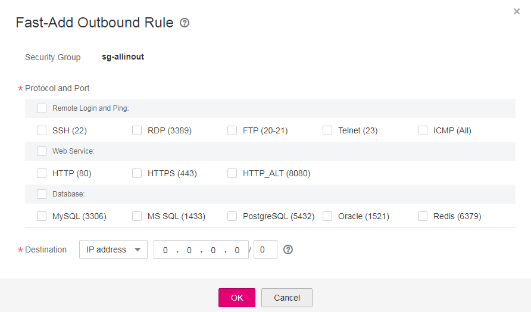

# Fast-Adding Security Group Rules

## Scenarios

The system provides some common ports and protocol combinations. You can add multiple security group rules with different protocols and ports at the same time.

## Procedure

1.  Log in to the management console.
2.  Click    in the upper left corner and select the desired region and project.
3.  On the console homepage, under  **Network**, click  **Virtual Private Cloud**.
4.  In the navigation pane on the left, choose  **Access Control**  \>  **Security Groups**.
5.  On the  **Security Groups**  page, locate the target security group and click  **Manage Rule**  in the  **Operation**  column to switch to the page for managing inbound and outbound rules.
6.  On the inbound rule tab, click  **Fast-Add Rule**. In the displayed dialog box, select the protocols and ports you wish to add all at once.

    **Figure  1**  Fast-Add Inbound Rule  
    

7.  On the outbound rule tab, click  **Fast-Add Rule**. In the displayed dialog box, select required protocols and ports to add multiple rules at a time.

    **Figure  2**  Fast-Add Outbound Rule  
    

8.  Click  **OK**.

